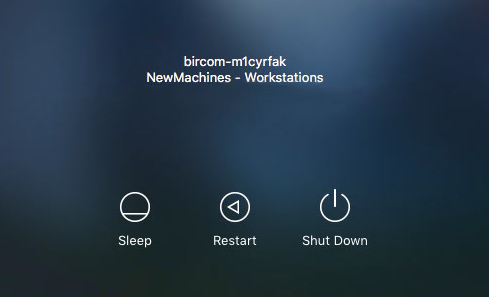
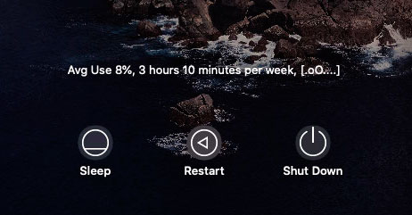
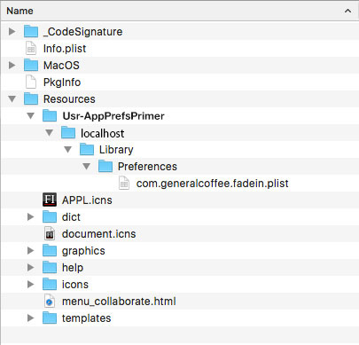
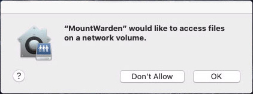

# LabWarden

## Brief

MacOS management tool for installing printers, applications and enforcing user and workstation policies.

## Introduction

LabWarden is a management tool for implementing custom policies.

These policies manage typical tasks, such as setting up the user side bar or dock, or installing printers and applications.

A Labwarden policy consists of a policy script and an accompanying policy profile (mobileconfig file). 

The profile specifies policy (script) "options" and determines how the policy is "triggered". Policies can be triggered by various system events - such as System Boot, User Login, Application Launch, Application Quit, etc.

Policies are applied by installing the policy profile. Profiles can be installed manually - or by your MDM server.

Policies are removed by uninstalling the policy profile.

See "Quick Demos 1-3" below to get a quick idea of the kind of things that LabWarden can do.

## Quick Demo 1

This example shows how to manually deploy the ShutdownWhenLidShut policy to a workstation. This policy shuts down a laptop if the lid is closed for more that a pre-defined length of time.

Open the Terminal app, and download the [LabWarden.pkg](https://raw.githubusercontent.com/execriez/LabWarden/master/SupportFiles/LabWarden.pkg) installer to your desktop by typing the following command. 

	curl -k --silent --retry 3 --retry-max-time 6 --fail https://raw.githubusercontent.com/execriez/LabWarden/master/SupportFiles/LabWarden.pkg --output ~/Desktop/LabWarden.pkg

* Double-click the downloaded package in order to install LabWarden
* Download (do not install) the mobileconfig from the following link: [LW-Sys-ShutdownWhenLidShut-(15secs).mobileconfig](https://raw.githubusercontent.com/execriez/LabWarden/master/SupportFiles/Profiles/Examples/V3/LW-Sys-ShutdownWhenLidShut-(15secs).mobileconfig)

Take a look at the file in a text editor, and navigate to the config section. 

There is a single configurable option **ShutdownDelaySecs** that is set to the value **15**. 

Further down the config, you can see that the policy is triggered by a **Sys-WillSleep** event.

	<?xml version="1.0" encoding="UTF-8"?>
	<!DOCTYPE plist PUBLIC "-//Apple//DTD PLIST 1.0//EN" "http://www.apple.com/DTDs/PropertyList-1.0.dtd">
	<plist version="1.0">
	<dict>
		<key>PayloadContent</key>
		<array>
			<dict>
				<key>618E5562-9330-479D-A852-135907A6E20B</key>
				<dict>
					<key>Config</key>
					<dict>
						<key>ShutdownDelaySecs</key>
						<integer>15</integer>
					</dict>
					<key>Name</key>
					<string>Sys-ShutdownWhenLidShut</string>
					<key>TriggeredBy</key>
					<array>
						<string>Sys-WillSleep</string>
					</array>
				</dict>
				<key>PayloadEnabled</key>
				<true/>
				<key>PayloadIdentifier</key>
				<string>618E5562-9330-479D-A852-135907A6E20B</string>
				<key>PayloadType</key>
				<string>com.github.execriez.labwarden</string>
				<key>PayloadUUID</key>
				<string>618E5562-9330-479D-A852-135907A6E20B</string>
				<key>PayloadVersion</key>
				<integer>1</integer>
			</dict>
		</array>
		<key>PayloadDescription</key>
		<string></string>
		<key>PayloadDisplayName</key>
		<string>LW Sys-ShutdownWhenLidShut (15secs)</string>
		<key>PayloadIdentifier</key>
		<string>6F546EA6-D23A-442B-A3B9-E43429FC1493</string>
		<key>PayloadOrganization</key>
		<string></string>
		<key>PayloadRemovalDisallowed</key>
		<true/>
		<key>PayloadScope</key>
		<string>System</string>
		<key>PayloadType</key>
		<string>Configuration</string>
		<key>PayloadUUID</key>
		<string>6F546EA6-D23A-442B-A3B9-E43429FC1493</string>
		<key>PayloadVersion</key>
		<integer>1</integer>
	</dict>
	</plist>

Manually install the policy profile on a laptop by double-clicking the mobileconfig.

After installing the policy profile, the laptop will shut down 15 seconds after closing the lid.

* Uninstall the policy by uninstalling the profile from **System Preferences>Profiles**.
* Uninstall LabWarden by running the package at the following link: [LabWarden-Uninstaller.pkg](https://raw.githubusercontent.com/execriez/LabWarden/master/SupportFiles/LabWarden-Uninstaller.pkg)

## Quick Demo 2

This example shows how to manually deploy the PolicyBanner policy to a workstation.

Open the Terminal app, and download the [LabWarden.pkg](https://raw.githubusercontent.com/execriez/LabWarden/master/SupportFiles/LabWarden.pkg) installer to your desktop by typing the following command. 

	curl -k --silent --retry 3 --retry-max-time 6 --fail https://raw.githubusercontent.com/execriez/LabWarden/master/SupportFiles/LabWarden.pkg --output ~/Desktop/LabWarden.pkg

* Double-click the downloaded package in order to install LabWarden
* Download (do not install) the mobileconfig from the following link: [LW-Sys-PolicyBanner.mobileconfig](https://raw.githubusercontent.com/execriez/LabWarden/master/SupportFiles/Profiles/Examples/V3/LW-Sys-PolicyBanner.mobileconfig)

Open the file in a text editor.

	<?xml version="1.0" encoding="UTF-8"?>
	<!DOCTYPE plist PUBLIC "-//Apple//DTD PLIST 1.0//EN" "http://www.apple.com/DTDs/PropertyList-1.0.dtd">
	<plist version="1.0">
	<dict>
		<key>PayloadContent</key>
		<array>
			<dict>
				<key>5FA0F0B2-2B68-4ACD-B650-5B44AE436C75</key>
				<dict>
					<key>Config</key>
					<dict>
						<key>Text</key>
						<string>Anyone whose behaviour
	is not in accordance with this Code of Practice
	may be subject to withdrawal of network access
	and subject to the disciplinary procedure.
	
	This is in keeping with the
	Disciplinary regulations.</string>
						<key>Title</key>
						<string>By clicking Accept,
	you are agreeing to abide by the
	Acceptable Use Policy.</string>
					</dict>
					<key>Name</key>
					<string>Sys-PolicyBanner</string>
					<key>TriggeredBy</key>
					<array>
					<string>Sys-Boot</string>
					</array>
				</dict>
				<key>PayloadEnabled</key>
				<true/>
				<key>PayloadIdentifier</key>
				<string>5FA0F0B2-2B68-4ACD-B650-5B44AE436C75</string>
				<key>PayloadType</key>
				<string>com.github.execriez.LabWarden</string>
				<key>PayloadUUID</key>
				<string>5FA0F0B2-2B68-4ACD-B650-5B44AE436C75</string>
				<key>PayloadVersion</key>
				<integer>1</integer>
			</dict>
		</array>
		<key>PayloadDescription</key>
		<string></string>
		<key>PayloadDisplayName</key>
		<string>LW Sys-PolicyBanner</string>
		<key>PayloadIdentifier</key>
		<string>AD787CCA-C943-4B1F-A06C-CEAD6479EE57</string>
		<key>PayloadOrganization</key>
		<string></string>
		<key>PayloadRemovalDisallowed</key>
		<true/>
		<key>PayloadScope</key>
		<string>System</string>
		<key>PayloadType</key>
		<string>Configuration</string>
		<key>PayloadUUID</key>
		<string>AD787CCA-C943-4B1F-A06C-CEAD6479EE57</string>
		<key>PayloadVersion</key>
		<integer>1</integer>
	</dict>
	</plist>
	
Edit the "Text" and "Title" properties within the file to reflect your own acceptable use or IT policy, then save the changes.

Manually install the policy profile by double-clicking the mobileconfig - then reboot the workstation.

>The Policy Banner will be shown on the login window of the workstation:
>
>
>

* Uninstall the policy by uninstalling the profile from **System Preferences>Profiles**.
* Uninstall LabWarden by running the package at the following link: [LabWarden-Uninstaller.pkg](https://raw.githubusercontent.com/execriez/LabWarden/master/SupportFiles/LabWarden-Uninstaller.pkg)

## Quick Demo 3

This example shows how to deploy an application to a workstation from the web via the Sys-SoftwareManifest policy.

Open the Terminal app, and download the [LabWarden.pkg](https://raw.githubusercontent.com/execriez/LabWarden/master/SupportFiles/LabWarden.pkg) installer to your desktop by typing the following command. 

	curl -k --silent --retry 3 --retry-max-time 6 --fail https://raw.githubusercontent.com/execriez/LabWarden/master/SupportFiles/LabWarden.pkg --output ~/Desktop/LabWarden.pkg

* Double-click the downloaded package in order to install LabWarden
* Download, then install the mobileconfig from the following link: [LW-Sys-SoftwareManifest-(web-MuseScore3).mobileconfig](https://raw.githubusercontent.com/execriez/LabWarden/master/SupportFiles/Profiles/Examples/V3/LW-Sys-SoftwareManifest-(web-MuseScore3).mobileconfig)

After a small delay, a disk image containing the application **MuseScore** will be downloaded from the internet and mounted. The application will be installed into /Applications and the disk image will be unmounted and discarded.

The profile contents are shown below. See the Sys-SoftwareManifest section in the LabWarden policy list (later) for an explanation of the policy options.

	<?xml version="1.0" encoding="UTF-8"?>
	<!DOCTYPE plist PUBLIC "-//Apple//DTD PLIST 1.0//EN" "http://www.apple.com/DTDs/PropertyList-1.0.dtd">
	<plist version="1.0">
	<dict>
		<key>PayloadContent</key>
		<array>
			<dict>
				<key>A2113065-E6DE-4872-875D-FEAF97280F3D</key>
				<dict>
				
					<key>Config</key>
					<dict>
						<key>Action</key>
						<string>Auto</string>

						<key>ManifestURI</key>
						<string>https://ftp.osuosl.org/pub/musescore-nightlies/macos/3x/stable/MuseScore-3.5.2.312126096.dmg</string>

						<key>MinOS</key>
						<string>10.10</string>

						<key>Item</key>
						<array>
						
							<dict>
								<key>FileName</key>
								<string>MuseScore 3.app</string>

								<key>Type</key>
								<string>Application</string>

								<key>TryMethod</key>
								<string>Once</string>

								<key>Application</key>
								<dict>
									<key>CFBundleLongVersionString</key>
									<string>3.5.2</string>
									<key>VersionKey</key>
									<string>CFBundleLongVersionString</string>
								</dict>
								
								<key>SrcDir</key>
								<string>/</string>

								<key>DstDir</key>
								<string>/Applications</string>
							</dict>
							
						</array>
						
					</dict>
					<key>Name</key>
					<string>Sys-SoftwareManifest</string>
					<key>Trigger</key>
					<array>
						<dict>
							<key>Name</key>
							<string>Sys-ManualTrigger</string>
						</dict>
						<dict>
							<key>Name</key>
							<string>Sys-Idle</string>
						</dict>
					</array>
				</dict>
				<key>PayloadEnabled</key>
				<true/>
				<key>PayloadIdentifier</key>
				<string>A2113065-E6DE-4872-875D-FEAF97280F3D</string>
				<key>PayloadType</key>
				<string>com.github.execriez.labwarden</string>
				<key>PayloadUUID</key>
				<string>A2113065-E6DE-4872-875D-FEAF97280F3D</string>
				<key>PayloadVersion</key>
				<integer>1</integer>
			</dict>
		</array>
		<key>PayloadDescription</key>
		<string></string>
		<key>PayloadDisplayName</key>
		<string>LW Sys-SoftwareManifest (web-MuseScore3)</string>
		<key>PayloadIdentifier</key>
		<string>F8DEDB14-604B-48A4-9FAB-B34372490F7A</string>
		<key>PayloadOrganization</key>
		<string></string>
		<key>PayloadRemovalDisallowed</key>
		<true/>
		<key>PayloadScope</key>
		<string>System</string>
		<key>PayloadType</key>
		<string>Configuration</string>
		<key>PayloadUUID</key>
		<string>F8DEDB14-604B-48A4-9FAB-B34372490F7A</string>
		<key>PayloadVersion</key>
		<integer>1</integer>
	</dict>
	</plist>

* Uninstall the policy by uninstalling the mobileconfig. Because the **Action** key is set **Auto**, this will (eventually) delete the installed application too.
* Uninstall LabWarden by running the package at the following link: [LabWarden-Uninstaller.pkg](https://raw.githubusercontent.com/execriez/LabWarden/master/SupportFiles/LabWarden-Uninstaller.pkg)

## Which policies are most useful in a lab environment?

Here is a list of policies that we make use of in our own Lab environment...

**On Wired Workstations...**

* Set a policy banner that is displayed at the Login Window - [LW-Sys-PolicyBanner.mobileconfig](https://raw.githubusercontent.com/execriez/LabWarden/master/SupportFiles/Profiles/Examples/V3/LW-Sys-PolicyBanner.mobileconfig)
* Set the system time server (NTP) - [LW-Sys-NetworkTime-(OnSite).mobileconfig](https://raw.githubusercontent.com/execriez/LabWarden/master/SupportFiles/Profiles/Examples/V3/LW-Sys-NetworkTime-(OnSite).mobileconfig)
* Set the Internet Proxy options - [LW-Sys-InternetProxy-(None).mobileconfig](https://raw.githubusercontent.com/execriez/LabWarden/master/SupportFiles/Profiles/Examples/V3/LW-Sys-InternetProxy-(None).mobileconfig)
* Add a SMB printer - [LW-Sys-PrinterManifest-(MarketingLaser2020queue).mobileconfig](https://raw.githubusercontent.com/execriez/LabWarden/master/SupportFiles/Profiles/Examples/V3/LW-Sys-PrinterManifest-(MarketingLaser2020queue).mobileconfig) 
* Install an application - [LW-Sys-SoftwareManifest-(web-MuseScore3).mobileconfig](https://raw.githubusercontent.com/execriez/LabWarden/master/SupportFiles/Profiles/Examples/V3/LW-Sys-SoftwareManifest-(web-MuseScore3).mobileconfig)
* Enforce local home directories on the startup disk, and mount the user home sharepoint at login - [LW-Sys-UserExperience-(localhome-mount).mobileconfig](https://raw.githubusercontent.com/execriez/LabWarden/master/SupportFiles/Profiles/Examples/V3/LW-Sys-UserExperience-(localhome-mount).mobileconfig) 
* Create symbolic links in the users local home to the users network Desktop, Documents etc. - [LW-Usr-CreateHomeFolderAliases.mobileconfig](https://raw.githubusercontent.com/execriez/LabWarden/master/SupportFiles/Profiles/Examples/V3/LW-Usr-CreateHomeFolderAliases.mobileconfig) 
* Set up the user's Dock - [LW-Usr-SetupDock.mobileconfig](https://raw.githubusercontent.com/execriez/LabWarden/master/SupportFiles/Profiles/Examples/V3/LW-Usr-SetupDock.mobileconfig)  
* Set up the user's sidebar - [LW-Usr-SetupSidebar.mobileconfig](https://raw.githubusercontent.com/execriez/LabWarden/master/SupportFiles/Profiles/Examples/V3/LW-Usr-SetupSidebar.mobileconfig) 
* Sync specified folders between the users local home and the network home - [LW-Usr-SyncPrefsToNetwork.mobileconfig](https://raw.githubusercontent.com/execriez/LabWarden/master/SupportFiles/Profiles/Examples/V3/LW-Usr-SyncPrefsToNetwork.mobileconfig) 

**On Laptops...**

Most of the above profiles, plus...

* Set the system time server (NTP) - [LW-Sys-NetworkTime-(OffSite).mobileconfig](https://raw.githubusercontent.com/execriez/LabWarden/master/SupportFiles/Profiles/Examples/V3/LW-Sys-NetworkTime-(OffSite).mobileconfig)
* Request and install a computer certificate from a certificate authority server and then set up Wi-Fi for 802.1X - [LW-Sys-dot1xWiFi.mobileconfig](https://raw.githubusercontent.com/execriez/LabWarden/master/SupportFiles/Profiles/Examples/V3/LW-Sys-dot1xWiFi.mobileconfig) 
* Turn on wireless and only allows admins to switch networks - [LW-Sys-WiFiControl-(LockedOn).mobileconfig](https://raw.githubusercontent.com/execriez/LabWarden/master/SupportFiles/Profiles/Examples/V3/LW-Sys-WiFiControl-(LockedOn).mobileconfig) 
* Reboot the workstation if it is woken after a long sleep - [LW-Sys-RestartAfterLongSleep-3hr.mobileconfig](https://raw.githubusercontent.com/execriez/LabWarden/master/SupportFiles/Profiles/Examples/V3/LW-Sys-RestartAfterLongSleep-3hr.mobileconfig) 
* Shut down a laptop if the lid is closed for more that 15 seconds - [LW-Sys-ShutdownWhenLidShut-(15secs).mobileconfig](https://raw.githubusercontent.com/execriez/LabWarden/master/SupportFiles/Profiles/Examples/V3/LW-Sys-ShutdownWhenLidShut-(15secs).mobileconfig)
* Enforce mobile accounts with local homes, and mount the user network home sharepoint at login - [LW-Sys-UserExperience-(localhome-mount-cachedcreds).mobileconfig](https://raw.githubusercontent.com/execriez/LabWarden/master/SupportFiles/Profiles/Examples/V3/LW-Sys-UserExperience-(localhome-mount-cachedcreds).mobileconfig)

## Installation

Open the Terminal app, and download the [LabWarden.pkg](https://raw.githubusercontent.com/execriez/LabWarden/master/SupportFiles/LabWarden.pkg) installer to your desktop by typing the following command. 

	curl -k --silent --retry 3 --retry-max-time 6 --fail https://raw.githubusercontent.com/execriez/LabWarden/master/SupportFiles/LabWarden.pkg --output ~/Desktop/LabWarden.pkg

* Double-click the downloaded package in order to install LabWarden

Alternatively, [download](https://github.com/execriez/LabWarden/archive/master.zip) the LabWarden zip archive, then unzip on a Mac workstation. Locate, then double-click the "LabWarden.pkg" installer package which can be found in the "SupportFiles" directory.

The installer will install the following files and directories:

	/Library/LaunchAgents/com.github.execriez.labwarden.Sys-LoginWindow.plist
	/Library/LaunchAgents/com.github.execriez.labwarden.Sys-LoginWindowPoll.plist
	/Library/LaunchAgents/com.github.execriez.labwarden.Usr-AppWarden.plist
	/Library/LaunchAgents/com.github.execriez.labwarden.Usr-AtDesktop.plist
	/Library/LaunchAgents/com.github.execriez.labwarden.Usr-ManagedPrefs.plist
	/Library/LaunchAgents/com.github.execriez.labwarden.Usr-Poll.plist
	
	/Library/LaunchDaemons/com.github.execriez.labwarden.Sys-ADwarden.plist
	/Library/LaunchDaemons/com.github.execriez.labwarden.Sys-Boot.plist
	/Library/LaunchDaemons/com.github.execriez.labwarden.Sys-ConsoleUserWarden.plist
	/Library/LaunchDaemons/com.github.execriez.labwarden.Sys-ManagedPrefs.plist
	/Library/LaunchDaemons/com.github.execriez.labwarden.Sys-MountWarden.plist
	/Library/LaunchDaemons/com.github.execriez.labwarden.Sys-NetworkStatusWarden.plist
	/Library/LaunchDaemons/com.github.execriez.labwarden.Sys-SleepWarden.plist
	/Library/LaunchDaemons/com.github.execriez.labwarden.Sys-Poll.plist
	
	/usr/LabWarden/

You should note that LabWarden does not (by default) make use of Login and Logout hooks - so can be installed side-by-side with projects that do.

After installation, you should reboot.

## Uninstalling

To uninstall, locate then double-click the "LabWarden-Uninstaller.pkg" installer package that can be found in the "SupportFiles" directory.

Alternatively, uninstall by running the package from the following link: [LabWarden-Uninstaller.pkg](https://raw.githubusercontent.com/execriez/LabWarden/master/SupportFiles/LabWarden-Uninstaller.pkg)

The uninstaller will uninstall the following files and directories:

	/Library/LaunchAgents/com.github.execriez.labwarden.Sys-LoginWindow.plist
	/Library/LaunchAgents/com.github.execriez.labwarden.Sys-LoginWindowPoll.plist
	/Library/LaunchAgents/com.github.execriez.labwarden.Usr-AppWarden.plist
	/Library/LaunchAgents/com.github.execriez.labwarden.Usr-AtDesktop.plist
	/Library/LaunchAgents/com.github.execriez.labwarden.Usr-ManagedPrefs.plist
	/Library/LaunchAgents/com.github.execriez.labwarden.Usr-Poll.plist
	
	/Library/LaunchDaemons/com.github.execriez.labwarden.Sys-ADwarden.plist
	/Library/LaunchDaemons/com.github.execriez.labwarden.Sys-Boot.plist
	/Library/LaunchDaemons/com.github.execriez.labwarden.Sys-ConsoleUserWarden.plist
	/Library/LaunchDaemons/com.github.execriez.labwarden.Sys-ManagedPrefs.plist
	/Library/LaunchDaemons/com.github.execriez.labwarden.Sys-MountWarden.plist
	/Library/LaunchDaemons/com.github.execriez.labwarden.Sys-NetworkStatusWarden.plist
	/Library/LaunchDaemons/com.github.execriez.labwarden.Sys-SleepWarden.plist
	/Library/LaunchDaemons/com.github.execriez.labwarden.Sys-Poll.plist
	
	/usr/LabWarden/

After you uninstall, you should reboot.
	
## LabWarden Policy profile format

An explanation of a typical Labwarden policy [profile](https://raw.githubusercontent.com/execriez/LabWarden/master/SupportFiles/Profiles/Examples/V3/LW-Sys-NetworkTime-(OnSite).mobileconfig) file is shown below.

	<?xml version="1.0" encoding="UTF-8"?>
	<!DOCTYPE plist PUBLIC "-//Apple//DTD PLIST 1.0//EN" "http://www.apple.com/DTDs/PropertyList-1.0.dtd">
	<plist version="1.0">
	<dict>
	
LabWarden specific options reside within the **PayloadContent** section. 
	
		<key>PayloadContent</key>
		<array>
			<dict>
			
This **key** should match the **PayloadUUID** (see later)
			
				<key>24F75B8A-DB11-46B1-9EA8-2F2B22A1FD5D</key>
				<dict>
				

The (optional) **Match** key can restrict the policy from running, depending on the **Condition** (true or false) that the **Pattern** (regex) matches the **Value**. Additionally, if the value is a string delimeted by % characters, the string is replaced by a LabWarden internal global variable. See later for a list of LabWarden global variables.

In this example, %SV\_DHCPOPTION15% is replaced by the value of the LabWarden global variable GLB\_SV\_DHCPOPTION15 which is the domain value as defined by DHCP.

					<key>Match</key>
					<dict>
						<key>Condition</key>
						<true/>
						<key>Pattern</key>
						<string>yourdomain1|yourdomain2</string>
						<key>Value</key>
						<string>%SV_DHCPOPTION15%</string>
					</dict>

The **Trigger** key is an array containing the names of all the events that trigger the policy.

					<key>Trigger</key>
					<array>
						<dict>
							<key>Name</key>
							<string>Sys-NetworkUp</string>
						</dict>
					</array>

					
The **Name** key is a string, indicating which policy should be triggered.

					<key>Name</key>
					<string>Sys-NetworkTime</string>
					
The **Config** key contains policy options. These options are unique to the policy in question.
				
					<key>Config</key>
					<dict>
						<key>TimeServer</key>
						<string>yourtimeserver.yourdomain</string>
						<key>TimeZone</key>
						<string>Europe/London</string>
						<key>UseNetworkTime</key>
						<true/>
					</dict>

.

				</dict>
				<key>PayloadEnabled</key>
				<true/>
				<key>PayloadIdentifier</key>
				<string>24F75B8A-DB11-46B1-9EA8-2F2B22A1FD5D</string>

**PayloadType** is a string that should contain **com.github.execriez.labwarden**

				<key>PayloadType</key>
				<string>com.github.execriez.labwarden</string>
				
This is the **PayloadUUID** (see earlier)

				<key>PayloadUUID</key>
				<string>24F75B8A-DB11-46B1-9EA8-2F2B22A1FD5D</string>
				
.
				
				<key>PayloadVersion</key>
				<integer>1</integer>
			</dict>
		</array>
		<key>PayloadDescription</key>
		<string></string>
		<key>PayloadDisplayName</key>
		<string>LW Sys-NetworkTime (OnSite)</string>
		<key>PayloadIdentifier</key>
		<string>DCCEA78B-D799-429D-9D87-55DCBAE78E47</string>
		<key>PayloadOrganization</key>
		<string></string>
		<key>PayloadRemovalDisallowed</key>
		<true/>
		<key>PayloadScope</key>
		<string>System</string>
		<key>PayloadType</key>
		<string>Configuration</string>
		<key>PayloadUUID</key>
		<string>DCCEA78B-D799-429D-9D87-55DCBAE78E47</string>
		<key>PayloadVersion</key>
		<integer>1</integer>
	</dict>
	</plist>
		

Please note, the **Trigger** key can contain an (optional) **Interval** key, that contains the minimum number of seconds between event triggers. 

In the example below, a policy is triggered by the Sys-ManualTrigger and Sys-Idle events. The Sys-Idle event would normally trigger every 4 minutes when there is no mouse or keyboard activity. In this case, an Interval Key has been defined as 25200 seconds which means that the policy will not be triggered again if it has been triggered within the last 7 hours.

					<key>Trigger</key>
					<array>
					
						<dict>
							<key>Name</key>
							<string>Sys-ManualTrigger</string>
						</dict>
						
						<dict>
							<key>Name</key>
							<string>Sys-Idle</string>
							
							<key>Interval</key>
							<integer>25200</integer>
						</dict>
						
					</array>

Additionally, the **Trigger** key can contain an (optional) **Match** key that has the format described earlier. 

In the example below, a policy is triggered by the Sys-Poll event which triggers every 4 minutes. In this case however, the event will not trigger the policy unless **Pattern** [0-5]|2[2-3] matches with the global **Value** %IV\_HOUR% - which is the current hour of the day (0-23). So this will policy will only trigger in the hours 22:00 to 05:00.

				<key>Trigger</key>
				<array>
				
					<dict>
						<key>Name</key>
						<string>Sys-Poll</string>

						<key>Match</key>
						<dict>
							<key>Pattern</key>
							<string>[0-5]|2[2-3]</string>
							<key>Value</key>
							<string>%IV_HOUR%</string>
						</dict>
					</dict>
					
				</array>
 

## LabWarden Global variables

This is a list of global variables that can be used within a policy profile.

	%SV_MODEL%              - Mac Model ID, i.e. MacBookPro5,4
	%IV_BUILDVERSION%       - The build version represented as a number, i.e. 14F1808 translates to 29745664
	%SV_BUILDVERSION%       - The build version represented as a string, i.e. 14F1808
	%IV_OS%                 - The system version represented as a number, i.e. 10.10.5 translates to 168428800
	%SV_OS%                 - The system version represented as a string, i.e. 10.10.5

	%SV_HOSTNAME%           - i.e. the workstation name
	%SV_ADFLATDOMAINNAME%   - Flat AD domain, i.e. YOURDOMAIN
	%SV_ADDNSDOMAINNAME%    - Fully qualified AD domain, i.e. yourdomain.yourcompany.com
	%SV_DHCPOPTION15%       - The domain advertised by DHCP

	%SV_RUNUSERNAME%        - The name of the user that is running the policy
	%IV_RUNUSERID%          - The user ID of the user that is running the policy

	%IV_MINUTE%             - The current minute (0-59)
	%IV_HOUR%               - The current hour (0-23)
	
	%IV_WEEKDAY%            - The current weekday as a number (0-6) 0=Sun, 6=Sat
	%SV_WEEKDAY%            - The current weekday as a string (Sun, Mon, etc.)
	
	%IV_DAY%                - The current day of the month
	%IV_MONTH%              - The current month as a number (1-12)
	%SV_MONTH%              - The current month as a string (Jan, Feb, etc.)
	%IV_YEAR%               - The current year
  
	%IV_YWEEKDAY%           - Yesterday's weekday as a number (0-6)
	%SV_YWEEKDAY%           - Yesterday's weekday as a string (Sun, Mon, etc.)
	
	%IV_YDAY%               - Yesterday's day of the month
	%IV_YMONTH%             - Yesterday's month as a number (1-12)
	%SV_YMONTH%             - Yesterday's month as a string (Jan, Feb, etc.)

	%IV_YYEAR%              - Yesterday's year

## LabWarden Policy list

A LabWarden Policy is a script and an associated custom profile (mobileconfig file) that holds the script options.

LabWarden Policies can be triggered by system events or user events. The policy will run as root if triggered by a system event, or as a normal user if triggered by a user event.

The following is a list of Labwarden policies. 

### Sys-BootVolumeFilePurge

**USE WITH CAUTION**

This policy deletes files from /. It will reboot after the files have been successfully deleted. This policy is potentially unsafe if misconfigured.

It is called as root and triggered by the **Sys-Boot** event.

The config consists of a **Path** array, containing a list of files and directories that should be deleted. Useful if you want to quickly delete a bunch of files from a number of workstations.

				<key>Config</key>
				<dict>
					<key>Path</key>
					<array>
						<string>/Applications/Utilities/Adobe Flash Player Install Manager.app/</string>
						<string>/Library/Application Support/Adobe/Flash Player Install Manager/</string>
						<string>/Library/Internet Plug-Ins/Flash Player.plugin/</string>
						<string>/Library/Internet Plug-Ins/PepperFlashPlayer/</string>
						<string>/Library/LaunchDaemons/com.adobe.fpsaud.plist</string>
						<string>/Library/PreferencePanes/Flash Player.prefPane/</string>
					</array>
				</dict>

There is one example profile:

[LW-Sys-BootVolumeFilePurge-(FlashPlayer).mobileconfig](https://raw.githubusercontent.com/execriez/LabWarden/master/SupportFiles/Profiles/Examples/V3/LW-Sys-BootVolumeFilePurge-(FlashPlayer).mobileconfig) 

This should be edited and configured to your own needs.

### Sys-CDPinfo

It is called as root and triggered by the **Sys-NetworkUp** event.

This policy checks the network for Cisco Discovery Protocol packets and sets the Apple Remote Desktop 'Computer info #4' field with switchport information. 

This allows you to see which switch and port a Mac is plugged in to directly from ARD. Only tested on Cisco switches.

The config contains an array called **CDPsource** that contains the device and hardware names of valid CDP sources. Only these sources will be checked for CDP packets.

				<key>Config</key>
				<dict>
					<key>CDPsource</key>
					<array>
						<dict>
							<key>Device</key>
							<string>en0</string>
							<key>Hardware</key>
							<string>Ethernet</string>
						</dict>
					</array>
				</dict>

There is one example profile:

[LW-Sys-CDPInfo.mobileconfig](https://raw.githubusercontent.com/execriez/LabWarden/master/SupportFiles/Profiles/Examples/V3/LW-Sys-CDPInfo.mobileconfig)

This should be edited and configured to your own needs.

### Sys-Defaults

This policy over-rides inbuilt hard-coded LabWarden defaults. 

It is called as root and triggered by the **Sys-Boot** event.

These are the current defaults that can be changed:

	MaxLogSizeBytes                 - Maximum length of LabWarden logs (81920 bytes)
	LogIsActive                     - Whether we should log by default (true) 
	LogLevelTrap                    - The default logging level for log entries(6 = info)
	NotifyLevelTrap                 - The default logging level for otifications (6 = info)

Logs and notifications will not be shown unless the message has a level less than or equal to the relevant **LogLevelTrap** or **NotifyLevelTrap**

Theses are the log level values.

	(0) Emergency, system is unusable
	(1) Alert, should be corrected immediately
	(2) Critical, critical conditions (some kind of failure in the systems primary function)
	(3) Error, error conditions
	(4) Warning, may indicate that an error will occur if no action is taken
	(5) Notice, events that are unusual, but not error conditions
	(6) Informational, normal operational messages that require no action
	(7) Debug, information useful for developing and debugging

If you wish to show debug messages in the log files, change **LogLevelTrap** to 7 (Debug). If you wish to only show errors, change **LogLevelTrap** to 3 (Error).

				<key>Config</key>
				<dict>
					<key>LogIsActive</key>
					<true/>
					<key>MaxLogSizeBytes</key>
					<integer>655360</integer>
					<key>LogLevelTrap</key>
					<integer>6</integer>
					<key>NotifyLevelTrap</key>
					<integer>6</integer>
				</dict>

There are a number of example profiles:

[LW-Sys-Defaults-(Debug).mobileconfig](https://raw.githubusercontent.com/execriez/LabWarden/master/SupportFiles/Profiles/Examples/V3/LW-Sys-Defaults-(Debug).mobileconfig)

[LW-Sys-Defaults-(Info).mobileconfig](https://raw.githubusercontent.com/execriez/LabWarden/master/SupportFiles/Profiles/Examples/V3/LW-Sys-Defaults-(Info).mobileconfig)

These should be edited and configured to your own needs.

### Sys-dot1xWiFi - Now unfortunately Legacy

This policy has become legacy due to new MacOS restrictions that prevent the installation of mobileconfig files programatically.

Crafting your own 802.1X Wifi mobileconfig is complex, this policy simplifies the process - by requiring a minimum setup.

The policy requests then installs a computer certificate from a certificate authority server, then sets up Wi-Fi for 802.1X. It is called as root and triggered by the **Sys-NetworkUp** event.

To successfully acquire a computer certificate from your certificate server, you need to configure the **CertServer**, **CertTemplate** and **TLSTrustedServerNames** keys.

The **SSID_STR** key is the SSID of the Wi-Fi network to be used. The **ProxyType** key value should be set to either 'None' or 'Auto'.

The **RenewCertBeforeDays** key allows the certificate to auto-renew when it is about to expire.

The **RevokeCertBeforeEpoch** key allows the certificate to be revoked and renewed if it was issued before a particular date.

				<key>Config</key>
				<dict>
					<key>CertServer</key>
					<string>yourcaserver.yourdomain</string>
					<key>CertTemplate</key>
					<string>Mac-Computer</string>
					<key>ProxyType</key>
					<string>Auto</string>
					<key>RenewCertBeforeDays</key>
					<integer>28</integer>
					<key>RevokeCertBeforeEpoch</key>
					<integer>0</integer>
					<key>SSID_STR</key>
					<string>YourSSID</string>
					<key>TLSTrustedServerNames</key>
					<array>
						<string>yourtrustedserver.yourdomain</string>
					</array>
				</dict>

When the policy successfully completes, a device profile will be installed named "Wi-Fi (YourSSID)". This profile contains the Wi-Fi settings and a Computer Certificate.

If there are issues getting a computer certificate, examine the LabWarden system log. The log can be found here: 

	/Library/Logs/com.github.execriez.labWarden.log

There is one example profile:

[LW-Sys-dot1xWiFi.mobileconfig](https://raw.githubusercontent.com/execriez/LabWarden/master/SupportFiles/Profiles/Examples/V3/LW-Sys-dot1xWiFi.mobileconfig) 

This should be edited and configured to your own needs.

### Sys-HostsFile

This policy adds entries to /etc/hosts. The policy is called as root and triggered by the **Sys-Boot** event.

The config consists of a **Entry** array, containing an **IP4** key (IP address) and a **Host** array. 

The entry will force the specified hosts to resolve to the specified IP address.

				<key>Config</key>
				<dict>
					<key>Entry</key>
					<array>
						<dict>
							<key>Host</key>
							<array>
								<string>captive.apple.com</string>
							</array>
							<key>IP4</key>
							<string>127.0.0.1</string>
						</dict>
					</array>
				</dict>

There is one example profile:

[LW-Sys-HostsFile-(CaptivePortal).mobileconfig](https://raw.githubusercontent.com/execriez/LabWarden/master/SupportFiles/Profiles/Examples/V3/LW-Sys-HostsFile-(CaptivePortal).mobileconfig) 

This should be edited and configured to your own needs.

### Sys-InternetProxy

This policy sets the web proxy. It is called as root and triggered by the **Sys-NetworkUp** event.

The config contains the usual proxy options. Options that are not defined in the config are assumed to be unset or false.

				<key>Config</key>
				<dict>
					<key>ExceptionsList</key>
					<array>
						<string>*.local</string>
						<string>169.254/16</string>
						<string>127.0.0.1</string>
						<string>localhost</string>
					</array>
					<key>FTPEnable</key>
					<false/>
					<key>FTPPort</key>
					<integer>8080</integer>
					<key>FTPProxy</key>
					<string></string>
					<key>GopherEnable</key>
					<false/>
					<key>GopherPort</key>
					<integer>8080</integer>
					<key>GopherProxy</key>
					<string></string>
					<key>HTTPEnable</key>
					<false/>
					<key>HTTPPort</key>
					<integer>8080</integer>
					<key>HTTPProxy</key>
					<string></string>
					<key>HTTPSEnable</key>
					<false/>
					<key>HTTPSPort</key>
					<integer>8080</integer>
					<key>HTTPSProxy</key>
					<string></string>
					<key>ProxyAutoConfigEnable</key>
					<false/>
					<key>ProxyAutoConfigURLString</key>
					<string></string>
					<key>ProxyAutoDiscoveryEnable</key>
					<false/>
					<key>RTSPEnable</key>
					<false/>
					<key>RTSPPort</key>
					<integer>8080</integer>
					<key>RTSPProxy</key>
					<string></string>
					<key>SOCKSEnable</key>
					<false/>
					<key>SOCKSPort</key>
					<integer>8080</integer>
					<key>SOCKSProxy</key>
					<string></string>
				</dict>

There are a number of example profiles:

[LW-Sys-InternetProxy-(None).mobileconfig](https://raw.githubusercontent.com/execriez/LabWarden/master/SupportFiles/Profiles/Examples/V3/LW-Sys-InternetProxy-(None).mobileconfig)

[LW-Sys-InternetProxy-(None-FullExample).mobileconfig](https://raw.githubusercontent.com/execriez/LabWarden/master/SupportFiles/Profiles/Examples/V3/LW-Sys-InternetProxy-(None-FullExample).mobileconfig)

[LW-Sys-InternetProxy-(OffSite-None).mobileconfig](https://raw.githubusercontent.com/execriez/LabWarden/master/SupportFiles/Profiles/Examples/V3/LW-Sys-InternetProxy-(OffSite-None).mobileconfig)
 
[LW-Sys-InternetProxy-(OnSite-AutoProxy).mobileconfig](https://raw.githubusercontent.com/execriez/LabWarden/master/SupportFiles/Profiles/Examples/V3/LW-Sys-InternetProxy-(OnSite-AutoProxy).mobileconfig)

These should be edited and configured to your own needs.

### Sys-LocalAccess

This policy enables SSH and restricts SSH access to members of the com.apple.access_ssh group. 

It sets up ARD remote user access via Apple's "Remote Desktop" application and via screen sharing using the Finder menu's "connect to Server..." with the address "vnc://someworkstation.local". 

At installation, it clears existing nested groups from the groups: admin, com.apple.access_ssh, ard_admin, ard_interact, ard_manage, ard_reports.

It provides the ability to make directory groups be members of local groups.

It is called as root and triggered by the **Sys-Poll** event.

The ARD functionality uses the kickstart utility. It remains here while kickstart is supported by MacOS but may be removed in future versions of LabWarden.

				<key>Config</key>
				<dict>
					<key>Association</key>
					<array>
						<dict>
							<key>DirectoryGroup</key>
							<string>Mac_Local_Admin</string>
							<key>LocalGroup</key>
							<array>
								<string>admin</string>
							</array>
						</dict>
						<dict>
							<key>DirectoryGroup</key>
							<string>Mac_Local_SSH</string>
							<key>LocalGroup</key>
							<array>
								<string>com.apple.access_ssh</string>
							</array>
						</dict>
						<dict>
							<key>DirectoryGroup</key>
							<string>Mac_Local_ARD</string>
							<key>LocalGroup</key>
							<array>
								<string>ard_admin</string>
							</array>
						</dict>
					</array>
				</dict>

The **Association** array holds a list of directory groups and local groups. 

The **DirectoryGroup** key holds the name of a directory group. 

The **LocalGroup** array holds a list of local groups that the Directory Group should be a member of.

There is one example profile:

[LW-Sys-LocalAccess.mobileconfig](https://raw.githubusercontent.com/execriez/LabWarden/master/SupportFiles/Profiles/Examples/V3/LW-Sys-LocalAccess.mobileconfig)

This should be edited and configured to your own needs.

### Sys-LocalProfileRetention

**USE WITH CAUTION**

This policy deletes outdated local user home folders for network accounts. The policy never deletes user homes for local accounts. This policy is potentially unsafe if misconfigured.

It is called as root and triggered by the **Sys-Poll** event.

The **DeleteMobileAccounts** key declares whether mobile accounts should be considered for deletion. The flag is assumed false if not set. If true, when a mobile account user home is deleted, the user account is also deleted.

The **LoginMinAgeDays** key defines a minimum age below which user folders should never be deleted. The example below sets this at 8. This means that user folders for accounts that have been logged in to within the last 8 days will not be considered for deletion.

The **LoginMaxAgeDays** key defines the maximum age above which user folders will automatically be deleted. The example below sets this at 62. This means that if a user does not log in for over 62 days, his local user folders will be deleted.

The **MinDiskSpaceMegs** defines the minimum disk space below which user folders will be automatically deleted. The policy deletes the oldest folders first, one by one, until the available disk space is greater than this value.

The **UserCacheEarliestEpoch** key sets a value for the earliest profile creation epoch. Any user folders in /private/var/folders created before this epoch will be deleted. This is useful when updating from one OS to another - since old user profiles can cause issues.

				<key>Config</key>
				<dict>
					<key>DeleteMobileAccounts</key>
					<false/>
					<key>LoginMaxAgeDays</key>
					<integer>62</integer>
					<key>LoginMinAgeDays</key>
					<integer>8</integer>
					<key>MinDiskSpaceMegs</key>
					<integer>2048</integer>
					<key>UserCacheEarliestEpoch</key>
					<integer>1462365175</integer>
				</dict>

There is one example profile:

[LW-Sys-LocalProfileRetention.mobileconfig](https://raw.githubusercontent.com/execriez/LabWarden/master/SupportFiles/Profiles/Examples/V3/LW-Sys-LocalProfileRetention.mobileconfig)

This should be edited and configured to your own needs.

### Sys-LoginwindowInfo
This policy updates the loginwindow text and RemoteDesktop Info Fields with workstation info. It is called as root and triggered by the **Sys-Boot** and **Sys-ActiveDirectoryUp** events.

The **ShowHostname** key defines whether the hostname is shown on line #1 of the login window text and in RemoteDesktop Info Field #1.

The **ShowADpath** key defines whether the AD OU is shown on line #2 of the login window text and in RemoteDesktop Info Field #2.

				<key>Config</key>
				<dict>
					<key>ShowADpath</key>
					<true/>
					<key>ShowHostname</key>
					<true/>
				</dict>

There is one example profile:

[LW-Sys-LoginwindowInfo.mobileconfig](https://raw.githubusercontent.com/execriez/LabWarden/master/SupportFiles/Profiles/Examples/V3/LW-Sys-LoginwindowInfo.mobileconfig) 

This should be edited and configured to your own needs.

### Sys-NetworkTime

This policy sets the system time (ntp) server.

It is called as root and triggered by the **Sys-NetworkUp** event.

It has two configurable keys of note, **TimeServer** and **TimeZone**.

				<key>Config</key>
				<dict>
					<key>TimeServer</key>
					<string>time.euro.apple.com</string>
					<key>TimeZone</key>
					<string>Europe/London</string>
					<key>UseNetworkTime</key>
					<true/>
				</dict>

There are a number of example profiles:

[LW-Sys-NetworkTime-(Apple).mobileconfig](https://raw.githubusercontent.com/execriez/LabWarden/master/SupportFiles/Profiles/Examples/V3/LW-Sys-NetworkTime-(Apple).mobileconfig)

[LW-Sys-NetworkTime-(OnSite).mobileconfig](https://raw.githubusercontent.com/execriez/LabWarden/master/SupportFiles/Profiles/Examples/V3/LW-Sys-NetworkTime-(OnSite).mobileconfig)

[LW-Sys-NetworkTime-(OffSite).mobileconfig](https://raw.githubusercontent.com/execriez/LabWarden/master/SupportFiles/Profiles/Examples/V3/LW-Sys-NetworkTime-(OffSite).mobileconfig)

These should be edited and configured to your own needs.

### Sys-PolicyBanner

This policy sets a policy banner which is displayed at the Login Window. It is called as root and triggered by the **Sys-Boot** event.

The config consists of a **Title** key and a **Text** key. The banner displays the title in bold followed by the text in plain type.

				<key>Config</key>
				<dict>
					<key>Text</key>
					<string>Anyone whose behaviour
	is not in accordance with this Code of Practice
	may be subject to withdrawal of network access
	and subject to the disciplinary procedure.

		This is in keeping with the
	Disciplinary regulations.</string>
					<key>Title</key>
					<string>By clicking 'Accept',
	you are agreeing to abide by the
	Acceptable Use Policy.</string>
				</dict>

There is one example profile:

[LW-Sys-PolicyBanner.mobileconfig](https://raw.githubusercontent.com/execriez/LabWarden/master/SupportFiles/Profiles/Examples/V3/LW-Sys-PolicyBanner.mobileconfig)

This should be edited and configured to your own needs.

### Sys-PowerOnError

This policy script schedules a power-on event if a LabWarden Error occurs. It is called as root and triggered by the **Sys-Error**, **Sys-Alert** and **Sys-Critical** events.

				<key>Config</key>
				<dict>
					<key>Start</key>
					<dict>
						<key>Hour</key>
						<integer>8</integer>
						<key>Minute</key>
						<integer>50</integer>
					</dict>
				</dict>

				

The config contains an array called **Start**. The policy will schedule a power-on randomly, between the start time and 10 minutes after the start time.

The start array can contain the following keys **Minute**, **Hour**, **Day**, **Month** and **Year**.

There is a single example profile:

[LW-Sys-PowerOnError-(Daily-0850).mobileconfig](https://raw.githubusercontent.com/execriez/LabWarden/master/SupportFiles/Profiles/Examples/V3/LW-Sys-PowerOnError-(Daily-0850).mobileconfig)

These should be edited and configured to your own needs.

### Sys-PrinterManifest

This policy adds a printer. The policy is called as root and triggered by the **Sys-Poll** event.

The config consists of an array called **Item** that contains printer info for one or more printers that should be installed. 

The **DisplayName**, **DeviceURI**, **PPDURI**, **Options** and **Location** keys define printer options. 

The **DeviceURI** key is the address of the printer queue, for example "lpd://192.168.0.5/" or "mdns://someprinter%20%40%20yourprintserver._ipp._tcp.local."

The **PPDURI** key is the address of the printer PPD file, for example "file://localhost/Library/Printers/PPDs/Contents/Resources/printermodel.gz" or "http://yourprintserver:631/printers/someprinter.ppd"

				<key>Config</key>
				<dict>
					<key>Item</key>
					<array>
						<dict>
							<key>DeviceURI</key>
							<string>lpd://192.168.0.5/</string>
							<key>DisplayName</key>
							<string>Marketing-Laser2020-direct</string>
							<key>Location</key>
							<string>Marketing network printer</string>
							<key>Options</key>
							<string>-o printer-is-shared=false -o printer-error-policy=abort-job -o PageSize=A4 -o HPBookletPageSize=A4</string>
							<key>PPDURI</key>
							<string>file://localhost/Library/Printers/PPDs/Contents/Resources/HP Color LaserJet CP2020 Series.gz</string>
						</dict>
					</array>
				</dict>

There are a number of example profiles:

[LW-Sys-PrinterManifest-(MarketingLaser2020direct)).mobileconfig](https://raw.githubusercontent.com/execriez/LabWarden/master/SupportFiles/Profiles/Examples/V3/LW-Sys-PrinterManifest-(MarketingLaser2020direct).mobileconfig)

[LW-Sys-PrinterManifest-(MarketingLaser2020queue).mobileconfig](https://raw.githubusercontent.com/execriez/LabWarden/master/SupportFiles/Profiles/Examples/V3/LW-Sys-PrinterManifest-(MarketingLaser2020queue).mobileconfig)

[LW-Sys-PrinterManifest-(MarketingEpsonSPro4880direct).mobileconfig](https://raw.githubusercontent.com/execriez/LabWarden/master/SupportFiles/Profiles/Examples/V3/LW-Sys-PrinterManifest-(MarketingEpsonSPro4880direct).mobileconfig)

[LW-Sys-PrinterManifest-(MarketingEpsonSPro4880queue).mobileconfig](https://raw.githubusercontent.com/execriez/LabWarden/master/SupportFiles/Profiles/Examples/V3/LW-Sys-PrinterManifest-(MarketingEpsonSPro4880queue).mobileconfig)

These should be edited and configured to your own needs.

### Sys-RestartAfterLongSleep

This policy reboots if the workstation is woken after a long sleep. It is called as root and triggered by the **Sys-WillSleep** and **Sys-WillWake** events.

It has one configurable key, **LongSleepMins** that declares the longest time in minutes that sleep is allowed before a wake from sleep forces a restart.

				<key>Config</key>
				<dict>
					<key>LongSleepMins</key>
					<integer>180</integer>
				</dict>

There is one example profile:

[LW-Sys-RestartAfterLongSleep-(3hr).mobileconfig](https://raw.githubusercontent.com/execriez/LabWarden/master/SupportFiles/Profiles/Examples/V3/LW-Sys-RestartAfterLongSleep-(3hr).mobileconfig) 

This you should modify to your own needs.

### Sys-SchedulePowerOn

This policy script schedules a power-on event. It is called as root and triggered by the **Sys-LoginWindowIdle** and **Sys-Poll** events.

				<key>Config</key>
				<dict>
					<key>Start</key>
					<dict>
						<key>Hour</key>
						<integer>22</integer>
					</dict>
					<key>End</key>
					<dict>
						<key>Hour</key>
						<integer>5</integer>
					</dict>
					<key>ShutdownOnIdleSecs</key>
					<integer>1200</integer>
				</dict>

				

The config contains two arrays called **Start** and **End**, that determine a time-slot. The policy will schedule a power-on randomly, between the start and end times.

The start and end arrays can contain the following keys **Minute**, **Hour**, **Day**, **Month** and **Year**.

The optional **ShutdownOnIdleSecs** key specifies how long we can be idle at the LoginWindow before performing a shutdown.

There are a number of example profiles:

[LW-Sys-SchedulePowerOn-(Daily-8-9).mobileconfig](https://raw.githubusercontent.com/execriez/LabWarden/master/SupportFiles/Profiles/Examples/V3/LW-Sys-SchedulePowerOn-(Daily-8-9).mobileconfig)

[LW-Sys-SchedulePowerOn-(Daily-22-05).mobileconfig](https://raw.githubusercontent.com/execriez/LabWarden/master/SupportFiles/Profiles/Examples/V3/LW-Sys-SchedulePowerOn-(Daily-22-05).mobileconfig)

[LW-Sys-SchedulePowerOn-(Christmas2020).mobileconfig](https://raw.githubusercontent.com/execriez/LabWarden/master/SupportFiles/Profiles/Examples/V3/LW-Sys-SchedulePowerOn-(Christmas2020).mobileconfig)

These should be edited and configured to your own needs.

### Sys-ShutdownWhenLidShut

This policy shuts down a laptop if the lid is closed for more that a pre-defined length of time (specified in the config). It is called as root and triggered by the **Sys-WillSleep** event.

The policy shuts down a laptop if the lid is closed for more the number of seconds specified in the **ShutdownDelaySecs** key.

				<key>Config</key>
				<dict>
					<key>ShutdownDelaySecs</key>
					<integer>15</integer>
				</dict>

There is at most a 30 second delay between a willsleep event occuring and the system actually going to sleep. You should set the shut down delay to a value that allows the policy to shutdown the laptop in good time before a full sleep event happens. 

There is one example profile:

[LW-Sys-ShutdownWhenLidShut-(15secs).mobileconfig](https://raw.githubusercontent.com/execriez/LabWarden/master/SupportFiles/Profiles/Examples/V3/LW-Sys-ShutdownWhenLidShut-(15secs).mobileconfig)

This should be edited and configured to your own needs.

### Sys-SleepSettings

This policy system sleep options. It is called as root and triggered by the **Sys-LoginWindow** and **Sys-ConsoleUserLoggedIn** events.

This allows different Battery/Power, DiskSleep, DisplaySleep, and SystemSleep options to be set depending on whether or not a user is logged in (Sys-ConsoleUserLoggedIn key) or whether the system is at the login window (Sys-LoginWindow key). The option units are specified in minutes.

				<key>Config</key>
				<dict>
					<key>Sys-ConsoleUserLoggedIn</key>
					<dict>
						<key>Battery</key>
						<dict>
							<key>DiskSleep</key>
							<integer>3</integer>
							<key>DisplaySleep</key>
							<integer>2</integer>
							<key>SystemSleep</key>
							<integer>10</integer>
						</dict>
						<key>Power</key>
						<dict>
							<key>DiskSleep</key>
							<integer>15</integer>
							<key>DisplaySleep</key>
							<integer>10</integer>
							<key>SystemSleep</key>
							<integer>0</integer>
						</dict>
					</dict>
					<key>Sys-LoginWindow</key>
					<dict>
						<key>Battery</key>
						<dict>
							<key>DiskSleep</key>
							<integer>3</integer>
							<key>DisplaySleep</key>
							<integer>2</integer>
							<key>SystemSleep</key>
							<integer>0</integer>
						</dict>
						<key>Power</key>
						<dict>
							<key>DiskSleep</key>
							<integer>15</integer>
							<key>DisplaySleep</key>
							<integer>10</integer>
							<key>SystemSleep</key>
							<integer>0</integer>
						</dict>
					</dict>
				</dict>

There are a number of example profiles:

[LW-Sys-SleepSettings-(10mins).mobileconfig](https://raw.githubusercontent.com/execriez/LabWarden/master/SupportFiles/Profiles/Examples/V3/LW-Sys-SleepSettings-(10mins).mobileconfig)

[LW-Sys-SleepSettings-(never).mobileconfig](https://raw.githubusercontent.com/execriez/LabWarden/master/SupportFiles/Profiles/Examples/V3/LW-Sys-SleepSettings-(never).mobileconfig)

These should be edited and configured to your own needs.

### Sys-SoftwareManifest

This policy installs and uninstalls software. The policy is called as root and triggered by the **Sys-PolicyInstall** and **Sys-PolicyUninstall** events, and optionally triggered by the **Sys-Poll**, and **Sys-Idle** events.

The **Action** key can be either **Install**, **Uninstall** or **Auto**. If **Action** is undefined, it will default to **Install**

If **Action** is **Install** or **Uninstall** then the action will occur during a Sys-Idle event.

If **Action** is set to be **Auto**, then the action will be determined dependent upon whether the policy profile itself is being installed or uninstalled. This happens during the **Sys-PolicyInstall** or **Sys-PolicyUninstall** events.

The optional **MinOS** key defines the minimum OS required for the policy to be actioned.

The optional **MaxOS** key defines the maximum OS supported for the policy to be actioned.

The **ManifestURI** key defines the location of the install/uninstall media.

The ManifestURI protocol identifier can be one of **file://** , **ftp://** , **http://** , **https://** or **smb://** 

Where the protocol identifier is **https://** a connection will be attempted without auth, and if that fails will then be attempted via basic auth using the computer account name and password. 

Where the protocol identifier is **smb://** a connection will be made using the computer account name and password. You should note however that scripting smb: connections will likely fail on MacOS 10.15 and later.

If a **.dmg** is defined, that disk image will be mounted.

The **Item** array contains a list of media types relevant to the install (or uninstall)

				<key>Config</key>
				<dict>
					<key>Action</key>
					<string>Install</string>

					<key>IdleDelaySecs</key>
					<integer>900</integer>

					<key>ManifestURI</key>
					<string>https://ftp.osuosl.org/pub/musescore-nightlies/macos/3x/stable/MuseScore-3.5.2.312126096.dmg</string>

					<key>MinOS</key>
					<string>10.10</string>

					<key>Item</key>
					<array>
						...
					</array>
					
				</dict>

#### Item filename:

The **FileName** key defines a manifest item filename. The filename is generally the name of an application, file, package or installer command.

#### Item type:

The **Type** keyword defines the type of the manifest item. Types can be **Application**, **Package**, **Executable**, or **File**. 

If the **Type** key is undefined, it will default as follows: 

**Application** if the **Filename** ends in **.app**, 

**Package** if the **Filename** ends in **.pkg**,

**Executable** if the **Filename** ends in **.sh**, **.py**, or **.command**,

or **File** for everything else.

#### Item try method:

The **TryMethod** key determines how the manifest item entry is treated. **TryMethod** can be **Check**, **Fix**, **Once**, or **Always**.

**Check** means that the item entry is solely informational. The install status is simply checked, and any actual install or uninstall of this item will be completed by another manifest item entry. 

**Fix** means that the action (install or uninstall) will run if there are one or more items in the manifest where the action has not yet completed successfully. 

**Once** means that the action (install or uninstall) is not re-tried if the action has already completed successfully. 

**Always** means that the action is always run for this manifest item, even if the action has already completed successfully. 

If **TryMethod** is undefined, it defaults to the value **Once**.

#### Items of type Executable:

An item of type **Executable** is always assumed to be already installed and uninstalled. As such, an install or uninstall will only happen if the **TryMethod** is set to be **Always** or **Fix**.

If **Action** is set to **Uninstall**, the command will only run if there are items in the manifest that are still installed.

Both install and uninstall are actioned by executing the command indicated by the **Filename** key which should be located in **SrcDir** (relative to the **ManifestURI**). If **SrcDir** is undefined, it defaults to the value **"/"**.

Executable command line parameters are passed in the **Executable:Args** key.

In the example below, **SrcDir** is undefined, so the **Install.command** will be executed from the root of the location defined by the **ManifestURI**. 

In this case, the **TryMethod** is set to be **Fix**. 

This means that if **Action** is defined as **Install** the command will be only run if there are items in the manifest that have not been installed.

					<key>Item</key>
					<array>
						<dict>
							<key>FileName</key>
							<string>Install.command</string>
							
							<key>Type</key>
							<string>Executable</string>

							<key>Executable</key>
							<dict>
								<key>Args</key>
								<string>--action=install</string>
							</dict>

							<key>TryMethod</key>
							<string>Fix</string>
						</dict>
						...
					</array>						

#### Items of type File:

The install status of an item of type **File** is determined via its md5 checksum. This is compared against the defined **md5checksum** key. 

If the **TryMethod** is **Check**, then nothing is done. The item entry is simply used to determine the install status, and it is up to another item entry to **Fix** the install.

Otherwise, items of type **File** are installed by copying the **FileName** from the **SrcDir** (relative to the **ManifestURI**) into the **DstDir**.

Items of type **File** are uninstalled by deleting **FileName** from the **DstDir**.

In the example below, **TryMethod** is defined as **Check** meaning that the item exists simply to determine the install status of the file. It is left to another item in the manifest to do the actual install/uninstall.

					<key>Item</key>
					<array>
						<dict>
							<key>FileName</key>
							<string>VersionInfo.txt</string>

							<key>Type</key>
							<string>File</string>

							<key>TryMethod</key>
							<string>Check</string>

							<key>File</key>
							<dict>
								<key>md5checksum</key>
								<string>34ef3b5ada1541c9f997835ead3127a5</string>
							</dict>
							
							<key>SrcDir</key>
							<string>/</string>

							<key>DstDir</key>
							<string>/Applications/Adobe Gaming SDK 1.4</string>
						</dict>
						...
					</array>					
					
#### Items of type Package:

The install status of an item of type **Package** is determined via a package **ID** and **VersionString**.

The package is considered to be not installed if the package receipt does not exist. The package is considered to be out-of-date if the installed version is less than the **VersionString** defined in the config. 

If the **TryMethod** is **Check**, then nothing is done. The item entry is simply used to determine the install status, and it is up to another item entry to **Fix** the install.

Otherwise, items of type **Package** are installed or uninstalled, by installing the package specified by **FileName** which is located in **SrcDir** (relative to the **ManifestURI**). 

If **SrcDir** is undefined, it defaults to the value **"/"**.

Please note, if you create a package to uninstall all the files installed by another package, remember to delete the original package receipts from the directory **/private/var/db/receipts/**.

					<key>Item</key>
					<array>
						<dict>
							<key>FileName</key>
							<string>LabWarden.pkg</string>
							
							<key>Type</key>
							<string>Package</string>

							<key>TryMethod</key>
							<string>Once</string>

							<key>Package</key>
							<dict>
								<key>ID</key>
								<string>com.github.execriez.labwarden</string>
								
								<key>VersionString</key>
								<string>3.2.5</string>
							</dict>
						</dict>
						...
					</array>					

#### Items of type Application:

The install status of an item of type **Application** is determined by the **VersionKey** key. The version specified by this key is compared against the version of the same key from the applications **/Content/Info.plist** file.

If **VersionKey** is undefined, it defaults to the value **CFBundleShortVersionString**.

Items of type **Application** are installed by copying the **FileName** from the **SrcDir** (relative to the **ManifestURI**) into the **DstDir**.

If **ManifestURI** is a disk image, that image is mounted and the application is copied from the **SrcDir** relative to the mounted directory.

Items of type **File** are uninstalled by deleting **FileName** from the **DstDir**.

If **SrcDir** is undefined, it defaults to the value **"/"**.

If **DstDir** is undefined, it defaults to the value **"/Applications"**.

					<key>Item</key>
					<array>
						<dict>
							<key>FileName</key>
							<string>MuseScore 3.app</string>

							<key>Type</key>
							<string>Application</string>

							<key>TryMethod</key>
							<string>Once</string>

							<key>Application</key>
							<dict>
								<key>VersionKey</key>
								<string>CFBundleLongVersionString</string>

								<key>CFBundleLongVersionString</key>
								<string>3.5.2</string>
							</dict>
							
							<key>SrcDir</key>
							<string>/</string>

							<key>DstDir</key>
							<string>/Applications</string>
						</dict>
						...
					</array>					

There are a number of example profiles:

[LW-Sys-SoftwareManifest-(LabWarden).mobileconfig](https://raw.githubusercontent.com/execriez/LabWarden/master/SupportFiles/Profiles/Examples/V3/LW-Sys-SoftwareManifest-(LabWarden).mobileconfig)

[LW-Sys-SoftwareManifest-(web-MuseScore3).mobileconfig](https://raw.githubusercontent.com/execriez/LabWarden/master/SupportFiles/Profiles/Examples/V3/LW-Sys-SoftwareManifest-(web-MuseScore3).mobileconfig)

[LW-Sys-SoftwareManifest-(AdobePhotoshopCC).mobileconfig](https://raw.githubusercontent.com/execriez/LabWarden/master/SupportFiles/Profiles/Examples/V3/LW-Sys-SoftwareManifest-(AdobePhotoshopCC).mobileconfig)

[LW-Sys-SoftwareManifest-(GoogleChrome).mobileconfig](https://raw.githubusercontent.com/execriez/LabWarden/master/SupportFiles/Profiles/Examples/V3/LW-Sys-SoftwareManifest-(GoogleChrome).mobileconfig)

[LW-Sys-SoftwareManifest-(MacOS10v15v4).mobileconfig](https://raw.githubusercontent.com/execriez/LabWarden/master/SupportFiles/Profiles/Examples/V3/LW-Sys-SoftwareManifest-(MacOS10v15v4).mobileconfig)

### Sys-UserExperience

This policy sets how user homes on network accounts are handled. It is called as root and triggered by the **Sys-ActiveDirectoryUp** event.

The policy takes the following action depending on the value of **alldomains**.

If the **alldomains** option is set to 'true', '/Search' and '/Search/Contacts' are both set to search 'All Domains'.

If **alldomains** is set to false, '/Search' and '/Search/Contacts' default are set to search the DHCP supplied domain only.

These remaining options match those that can be found in the "User Experience" tab of the Directory Utility app.

				<key>Config</key>
				<dict>
					<key>alldomains</key>
					<false/>
					<key>localhome</key>
					<true/>
					<key>mobile</key>
					<false/>
					<key>mobileconfirm</key>
					<false/>
					<key>preferredserver</key>
					<string></string>
					<key>protocol</key>
					<string>smb</string>
					<key>sharepoint</key>
					<true/>
					<key>useuncpath</key>
					<true/>
				</dict>

There are a number of example profiles:

[LW-Sys-UserExperience-(localhome).mobileconfig](https://raw.githubusercontent.com/execriez/LabWarden/master/SupportFiles/Profiles/Examples/V3/LW-Sys-UserExperience-(localhome).mobileconfig)

[LW-Sys-UserExperience-(localhome-cachedcreds).mobileconfig](https://raw.githubusercontent.com/execriez/LabWarden/master/SupportFiles/Profiles/Examples/V3/LW-Sys-UserExperience-(localhome-cachedcreds).mobileconfig)

[LW-Sys-UserExperience-(localhome-mount).mobileconfig](https://raw.githubusercontent.com/execriez/LabWarden/master/SupportFiles/Profiles/Examples/V3/LW-Sys-UserExperience-(localhome-mount).mobileconfig)

[LW-Sys-UserExperience-(localhome-mount-cachedcreds).mobileconfig](https://raw.githubusercontent.com/execriez/LabWarden/master/SupportFiles/Profiles/Examples/V3/LW-Sys-UserExperience-(localhome-mount-cachedcreds).mobileconfig)

[LW-Sys-UserExperience-(networkhome).mobileconfig](https://raw.githubusercontent.com/execriez/LabWarden/master/SupportFiles/Profiles/Examples/V3/LW-Sys-UserExperience-(networkhome).mobileconfig)

[LW-Sys-UserExperience-(networkhome-cachedcreds).mobileconfig](https://raw.githubusercontent.com/execriez/LabWarden/master/SupportFiles/Profiles/Examples/V3/LW-Sys-UserExperience-(networkhome-cachedcreds).mobileconfig)

These should be edited and configured to your own needs.

### Sys-Usagestats

This policy collects usage stats. It is called as root and triggered by the **Sys-Boot** and **Sys-Poll** events.

The calculated usage is displayed on line #3 of the login window text and in RemoteDesktop Info Field #3. Usage is not displayed until stats have been collected for one week.

The stats usage text shows; Avg Use (%), Weekly use (Hours, Mins) and a simple textual graph that uses the characters .oO to illustrate daily use. 

In the example above, there is some use Mondays, more use on Tuesdays, and little or no use the rest of the week.

Usage is calculated at 100% for full working week. For example for a 37 hour working week, usage will be shown at 100% for 37 hours of computer use.

The config contains a key called **AuditTag**. The displayed stats are reset to zero with each new audit tag. If the key is undefined, it defaults to Year-MonthNum, i.e. 2021-09.  

There are also two arrays called **WorkingWeek** and **Holidays**.

The WorkingWeek array contains the keys **Hours** and **Minutes** that defines the expected working week. If the array is not defined the working week value defaults to 37 hours.

The Holidays array contains the **Start** and **End**; **Day**, **Month** and **Year**; of days that are closed. These days are excluded from expected usage.  

				<key>Config</key>
				<dict>

					<key>AuditTag</key>
					<string>Sep-2021</string>

					<key>WorkingWeek</key>
					<dict>
						<key>Hours</key>
						<integer>37</integer>
						<key>Minutes</key>
						<integer>0</integer>
					</dict>

					<key>Holidays</key>
					<array>
					
						<dict>
							<key>Start</key>
							<dict>
								<key>Day</key>
								<integer>22</integer>
								<key>Month</key>
								<integer>10</integer>
								<key>Year</key>
								<integer>2021</integer>
							</dict>

							<key>End</key>
							<dict>
								<key>Day</key>
								<integer>1</integer>
								<key>Month</key>
								<integer>11</integer>
								<key>Year</key>
								<integer>2021</integer>
							</dict>
						</dict>
						
						<dict>
							<key>Start</key>
							<dict>
								<key>Day</key>
								<integer>20</integer>
								<key>Month</key>
								<integer>12</integer>
								<key>Year</key>
								<integer>2021</integer>
							</dict>

							<key>End</key>
							<dict>
								<key>Day</key>
								<integer>4</integer>
								<key>Month</key>
								<integer>1</integer>
								<key>Year</key>
								<integer>2022</integer>
							</dict>
						</dict>

					</array>
				</dict>

There is one example mobileconfig:

[LW-Sys-UsageStats-(Sep-2021).mobileconfig](https://raw.githubusercontent.com/execriez/LabWarden/master/SupportFiles/Profiles/Examples/V3/LW-Sys-UsageStats-(Sep-2021).mobileconfig)

This should be edited and configured to your own needs.

### Sys-WiFiControl
This policy script turns wireless on or off, and defines whether non-admins can change the wireless state. It is called as root and triggered by an **Sys-Boot** event.

The **RequireAdminIBSS** key defines whether you need to be an admin to create computer-to-computer networks.

The **RequireAdminNetworkChange** key defines whether you need to be an admin to choose a different wireless SSID.

The **RequireAdminPowerToggle** key defines whether you need to be an admin to turn wireless on or off.

The **WirelessState** key should be set to either **on** or **off**.

				<key>Config</key>
				<dict>
					<key>RememberRecentNetworks</key>
					<false/>
					<key>RequireAdminIBSS</key>
					<true/>
					<key>RequireAdminNetworkChange</key>
					<true/>
					<key>RequireAdminPowerToggle</key>
					<true/>
					<key>SSIDAllowList</key>
					<key>WirelessState</key>
					<string>on</string>
					<array>
						<string>YourGoodSSID1</string>
						<string>YourGoodSSID2</string>
					</array>
					<key>SSIDRemoveList</key>
					<array>
						<string>YourBadSSID1</string>
						<string>YourBadSSID1</string>
					</array>
				</dict>

The **AllowListSSID** optional array contains a list of Allowed SSIDs. Any SSID that is not in this list will be removed, along with any accompanying SSID password.

This is useful if you have laptops that go out on loan, to remove the SSID and SSID password of any personal Wi-Fi network that might have been joined. These passwords are visible to the system admin - and he really doesn't need to know the users home network details.

The **RemoveListSSID** optional array contains the a list of SSIDs that should be removed.

There are a number of example profiles:

[LW-Sys-WiFiControl-(Off).mobileconfig](https://raw.githubusercontent.com/execriez/LabWarden/master/SupportFiles/Profiles/Examples/V3/LW-Sys-WiFiControl-(Off).mobileconfig)

[LW-Sys-WiFiControl-(On).mobileconfig](https://raw.githubusercontent.com/execriez/LabWarden/master/SupportFiles/Profiles/Examples/V3/LW-Sys-WiFiControl-(On).mobileconfig)

[LW-Sys-WiFiControl-(LockedOn).mobileconfig](https://raw.githubusercontent.com/execriez/LabWarden/master/SupportFiles/Profiles/Examples/V3/LW-Sys-WiFiControl-(LockedOn).mobileconfig)

[LW-Sys-WiFiControl-(ManageSSIDs).mobileconfig](https://raw.githubusercontent.com/execriez/LabWarden/master/SupportFiles/Profiles/Examples/V3/LW-Sys-WiFiControl-(ManageSSIDs).mobileconfig)

These should be edited and configured to your own needs.

### Usr-AppDataDeleteOnQuit

This policy deletes application data when an application quits. It is called as the user and triggered by an **Usr-AppDidTerminate** event.

The profile config consists of an **AppData** array that contains an **ApplicationBundleIdentifier** followed by a **Path** array. The path array contains the paths that should be deleted when the stated application quits. Paths are relative to the user home.

				<key>Config</key>
				<dict>
					<key>AppData</key>
					<array>
						<dict>
							<key>ApplicationBundleIdentifier</key>
							<string>com.adobe.AdobePremierePro</string>
							<key>Path</key>
							<array>
								<string>/Library/Application Support/Adobe/Common/Media Cache Files/</string>
								<string>/Library/Application Support/Adobe/Common/Media Cache/</string>
							</array>
						</dict>
						<dict>
							<key>ApplicationBundleIdentifier</key>
							<string>org.chromium.Chromium</string>
							<key>Path</key>
							<array>
								<string>/Library/Application Support/Chromium/Default/Pepper Data/</string>
							</array>
						</dict>
						<dict>
							<key>ApplicationBundleIdentifier</key>
							<string>com.google.Chrome</string>
							<key>Path</key>
							<array>
								<string>/Library/Application Support/Google/Chrome/Default/Pepper Data/</string>
							</array>
						</dict>
					</array>
				</dict>

There is one example profile that deletes miscellaneous application data when Adobe Premiere Pro, Chrome or Chromium quits.

[LW-Usr-AppDataDeleteOnQuit.mobileconfig](https://raw.githubusercontent.com/execriez/LabWarden/master/SupportFiles/Profiles/Examples/V3/LW-Usr-AppDataDeleteOnQuit.mobileconfig)

This should be edited and configured to your own needs.

### Usr-AppFirefoxFirstSetup
This policy script sets up Firefox first run behaviour. It is called as the user and triggered by an **Usr-AppWillLaunch** event.

The policy creates a blank Firefox userprofile at first launch - so that users aren't asked to create one.

There is one example profile: 

[LW-Usr-AppFirefoxFirstSetup.mobileconfig](https://raw.githubusercontent.com/execriez/LabWarden/master/SupportFiles/Profiles/Examples/V3/LW-Usr-AppFirefoxFirstSetup.mobileconfig)

There are no configurable parameters.

### Usr-AppFirefoxFixForNetworkHomes
This policy script sets up Firefox so that it can run on network homes. It is called as the user and triggered by the **Usr-AppWillLaunch** and **Usr-AppDidTerminate** events.

If user homes are on the network (i.e. not forced local), Firefox has trouble placing file locks on the following files: "places.sqlite-shm", "webappsstore.sqlite-shm" and "cookies.sqlite-shm". This prevents Firefox from loading.

This policy creates symbolic links to local versions of the files during application launch, and then deletes the symbolic links when the application quits. This allows Firefox to load properly.

There is one example profile: 

[LW-Usr-AppFirefoxFirstSetup.mobileconfig](https://raw.githubusercontent.com/execriez/LabWarden/master/SupportFiles/Profiles/Examples/V3/LW-Usr-AppFirefoxFirstSetup.mobileconfig)

There are no configurable parameters.

### Usr-AppPrefsPrimer
This policy copies a set of master prefs from an applications 'Contents/Resources' folder into the user prefs folder at application launch. Once copied it will not be copied again, unless the prefs are updated.

It is called as the user and triggered by an **Usr-AppWillLaunch** event.

In order for the policy to work, you should create a 'Usr-AppPrefsPrimer' folder within the applications 'Contents/Resources/' folder as the image below.

The 'localhost/Library/Preferences/' folder should contain a preference file. This file should at least contain an 'Usr-AppPrefsPrimer' attribute, which is a unique id for the preference set:

	<key>Usr-AppPrefsPrimer</key>
	<string>0F4C35F6-1D47-4BAF-8F1F-05C15F33960E</string>
	
Once a preference set is deployed, it will not be deployed again unless the unique id changes. The preference set is the complete contents of the 'localhost/Library/' folder

To use unique preferences on selective workstations, change the folder 'localhost' to the workstation hostname.

There is one example profile here: 

[LW-Usr-AppPrefsPrimer.mobileconfig](https://raw.githubusercontent.com/execriez/LabWarden/master/SupportFiles/Profiles/Examples/V3/LW-Usr-AppPrefsPrimer.mobileconfig)

There are no configurable parameters.

### Usr-AppRestrict
This policy script restricts application usage depending on a blacklist or whitelist. It is called as the user and triggered by an **Usr-AppWillLaunch** event.

The policy restricts which Apps users can launch.

The config can contain a **BlackList**, a **WhiteList**, an  **ExceptionList**, a **PathBlackList**, a **PathWhiteList** and an **OnlyAllowLocalApps** key. Here is a typical complete config.

				<key>Config</key>
				<dict>
					<key>BlackList</key>
					<array>
						<dict>
							<key>ApplicationBundleIdentifier</key>
							<string>com\.apple\.Terminal</string>
							<key>ApplicationName</key>
							<string>Terminal</string>
						</dict>
					</array>
					<key>ExceptionList</key>
					<array>
						<dict>
							<key>ApplicationBundleIdentifier</key>
							<string>com\.apple\.print\.PrinterProxy</string>
							<key>ApplicationName</key>
							<string>PrinterProxy</string>
						</dict>
						<dict>
							<key>ApplicationBundleIdentifier</key>
							<string>com\.google\.Chrome\.app\..*</string>
							<key>ApplicationName</key>
							<string>.*</string>
						</dict>
						<dict>
							<key>ApplicationBundleIdentifier</key>
							<string>com\.citrixonline\.mac\.WebDeploymentApp</string>
							<key>ApplicationName</key>
							<string>Citrix Online Launcher</string>
						</dict>
						<dict>
							<key>ApplicationBundleIdentifier</key>
							<string>com\.citrixonline\.GoToMeeting</string>
							<key>ApplicationName</key>
							<string>GoToMeeting.*</string>
						</dict>
					</array>
					<key>OnlyAllowLocalApps</key>
					<true/>
					<key>PathBlackList</key>
					<array>
						<string>~/.*</string>
					</array>
				</dict>

If the **WhiteList** is not null, then these Applications (and only these) are allowed. When the WhiteList is not null, then it should at least contain:

				<key>WhiteList</key>
				<array>
					<dict>
						<key>ApplicationBundleIdentifier</key>
						<string>com\.apple\.Finder</string>
						<key>ApplicationName</key>
						<string>Finder</string>
					</dict>
				</array>

Any Application in the **BlackList** is always disallowed for non-admins. The example BlackList contains the following, which prevents non-admins from launching the Terminal App:

				<key>BlackList</key>
				<array>
					<dict>
						<key>ApplicationBundleIdentifier</key>
						<string>com\.apple\.Terminal</string>
						<key>ApplicationName</key>
						<string>Terminal</string>
					</dict>
				</array>

Any Application defined in the **ExceptionList** is exempt from Whitelist/BlackList checking. This allows you to have Apps that will run from any location without having to implement a whitelist.

The example ExceptionList contains the following, which allows the Printer Proxy App to run. The printer proxy App always runs from the user home - without this entry - the user would not be able to print.

				<key>ExceptionList</key>
				<array>
					<dict>
						<key>ApplicationBundleIdentifier</key>
						<string>com\.apple\.print\.PrinterProxy</string>
						<key>ApplicationName</key>
						<string>PrinterProxy</string>
					</dict>
				</array>

Regular expressions can be used.

If the **PathWhiteList** is not null, then Applications at the specified paths (and only these paths) are allowed. When the path WhiteList is not null, it should at least contain:
	
				<key>PathWhiteList</key>
				<array>
					<string>^/Applications/.*$</string>
					<string>^/System/Library/CoreServices/.*$</string>
				</array>

Regular expressions should be used. ~/ is expanded to the current user home before comparison.

Any application located at a path in the **PathBlackList** is always disallowed for non-admins.

The example PathBlackList contains the following, which prevents users from launching Applications from their home area.

				<key>PathBlackList</key>
				<array>
					<string>~/.*</string>
				</array>

Regular expressions can be used. ~/ is expanded to the current user home before comparison.

Finally, the **OnlyAllowLocalApps** key prevents Apps from running from mounted Volumes/Filesystems (USB sticks and network drives).

				<key>OnlyAllowLocalApps</key>
				<true/>

There is one example profile that restricts the use of the Terminal.app and prevents application launches from user home areas and external drives:

[LW-Usr-Usr-AppRestrict.mobileconfig](https://raw.githubusercontent.com/execriez/LabWarden/master/SupportFiles/Profiles/Examples/V3/LW-Usr-AppRestrict.mobileconfig)  

This should be edited and configured to your own needs.

### Usr-AppShowHints
This policy shows a random hint from a list when a specified application is opened. It is called as the user and triggered by an **Usr-AppWillLaunch** event.

The config consists of an **ApplicationBundleIdentifier** key and an array of hints called **AppHints**. 

Each entry in the array should contain a short hint.

				<key>Config</key>
				<dict>
					<key>AppHints</key>
					<array>
						<string>Set Media Cache location via Premiere&gt;Preferences&gt;Media Cache</string>
						<string>Hide clips in your project panel to remove clutter</string>
					</array>
					<key>ApplicationBundleIdentifier</key>
					<string>com.adobe.PremierePro.CC12</string>
				</dict>

There is one example profile that shows application specific hints when Adobe Premiere Pro is launched:

[LW-Usr-AppShowHints.mobileconfig](https://raw.githubusercontent.com/execriez/LabWarden/master/SupportFiles/Profiles/Examples/V3/LW-Usr-AppShowHints.mobileconfig)

This should be edited and configured to your own needs.

### Usr-CheckQuotaOnNetHome
This policy script checks if a users network drive is getting full. It is called as the user and triggered by an **Usr-Poll** event.

There is one example profile 

[LW-Usr-CheckQuotaOnNetHome.mobileconfig](https://raw.githubusercontent.com/execriez/LabWarden/master/SupportFiles/Profiles/Examples/V3/LW-Usr-CheckQuotaOnNetHome.mobileconfig)

There are no configurable options.

### Usr-CreateFolder
This policy creates folders in the users home folder. It is called as the user and triggered by an **Usr-ConsoleUserLoggedIn** event.

The config contains a single array called **Path** containing the folders that should be created.

				<key>Config</key>
				<dict>
					<key>Path</key>
					<array>
						<string>/Desktop/</string>
						<string>/Documents/</string>
						<string>/Downloads/</string>
						<string>/Library/Preferences/</string>
						<string>/Movies/</string>
						<string>/Music/</string>
						<string>/Pictures/</string>
					</array>
				</dict>

There is one example policy config:

[LW-Usr-CreateFolder.mobileconfig](https://raw.githubusercontent.com/execriez/LabWarden/master/SupportFiles/Profiles/Examples/V3/LW-Usr-CreateFolder.mobileconfig) 

This should be configured to your own needs.

### Usr-CreateHomeFolderAliases

This is the first of two policies that link local folders to user network folders.

It is called as the user via the **Usr-AtDesktop** and **Usr-Poll** events.

This policy creates symbolic links (soft links) from paths within the users network share, to paths within users local home folder.

These paths are defined in the config by the **Path** array.

The policy requires that "Force local home directory on startup disk" is enabled.

				<key>Config</key>
				<dict>
					<key>Path</key>
					<array>
						<string>/Desktop/</string>
						<string>/Documents/</string>
						<string>/Downloads/</string>
						<string>/Movies/</string>
						<string>/Music/</string>
						<string>/Pictures/</string>
					</array>
				</dict>

There is one example policy config:

[LW-Usr-CreateHomeFolderAliases.mobileconfig](https://raw.githubusercontent.com/execriez/LabWarden/master/SupportFiles/Profiles/Examples/V3/LW-Usr-CreateHomeFolderAliases.mobileconfig) 
 
This should be configured to your own needs.

### Usr-CreateHomeFolderRedirections

This is the second of two policies that link local folders to user network folders.

It is called as the user via the **Usr-AtDesktop** and **Usr-Poll** events.

This policy creates mount points to paths within the users network share, linked to paths within users local home folder.

These paths are defined in the config by the **Path** array.

The policy requires that "Force local home directory on startup disk" is enabled.

				<key>Config</key>
				<dict>
					<key>Path</key>
					<array>
						<string>/Desktop/</string>
						<string>/Documents/</string>
						<string>/Downloads/</string>
						<string>/Movies/</string>
						<string>/Music/</string>
						<string>/Pictures/</string>
					</array>
				</dict>

There is one example policy config:

[LW-Usr-CreateHomeFolderRedirections.mobileconfig](https://raw.githubusercontent.com/execriez/LabWarden/master/SupportFiles/Profiles/Examples/V3/LW-Usr-CreateHomeFolderRedirections.mobileconfig)

This should be configured to your own needs.

### Usr-DeleteFiles

**USE WITH CAUTION**

This policy can be used to delete specific files and folders from a users home directory. This policy is potentially unsafe if misconfigured.

The policy is triggered by the **Usr-Idle** event. 

The config contains a key called **SafeFlag**. If true, deletes are limited to the users 'Library' folder in either the users local or network homes. 

The config also contains an array called **Delete**. This array contains a key called **Path** that defines which file or folder to delete. This path is a path relative to the user home folder. 

The **Delete** array also contains an sub-array called **Exclude**. This defines a list of paths to exclude from deletion. The exclude paths are relative to the **Path** key.

				<key>Config</key>
				<dict>
					<key>Delete</key>
					<array>
						<dict>
							<key>Exclude</key>
							<array>
								<string>org.virtualbox.vboxwebsrv.plist</string>
							</array>
							<key>Path</key>
							<string>/Library/LaunchAgents/</string>
						</dict>
					</array>
					<key>SafeFlag</key>
					<true/>
				</dict>

There is one example policy config:

[LW-Usr-DeleteFiles.mobileconfig](https://raw.githubusercontent.com/execriez/LabWarden/master/SupportFiles/Profiles/Examples/V3/LW-Usr-DeleteFiles.mobileconfig) 

This should be configured to your own needs.

### Usr-DesktopWallpaperURI
This policy allows you to set the user Desktop Wallpaper. 

The policy is triggered by an **Usr-AtDesktop** event. This means that the policy will be called as the user, after login, as the desktop loads.

Desktop wallpaper can be set using a standard mobileconfig, however this policy allows you to define a URI for the wallpaper image, which allows the image to be pulled from a server. 

If a server location is specified in **UserDesktopWallpaperURI**, then it is important that the user has access to that resource without being asked for credentials. 

				<key>Config</key>
				<dict>
					<key>DesktopWallpaperURI</key>
					<string>smb://YOURSERVER/YOURSHARE/YOURFOLDER/desktop.bmp</string>
				</dict>

There is one example policy config:

[LW-Usr-DesktopWallpaperURI.mobileconfig](https://raw.githubusercontent.com/execriez/LabWarden/master/SupportFiles/Profiles/Examples/V3/LW-Usr-DesktopWallpaperURI.mobileconfig) 

This should be configured to your own needs.

### Usr-KeychainFix
This policy attempts to fix Keychain issues caused by password reset issues. Users can be locked out of their keychain if they change their password on a PC, or on a workstation that has no access to the keychain in question. 

This policy is no more or less successful than other solutions. It is called as the user and triggered by an **Usr-AtDesktop** event.

There is one example policy config: 

[LW-Usr-KeychainFix.mobileconfig](https://raw.githubusercontent.com/execriez/LabWarden/master/SupportFiles/Profiles/Examples/V3/LW-Usr-KeychainFix.mobileconfig)

It has no configurable options.

### Usr-SetDefaultHandlers
This policy sets the default handlers for specific file types. It is called as the user and triggered by an **Usr-AtDesktop** event.

The config contains an array called **Handler**, that contains the following keys:

**Method** is the handling method, currently either "URLScheme" or "ContentType".

The "URLScheme" method is called when you click a link within an application. For example when you read a PDF file within a PDF reader, and you click a "http" link - then the default "http" URLScheme handling application will be launched.

If the method is "URLScheme", then there should be a key called **URLScheme** that contains the Scheme that should be handled, i.e. "http", "https", etc...

The "ContentType" method is called when double-click a file within the Finder. For example, if you double-click a zip file - then the default "zip" ContentType handling application will be launched. 

If the method is "ContentType", then there should be a key called **ContentType** that contains the content type that should be handled, i.e. "zip", "public.xhtml", etc...

Additionally, when the method is "ContentType", there should be a key called "Role" that contains how the content is to be handled by the application. The **Role** key can currently contain the following keywords "None", "Viewer", "Editor", "Shell" or "All"

Finally, **BundleID** is the ID of the handling application.

				<dict>
					<key>Handler</key>
					<array>
						<dict>
							<key>BundleID</key>
							<string>cx.c3.theunarchiver</string>
							<key>ContentType</key>
							<string>zip</string>
							<key>Method</key>
							<string>ContentType</string>
							<key>Role</key>
							<string>all</string>
						</dict>
						<dict>
							<key>BundleID</key>
							<string>com.google.Chrome</string>
							<key>ContentType</key>
							<string>public.xhtml</string>
							<key>Method</key>
							<string>ContentType</string>
							<key>Role</key>
							<string>all</string>
						</dict>
						<dict>
							<key>BundleID</key>
							<string>com.google.Chrome</string>
							<key>Method</key>
							<string>URLScheme</string>
							<key>URLScheme</key>
							<string>http</string>
						</dict>
						<dict>
							<key>BundleID</key>
							<string>com.google.Chrome</string>
							<key>Method</key>
							<string>URLScheme</string>
							<key>URLScheme</key>
							<string>https</string>
						</dict>
					</array>
				</dict>

The is one example policy config:

[LW-Usr-SetDefaultHandlers.mobileconfig](https://raw.githubusercontent.com/execriez/LabWarden/master/SupportFiles/Profiles/Examples/V3/LW-Usr-SetDefaultHandlers.mobileconfig) 

This should be configured to your own needs.

### Usr-SetupDock

This policy allows you to set the user Dock and makes use of **dockutil**.

The policy is triggered by an **Usr-AtDesktop** event. This means that the policy will be called as the user, after login, as the desktop loads.

The config contains two arrays, **Add** and **Remove** that contain the items to add or remove from the users dock, in the form of a **URI** key and a **Label** key.

The **Replace** key determines whether or not an item will be replaced if it already exists in the dock.

				<key>Config</key>
				<dict>
					<key>Add</key>
					<array>
						<dict>
							<key>Label</key>
							<string></string>
							<key>URI</key>
							<string>file://%SV_CONSOLEUSERHOMEDIRPATH%</string>
						</dict>
						<dict>
							<key>Label</key>
							<string></string>
							<key>URI</key>
							<string>file://%SV_CONSOLEUSERHOMEDIRPATH%/Downloads</string>
						</dict>
					</array>
					<key>Remove</key>
					<array>
						<dict>
							<key>Label</key>
							<string>Mail</string>
							<key>URI</key>
							<string></string>
						</dict>
						<dict>
							<key>Label</key>
							<string>Contacts</string>
							<key>URI</key>
							<string></string>
						</dict>
						<dict>
							<key>Label</key>
							<string>Calendar</string>
							<key>URI</key>
							<string></string>
						</dict>
						<dict>
							<key>Label</key>
							<string>Notes</string>
							<key>URI</key>
							<string></string>
						</dict>
						<dict>
							<key>Label</key>
							<string>Reminders</string>
							<key>URI</key>
							<string></string>
						</dict>
						<dict>
							<key>Label</key>
							<string>Messages</string>
							<key>URI</key>
							<string></string>
						</dict>
						<dict>
							<key>Label</key>
							<string>FaceTime</string>
							<key>URI</key>
							<string></string>
						</dict>
						<dict>
							<key>Label</key>
							<string>App Store</string>
							<key>URI</key>
							<string></string>
						</dict>
					</array>
					<key>Replace</key>
					<true/>
				</dict>

There is one example policy config:

[LW-Usr-SetupDock.mobileconfig](https://raw.githubusercontent.com/execriez/LabWarden/master/SupportFiles/Profiles/Examples/V3/LW-Usr-SetupDock.mobileconfig) 

This should be configured to your own needs.

### Usr-SetupSidebar

This policy allows you to set the user sidebar and makes use of **mysides**.

The policy is triggered by an **Usr-AtDesktop** event. This means that the policy will be called as the user, after login, as the desktop loads.

The config contains two arrays, **Add** and **Remove** that contain the items to add or remove from the users sidebar, in the form of a **URI** key and a **Label** key.

The **Replace** key determines whether or not an item will be replaced if it already exists in the sidebar.

				<key>Config</key>
				<dict>
					<key>Add</key>
					<array>
						<dict>
							<key>Label</key>
							<string></string>
							<key>URI</key>
							<string>file://%SV_CONSOLEUSERHOMEDIRPATH%</string>
						</dict>
						<dict>
							<key>Label</key>
							<string></string>
							<key>URI</key>
							<string>file://%SV_CONSOLEUSERHOMEDIRPATH%/Desktop</string>
						</dict>
						<dict>
							<key>Label</key>
							<string></string>
							<key>URI</key>
							<string>file://%SV_CONSOLEUSERHOMEDIRPATH%/Documents</string>
						</dict>
						<dict>
							<key>Label</key>
							<string></string>
							<key>URI</key>
							<string>file://%SV_CONSOLEUSERHOMEDIRPATH%/Downloads</string>
						</dict>
						<dict>
							<key>Label</key>
							<string></string>
							<key>URI</key>
							<string>file://%SV_CONSOLEUSERHOMEDIRPATH%/Movies</string>
						</dict>
						<dict>
							<key>Label</key>
							<string></string>
							<key>URI</key>
							<string>file://%SV_CONSOLEUSERHOMEDIRPATH%/Music</string>
						</dict>
						<dict>
							<key>Label</key>
							<string></string>
							<key>URI</key>
							<string>file://%SV_CONSOLEUSERHOMEDIRPATH%/Pictures</string>
						</dict>
					</array>
					<key>Remove</key>
					<array>
						<dict>
							<key>Label</key>
							<string>All My Files</string>
							<key>URI</key>
							<string></string>
						</dict>
						<dict>
							<key>Label</key>
							<string>iCloud</string>
							<key>URI</key>
							<string></string>
						</dict>
						<dict>
							<key>Label</key>
							<string>AirDrop</string>
							<key>URI</key>
							<string></string>
						</dict>
						<dict>
							<key>Label</key>
							<string>domain-AirDrop</string>
							<key>URI</key>
							<string></string>
						</dict>
					</array>
					<key>Replace</key>
					<true/>
				</dict>

There is one example policy config:

[LW-Usr-SetupSidebar.mobileconfig](https://raw.githubusercontent.com/execriez/LabWarden/master/SupportFiles/Profiles/Examples/V3/LW-Usr-SetupSidebar.mobileconfig)

This should be configured to your own needs.

### Usr-SpotlightSettingOnNetHome

This policy enables or disables spotlight indexing on a users network home. 

It is called as the user and triggered by an **Usr-AtDesktop** event.

On early MacOS versions, allowing multiple users to Build Spotlight indices on network volumes could cause a network volume DDOS. It's uncertain as to whether this is still the case.

The policy has a one configurable key **SpotlightEnabled**, that determines whether or not Spotlight is enabled for the user home.

				<key>Config</key>
				<dict>
					<key>SpotlightEnabled</key>
					<true/>
				</dict>

There are two example policy configs:

[LW-Usr-SpotlightSettingOnNetHome-(off).mobileconfig](https://raw.githubusercontent.com/execriez/LabWarden/master/SupportFiles/Profiles/Examples/V3/LW-Usr-SpotlightSettingOnNetHome-(off).mobileconfig)

[LW-Usr-SpotlightSettingOnNetHome-(on).mobileconfig](https://raw.githubusercontent.com/execriez/LabWarden/master/SupportFiles/Profiles/Examples/V3/LW-Usr-SpotlightSettingOnNetHome-(on).mobileconfig)

These should be configured to your own needs.

### Usr-SyncPrefsToNetwork

**USE WITH CAUTION**

This policy syncs specified folders from the users local home to network home. This policy is potentially unsafe if misconfigured.

It is called as a user and is only relevant for user network accounts where "Force local home directory on startup disk" is enabled in the "User experience" tab of "Directory Utility".

Files are synced down from the network during a **Usr-VolDidMount** event, when the users network home is mounted. Files are synced back up to the network at a **Usr-Poll** event.

On MacOS 10.15 and later, users will be asked to allow access to their network home in order for the sync to happen.

The config contains a key called **SafeFlag**. If true, syncs are limited to the users 'Library' folder within the users local and network homes. 

				<key>Config</key>
				<dict>
					<key>Path</key>
					<array>
						<string>/Library/Fonts/</string>
						<string>/Library/Application Support/Chromium/Default/Bookmarks</string>
						<string>/Library/Application Support/Chromium/Default/Current Tabs</string>
						<string>/Library/Application Support/Chromium/Default/History</string>
						<string>/Library/Application Support/Chromium/Default/Preferences</string>
						<string>/Library/Application Support/Chromium/First Run</string>
						<string>/Library/Application Support/Google/Chrome/Default/Bookmarks</string>
						<string>/Library/Application Support/Google/Chrome/Default/Current Tabs</string>
						<string>/Library/Application Support/Google/Chrome/Default/History</string>
						<string>/Library/Application Support/Google/Chrome/Default/Preferences</string>
						<string>/Library/Application Support/Google/Chrome/First Run</string>
						<string>/Library/Application Support/Firefox/profiles.ini</string>
						<string>/Library/Application Support/Firefox/Profiles/mozilla.default/bookmarkbackups/</string>
						<string>/Library/Application Support/Firefox/Profiles/mozilla.default/places.sqlite</string>
						<string>/Library/Application Support/Firefox/Profiles/mozilla.default/prefs.js</string>
						<string>/Library/Safari/Bookmarks.plist</string>
						<string>/Library/Safari/History.db</string>
						<string>/Library/Safari/TopSites.plist</string>
					</array>
					<key>SafeFlag</key>
					<true/>
				</dict>

There is one example policy config 

[LW-Usr-SyncPrefsToNetwork.mobileconfig](https://raw.githubusercontent.com/execriez/LabWarden/master/SupportFiles/Profiles/Examples/V3/LW-Usr-SyncPrefsToNetwork.mobileconfig) 

This should be configured to your own needs.

## System Events (system policy triggers)

System events trigger policies that run as the root user:

### Sys-Boot
Triggered at boot up

### Sys-LoginWindow
Triggered at the login window

### Sys-LoginWindowPoll
Triggered every 5 minutes when at the login window

### Sys-LoginWindowIdle
Triggered after 5 minutes of no user interaction when at the login window. If the user remains idle, the event will retrigger every 5 minutes.

### Sys-InterfaceUp
Triggered when a network interface comes up.

### Sys-InterfaceDown
Triggered when a network interface goes down.

### Sys-NetworkUp
Triggered when the primary network comes up, or changes.

### Sys-NetworkDown
Triggered when the primary network goes down.

### Sys-ActiveDirectoryUp
Triggered when Active Directory becomes available

### Sys-ActiveDirectoryDown
Triggered when Active Directory becomes unavailable

### Sys-ConsoleUserLoggedIn
Triggered after a user logs in.

### Sys-ConsoleUserLoggedOut
Triggered after a user logs out.

### Sys-ConsoleUserSwitch
Triggered when fast user switching to a new user.

### Sys-Poll
Triggered every 4 minutes

### Sys-Idle
Triggered after 4 minutes of no user interaction. If the user remains idle, the event will retrigger every 4 minutes.

### Sys-IdleSleep
Trigerred when the system is about to sleep due to idleness

### Sys-WillSleep
Trigerred when the system has started to sleep

### Sys-WillWake
Trigerred when the system has started the wake up process

### Sys-HasWoken
Trigerred when the system has finished waking up

### Sys-PolicyInstall
Passed to a policy as an event when the policy is first installed

### Sys-PolicyUninstall
Passed to a policy as an event when the policy is uninstalled

### Sys-Error, Sys-Alert, Sys-Critical
Trigered when a significant LabWarden error occurs

## User Events (user policy triggers)

User events trigger policies that run as a normal logged-in user:

### Usr-ConsoleUserLoggedIn
Triggered after a user logs in.

### Usr-ConsoleUserSwitch
Triggered when fast user switching to a new user.

### Usr-AtDesktop
Triggered when the desktop loads just after a user logs in.

### Usr-AppWillLaunch
Triggered as an application is launching.

### Usr-AppDidLaunch
Triggered after an application has launched.

### Usr-AppDidTerminate
Triggered after an application has quit.

### Usr-Poll
Triggered every 3 minutes when a user is logged in

### Usr-Idle
Triggered every 3 minutes when a user is logged and there has been no user interaction for over 3 minutes

### Usr-VolDidMount
Triggered when a volume is mounted.

### Usr-VolWillUnmount
Triggered when a volume is about to unmount.

### Usr-VolDidUnmount
Triggered when a volume has just unmounted.

### Usr-PolicyInstall
Passed to a policy as an event when the policy is first installed

### Usr-PolicyUninstall
Passed to a policy as an event when the policy is uninstalled

## Your Custom Policies

If you have a custom script that you need to run - you can turn it into a custom LabWarden policy.

A LabWarden policy is just a script and an associated mobileconfig.

The script config contains the script options and a list of event(s) that trigger the script. 

LabWarden Policy Scripts can be triggered by system events or user events. They will run as root if triggered by a system event, or as a normal user if triggered by a user event.

You should note that when an event happens, every script that is triggered by that event is run together. Scripts don't wait around for other scripts to finish - they are all run at the same time (multitasking).

Custom policies should be stored in the directory "/usr/local/LabWarden/Custom-Policies/". This prevents the policy from being deleted, should you update LabWarden by installing a new LabWarden package.

For a custom policy called 'MyPolicy', the policy script should be '/usr/local/LabWarden/Custom-Policies/MyPolicy' and the accompanying mobileconfig file should be called 'MyPolicy.mobileconfig'. All policy options should be stored in the mobileconfig file.

Take a look at the example custom policies and associated mobileconfigs for inspiration.

## References

LabWarden makes use of the following tools:

* [AppWarden](https://github.com/execriez/AppWarden/ "AppWarden") - Run custom code when a Mac OS app is launched or terminated
* [ConsoleUserWarden](https://github.com/execriez/ConsoleUserWarden/ "ConsoleUserWarden") - Run custom code when the console user changes on MacOS
* [dockutil](https://github.com/kcrawford/dockutil "dockutil") - command line tool for managing dock items
* [MountWarden](https://github.com/execriez/MountWarden/ "MountWarden") - Run custom code when a volume is mounted or umounted on MacOS
* [mysides](https://github.com/mosen/mysides "mysides") - A command line application for managing OS X Finder sidebar favourites
* [NetworkStatusWarden](https://github.com/execriez/NetworkStatusWarden/ "NetworkStatusWarden") - Run custom code when the primary network interface changes on MacOS
* [rsync](https://rsync.samba.org "rsync") - an open source utility that provides fast incremental file transfer
* [SleepWarden](https://github.com/execriez/SleepWarden/ "SleepWarden") - Run custom code when a MacOS system sleeps or wakes.

LabWarden includes code from the following sources:

* [CLCMacTeam](https://github.com/CLCMacTeam/IdleLogout/ "CLCMacTeam") - Terminal command to check idle seconds on USB devices
* [cdown](https://gist.github.com/cdown/1163649/ "cdown") - urlencode/urldecode functions
* [BaddMann](https://www.jamf.com/jamf-nation/discussions/9311/network-port-mapping "BaddMann") - tcpdump command to list CDP info, I'm only guessing that this is the original listing 

## History

3.3.1 - 23-May-2022

* Fix in 'ManagedPrefs' utility for case where you uninstall the last managed pref, leaving no managed prefs file. 

* Added the 'Sys-Poll' trigger as an option in the 'Sys-SoftwareManifest' policy. 

3.3.0 - 22-May-2022

* Binaries have been updated with fat versions to support both Apple Silicon and Intel Chipsets, hence the version jump. These binaries include: AppWarden, ConsoleUserWarden, MountWarden, NetworkStatusWarden, SleepWarden, mysides and rsync. 

* CocoaDialog has been removed. Notifications now just use an applescript (they don't look as nice). In the future LabWarden may make use of one of the many notification tools, althought they all now require special permissions.

* On MacOS 11 and later the Sys-dot1xWiFi policy should be seen as legacy, as installing mobileconfigs administratively via a script is not allowed. On those systems, the policy builds the config but leaves it to an admin to install it manually (see logs).

* Fixed a divide by zero possibility in policy 'Sys-UsageStats' if you deleted its running prefs.

* The function 'GLB_BF_NAMEDLOCKGRAB' in BaseDefs.sh ignores existing locks if the original process that created the lock no longer exists. This could happen if a critical error kills the process before it has time to clear the lock.

* The script includes have been renamed and modified to separate base (includes used everywhere), core (used in the core control functions) and policy (used only in policies).

* The package creation and installation code has been aligned with other "Warden" projects.

* This version requires MacOS 10.9 or later.

3.2.23 - 21-Feb-2022

* Usr-CreateHomeFolderRedirections can now be triggered by Usr-ConsoleUserLoggedIn as well as Usr-AtDesktop, Usr-Poll and Usr-ManualTrigger.

* The Sys-SoftwareManifest policy can now contain multiple manifests in the same config. (It could already include multiple items in the same manifest, now it can contain multiple unrelated manifests too).

* The NEVER TryMethod keyword in the Sys-SoftwareManifest policy is changed to CHECK, which more effectively describes what it does. The old keyword still works for the time-being.

3.2.22 - 18-Feb-2022

* Usr-CreateHomeFolderRedirections no longer reloads the Finder when the Desktop is redirected on MacOS 10.14 and later, as the desktop view is refreshed automatically by the OS when the Desktop Folder content changes.

3.2.21 - 01-Feb-2022

* Fix in GLB\_NF\_SCHEDULE4EPOCH in Common.sh. The code that removed redundant schedules meant that only one schedule could be active. The function no longer tries to tidy up redundant schedules. 

3.2.20 - 26-Jan-2022

* Fix for Sys-SoftwareManifest "file copy" installations, for when the destination path does not exist.

* Fix for Sys-UsageStats for when the system clock defaults. Previously if the system time pre-dated the last audit epoch, usage stats could be corrupted displaying negative values.

3.2.19 - 02-Dec-2021

* Removed unnecessary wait around code from Trigger which fixes idle-loop issues and complexities.

* Dir group errors in policy Sys-LocalAccess are downgraded to a warning, as such errors may simply be because the directory is unavailable (i.e. if working offsite).

3.2.18 - 24-Nov-2021

* Removed a code error in Sys-SoftwareManifest that added an unwanted addition to the end of an executables command line options

3.2.17 - 22-Nov-2021

* The --fail option is added to the curl commands in the function GLB\_SF\_RESOLVEFILEURITOPATH so that http 404 does not return an html file describing the error.

* Added Sys-LoginWindowIdle to the supported triggers for Sys-SoftwareManifest and Sys-UpdatePackage. You can use one or both in your policy config. This gives the option to only install software when idle at the login screen.

* Sys-UpdatePackage no longer runs at policy install. This is to prevent unexpected system reboots.

* Fixed a bug in policies Usr-CreateHomeFolderAliases and Usr-CreateHomeFolderRedirections where the "FolderRedir" lock was not released.

3.2.16 - 19-Nov-2021

* Added GLB\_SV\_ARCH global var that contains the processor architecture i.e. i386 or arm

* Update to prevent more than one instance of the legacy policy Sys-UpdatePackage running at the same time. This is to prevent packages being installed twice when the policy is first installed. 

3.2.15 - 09-Nov-2021

* Fixed a typo in PolicyDefs.sh that prevented basic auth being tried with computer account credentials when resolving a HTTPS URL. This was noticeable if Sys-SoftwareManifest tried to deploy an install from a secured web address.

* Removed some legacy code from Sys-SoftwareManifest

* Fixed an issue where too many nested triggers could cause the Trigger code to get stuck in an idle loop. Noticeable when an error in a policy caused multiple Sys-Error events.

* Slight modification to RadmindUpdate code

3.2.14 - 06-Nov-2021

* Added policy Sys-LocalAccess which deprecates Sys-RemoteManagement. This policy enables SSH and restricts SSH access to members of the com.apple.access_ssh group. It enables ARD. It clears existing nested groups from the groups: admin, com.apple.access_ssh, ard_admin, ard_interact, ard_manage, ard_reports. It provides the ability to make directory groups be members of local groups for remote access.

3.2.13 - 06-Nov-2021

* Altered the policy Usr-DesktopWallpaperURI to use an automator app to change the user desktop, instead of using osascript. osascript caused users to be asked to authorise system events before changing the desktop background.

* Updated the policies Usr-CreateHomeFolderAliases and Usr-CreateHomeFolderRedirections to prevent multiple instances running at the same time. This could happen at policy install. 

* Fix in Sys-NetworkTime for error that is thrown by sntp if the file is missing. 

* Fix. A bug in Sys-UsageStats that corrupted total audit count after a holiday period. Fortunately this count can be recalculated from the first audit epoch. This caused usage to be displayed as 0% after a holiday.

* Fix. The Sys-PowerOnError policy aborts if it is already active by another trigger. Previously, errors could stack up badly and affect responsiveness.
 
* Change. The internal function GLB_BF_NAMEDLOCKGRAB silent flag is only silent for lock waits, failures and log manipulations. Successful grabs are logged. GLB_NF_NAMEDLOCKRELEASE no longer accepts a silent flag.

3.2.12 - 10-Oct-2021

* Updated the policies Usr-CreateHomeFolderAliases and Usr-CreateHomeFolderRedirections. With these policies, the network user home folder is now always mounted within the folder "/NetworkMounts/USERHOME" for ease of access to files within the home root folder. The Dock and Sidebar are now only checked for reload if home folders have actually been redirected. The policies also now trigger on Usr-Poll which picks up the situation where redirections are missed at first login due to user profile creation taking too long.

* Updated policy Sys-UsageStats. Audit stat counters could be influenced by locale changes which is now fixed. Also, usage is now displayed as percentage, in hours and mins per week, and as a simple graph built of .oO characters that shows usage Sun to Sat, i.e. [..oOOo.]

3.2.11 - 26-Sep-2021

* Updated the legacy policy Sys-UpdatePackage, as installation files could be left in the '/usr/local/LabWarden/REPO' directory. 

3.2.10 - 22-Sep-2021

* Added policy Sys-UsageStats 

3.2.9 - 31-Aug-2021

* GLB\_SV\_DEPRECATEDBYPOLICYLIST has been updated in the legacy policy 'Usr-HomeMakePathRedirections'. Without this change, the legacy policy could have clashed with current versions of the Home folder redirect policies if deployed simultaneously.

* Updated documentation for Sys-SoftwareManifest to mention https:// basic auth, and the fact that scripting smb:// connections will fail on MacOS 10.15 and later.

3.2.8 - 29-Aug-2021

* Changes made to policies Usr-CreateHomeFolderAliases and Usr-CreateHomeFolderRedirections so that the Finder is only reloaded when absolutely necessary.

* IdleDelaySecs option removed from Sys-SoftwareManifest policy as it conflicted with the Trigger Interval option

* Sys-dot1xWiFi has become legacy due to new MacOS restrictions. The Sys-dot1xWiFi policy constructs then installs a wifi profile (mobileconfig). Installing mobileconfigs administratively is not supported in MacOS 11 and later. 

* The events Usr-ManualTrigger and Sys-ManualTrigger can now be called against a policy even if these events are not listed as a trigger in the policy config.

* Major errors now trigger an event. These are the Sys-Error, Sys-Alert, or Sys-Critical events.

* Added the Sys-PowerOnError policy. This schedules a power on if a LabWarden Error occurs. 

* Fixed a typo in Sys-NetworkTime that was introduced in version 3.2.7

* Fixed a typo in Sys-SoftwareManifest that would have interfered with package installations.

* FIX4SIP updated to a more recent version

3.2.7 - 30-May-2021

* Fixed bug in Sys-dot1xWiFi. Added "--http1.1" to curl command to fix issue on Catalina (10.15) that resulted in the error "curl: (92) HTTP/2 stream 0 was not closed cleanly: HTTP_1_1_REQUIRED (err 13)"

* Fixed bug in Sys-NetworkTime. On 10.14 and later, the ntpdate command is replaced by sntp.

3.2.6 - 01-Jan-2021

* Fixed bug in /bin/ManagedPrefs that assumed "/Library/Managed Prefs" always exists. If a profile has never been installed, this directory doesn't exist.

3.2.5 - 30-Dec-2020

* There have been some significant internal changes since the last release - hence the major version change. 

* The code that allowed policy profiles to be encoded and distributed via the notes attribute of an AD group has been removed and moved into the LabNotes project. The ability to administratively install profiles from the command-line may be removed from future versions of MacOS making that particular bit of code legacy. This means that the gpupdate command is no-longer part of this project.

* Many policies have been renamed in this version. 

* Sys- policies are now always run as root, and Usr- policies are always run as a normal user. V2 LabWarden did not enforce this.

* The underlying directory structure has changed, internal variables have been renamed, and some events and policies have been renamed.

* There is now a layer of separation between the core trigger code and policy code. Policies are self contained and all necessary parameters are passed to the policy as command-line variables. This will help if writing policies in something other than bash. The number of command-line vars have increased and the order of vars has changed in this version.

* Internal globals are now upper case and many are renamed for clarity and consistency.

* Internal global variable can now be referenced within a policy profile via the %% escape characters. For example GLB\_SV\_ADDNSDOMAINNAME can be referenced via %SV\_ADDNSDOMAINNAME%

* Event handlers have been moved out of the bin directory into the "EventHandlers" directory. Other LabWarden utilities have been moved into bin.

* Updated the binaries for AppWarden, SleepWarden, NetworkStatusWarden and ConsoleUserWarden to the latest versions.

* Common code segments from the (bash) policies have been moved into 'PolicyHeader.sh' and 'PolicyFooter.sh' includes within '/inc'. This cuts down on duplication and makes the code more human-readable.

* Added the Sys-SoftwareManifest policy that can install applications to a workstation.

* Added the events Sys-InterfaceUp and Sys-InterfaceDown. These events are called when a network interface changes state. These complement the existing Sys-NetworkUp and Sys-NetworkDown events that are called when the primary interface changes state.

* Added events Usr-VolDidMount, Usr-VolWillUnmount and Usr-VolDidUnmount that are called when a volume (disk or share) is mounted or unmounted. These make use of the newly added MountWarden binary.

* Updated all policies to include an optional deprecation list. This is a list of other policies that deprecate the policy in question. At run time, if the deprecated policy sees a payload from a policy in the list, the deprecated policy quits. For example the legacy 'Sys-Update' policy has a deprecation list that contains 'Sys-SoftwareManifest'. If you deploy a 'Sys-SoftwareManifest' policy profile to a workstation, then 'Sys-Update' policies will not be processed.

* RadmindUpdate no longer uses iHook when running on MacOS 10.13 or later, since iHook appears to stall on these OS versions.

* The error level for a 'property read failure' in GLB\_sf\_GetPlistProperty has been changed from NOTICE to DEBUG. More often than not the failure is due to the property not having been created yet, so does not warrant such prominance in the logs. The same change has been made to GLB\_sf\_DeletePlistProperty for when it fails to delete a property that doesn't exist. Other delete failures in GLB\_sf\_DeletePlistProperty have been increased from NOTICE to ERR

* Policies no longer temporarily disable logging when reading optional property values.

* Policies now wait until all subtasks (if any) have finished before exiting.

* The values of 'true' and 'false' at various places within the code have been replaced by the global constant variables GLB\_BV\_TRUE and GLB\_BV\_FALSE. Also, boolean values are forced lowercase when read from a config. This is to reduce the risk of typing 'True' instead of 'true'.

* The function GLB\_nf\_SetPlistProperty now checks if a property value has been set as expected, and if it hasn't it deletes the property and retries. This allows integer properties to be overwritten by strings. This is useful if the function has been fooled into storing a string as a integer type (if the string happened to be initially completely numerical).

* MOVING FROM VERSION 2 TO VERSION 3 should be seamless. Version 2 compatible policies reside in the Legacy-Policy folder. These may be removed in later versions. If you have version 2 policies profiles deployed, you should update them to version 3 as soon as possible. 	

2.0.21 - 10-Sep-2018

* Altered Sys-ADCompCert8021XWiFi to add ' -subj "/" ' to the openssl line that generates a CSR. This fixes an issue in 10.12 and later that gave the following error "problems making a certificate request" and "no objects specified in config file".

2.0.20 - 27-Oct-2017

* Fixed a bug in the policy 'Usr-CreateFolder' with the 'NETWORKHOME' option, that would create an extra erroneous link at the destination folder.

* Added policy 'App-PrefsPrimer' that can copy a set of master prefs from an applications 'Contents/Resources' folder into the user prefs folder at application launch.

* The policy 'Sys-DeleteOldUserProfiles' is now triggered by the 'Sys-Poll' event and can delete mobile accounts via the 'DeleteMobileAccounts' flag. This flag is assumed 'false' if not present. The policy is also now quicker to terminate if it finds there is nothing to do. The example config file is updated accordingly.

* The routines 'mobileconfig-install', 'mobileconfig-Uninstall' and 'mobileconfig-verify' now log the payload display name in the log files.

* The version on the 'Trigger' routine is now always the same as the LabWarden release version. This allows you to more easily see in the log file which version of LabWarden is installed.

* Log entries now also show a timezone to avoid ambiguity when the clocks change.

* Fixed a bug that could happen if a log entry was made while the logs were being backed up.

2.0.19 - 25-Oct-2017

* Added 'SafeMode' flag to the config for policy 'LW-Usr-SyncLocalHomeToNetwork'. The policy now restricts syncs to the users Library folder if the 'SafeMode' flag is true. The 'SafeMode' flag is assumed true if undefined. You should note that syncing anything but the Library folder can be potentially unsafe if misconfigured.

* Added the 'sv_CodeVersion' variable to various routines that didn't have a code version. 

* Logging is altered to show the code version, and previous logs are tgz archived up to a maximum of 10 previous logs.

* The function 'GLB_sf_ResolveFileURItoPath' now uses 'GLB_sf_OriginalFilePath' on file paths to resolve links.

* Updated the references section of the readme.

* You can now use the following variable in configs %FQADDOMAIN%, which is the fully qualified active directory domain of the workstaion.

2.0.18 - 20-Oct-2017

* Fixed bug in 'LW-Usr-SyncLocalHomeToNetwork' that caused it to sometimes not sync. Also, sometimes Rsync could fail with 'rsync: get\_xattr\_data: lgetxattr(""..."","com.apple.FinderInfo",0) failed: Attribute not found (93)' due to a bug with MacOS and SMB mounted drives that sometimes creates a faulty file xattr that lists as "com.apple.FinderInfo -1".

* Added the policy 'Usr-DeleteFiles' that can be used to delete specific files and folders from a users home directory. This policy is potentially unsafe if misconfigured.

* The internal functions 'GLB\_bf\_GrabNamedLock', 'GLB\_nf\_ReleaseNamedLock', 'GLB\_nf\_CreateNamedFlag', 'GLB\_nf\_TestNamedFlag' and 'GLB\_nf\_DeleteNamedFlag' now work for normal users as well as the root user. The locks and flags created are only relevant to the user that created them.

* 'gpupdate' and 'configupdate' now use locks, to prevent other instances from running at the same time. This prevents config update tug-of-war issues.

* The policy 'App-FirefoxFirstSetup' now ensures that the active profile is always called 'mozilla.default'.

* You can now use the following variables in configs %COMPUTERNAME%, %USERNAME%, %HOMEPATH%, %HOMESHARE%, %HOMELOCAL%, %DOMAIN%

* The policy 'Gen-Debug' is updated to log which of the above variables are available during each event. This is one of the oldest policies and hadn't been updated for a while.

* Updated the example 'LW-Usr-DockContent.mobileconfig' and 'LW-Usr-SidebarContent.mobileconfig' files to use the %HOMEPATH% variable. 

* Updated the example 'LW-Usr-SyncLocalHomeToNetwork.mobileconfig' file to be a bit more useful - for syncing fonts and browser bookmarks to and from a network home.

* Added the mobileconfigs 'Mac-NoMSExcelFirstRunDialogs.mobileconfig', 'Mac-NoMSOneNoteFirstRunDialogs.mobileconfig', 'Mac-NoMSOutlookFirstRunDialogs.mobileconfig', 'Mac-NoMSPowerpointFirstRunDialogs.mobileconfig' and Mac-NoMSWordFirstRunDialogs.mobileconfig which are heavily influenced by the rtrouton profiles. These are atandard MacOS configs, not LabWarden configs.
 
2.0.17 - 10-Oct-2017

* Added policy 'Sys-CDPinfo' and associated config 'LW-Sys-CDPInfo.mobileconfig'. This policy checks the network for Cisco Discovery Protocol packets and sets the Apple Remote Desktop 'Computer info #4' field with switchport information. This allows you to see which switch and port a Mac is plugged in to directly from ARD. Only tested on Cisco switches.

* Added the 'Sys-IdleSleep', 'Sys-WillSleep', 'Sys-WillWake' and 'Sys-HasWoken' events. This makes use of the 'SleepWarden' tool (see references).

* Added policy 'Sys-ShutdownWhenLidShut' and associated config 'LW-Sys-ShutdownWhenLidShut.mobileconfig'. This policy shuts down a laptop if the lid is closed for more that a pre-defined length of time (specified in the config).

* Added policy 'Sys-RestartAfterLongSleep' that will force a reboot if the workstation is woken after a long sleep. Added example config 'Sys-RestartAfterLongSleep-90.mobileconfig'.

* Added example config 'LW-Sys-WirelessSetState-static.mobileconfig' that turns wireless on and only allows admins to switch networks.

* Fixed a bug in policy 'Usr-HomeMakePathRedirections' that sometimes did not create redirection links to a users network folders. This would happen if a non-empty local folder existed with the same name as the required link. It should have backed up the local folder and then created the link. Instead it just failed. Introduced in 2.0.15

* Fixed a bug in policies Sys-WirelessForgetSSID and Sys-WiFiRemoveUnknownSSIDs that assumed the wireless device was always en1. Thought I'd fixed this in 2.0.15

* Fixed a bug in the uninstaller that did not forget the package receipt.

* Fixed a bug in policy 'Sys-InstallPackageFromFolder' that did not set the policy global prefs correctly. This policy is now triggered by the 'Sys-Idle' event rather than 'Sys-LoginWindowIdle'. 

* Altered 'Sys-UpdatePackage' config to require an array of packages to update. This policy is now triggered by the 'Sys-Idle' event rather than 'Sys-NetworkUp'.

* The installer now doesn't always uninstall first - unless the major or minor version changes. This allows updates to happen in the background without much disruption to LabWarden services. LabWarden version numbers use the following syntax MAJOR.MINOR.PATCH

* The 'Trigger' script is tidied up a bit and now allows you to target policies with events, which is useful for debugging - i.e. /usr/local/LabWarden/lib/Trigger "Sys-AddPrinter.Sys-Poll"

* The '/usr/local/LabWarden/util/Update' script now uses a targeted 'Sys-Update.Sys-ManualTrigger' event instead of a general 'Sys-ManualUpdate' event. 

* Restart and Shutdown commands are now delayed until all triggers have completed. Previously it was possible that a flagged shutdown or restart might happen in the middle of a triggered policy.

2.0.16 - 26-Sep-2017

* The policy Sys-RemoteManagement now checks the expected setup regularly in case someone changes the settings after the policy has already set things up.

* The policy Sys-Update is now also triggered during the Sys-LoginWindow and Sys-Poll events, in order to schedule possible future poweron updates that were originally only scheduled during a Sys-LoginWindowIdle event. This hopefully fixes an issue where scheduled updates didn't always happen.

* Fix added to policy Sys-Update since the "pmset schedule" command does not appear to set the "owner" correctly in MacOS 10.12.

* Fixed a bug in Usr-DockContent and Usr-SidebarContent that didn't handle symbolic links correctly when adding a new entry or checking an existing entry.

* Common.sh now checks if the user network home directory exists before setting the value GLB_sv_LoggedInUserHomeNetworkDirPath.

* Minor change. sf_OptionIsActiveForThisDomain() has always returned a bool value, so it has been renamed to bf_OptionIsActiveForThisDomain() in Gen-OfficeHours, Sys-ADUserExperience, Sys-NetworkProxy, Sys-TimeServer and Sys-Update.

2.0.15 - 11-Sep-2017

* Updated the readme.

2.0.15 - 08-Sep-2017

* Fixed a bug in Gen-OfficeHours that calculated the Core hours totals incorrectly. The core hours calculation was introduced in 2.0.14.

* Fixed a bug in Sys-WirelessForgetSSID that assumed the wireless device was always en1

* The example mobileconfig for Sys-ADTrustAccountProxyAccess is modified to include access for 'suhelperd' and 'storeassetd'

* The user '_mbsetupuser' is now excluded from user policies by default.

* Sys-ADTrustAccountProxyAccess once again deletes its proxy password entry from the system keychain before updating it, so that users aren't occassionally asked to provide an admin password.

* Usr-DockContent and Usr-SidebarContent have better checking for when file object for a dock or sidebar entry doesn't exist or no-longer exists.

* Usr-HomeMakePathRedirections handles existing links better (it doesn't try to recreate them unecessarily)

* Added the policy 'Sys-WiFiRemoveUnknownSSIDs' which removes SSIDs and passwords of all unknown SSIDs. A list of known SSIDs can be provided in the associated mobileconfig config file.

2.0.14 - 26-Aug-2017

* Updated the policy "Sys-NetworkProxy". On previous versions, proxy settings were cleared during a Sys-Boot event, and setup during a Sys-NetworkUp event. However, policies triggered by Sys-Boot events are not guaranteed to run before policies triggered by other events (like Sys-NetworkUp). This occassionally caused the policy to leave the proxy settings cleared. Proxy settings are now setup or reset during the same Sys-NetworkUp event which fixes the issue. 

* Updated the policy "Gen-OfficeHours". An issue similar to the one in "Sys-NetworkProxy" above was fixed. The policy now also introduces two new keys, "CoreOpeningTime" and "CoreClosingTime". The stats displayed at the loginwindow now take into account core opening hours - to better reflect usage. Your office may be open 24/7 - but it's usage during core hours that are most significant.

2.0.13 - 06-Aug-2017

* Updated the readme.

2.0.13 - 03-Aug-2017

* Added "TLSTrustedServerNames" key to the policy "Sys-ADCompCert8021XWiFi" for compatibility with MacOS Sierra.

* Changed the format of the mobileconfig for the policy "Sys-ADTrustAccountProxyAccess". Updated the documentation and example mobileconfig file.

* The policy "Sys-InstallPackageFromFolder" now checks if the package(s) installed correctly. 

* The policy "Sys-InstallPackageFromFolder" now lets you install split tgz packages - i.e. packages that have been tar gzipped and split into multiple files (Install.pkg.tgz.1 Install.pkg.tgz.2 etc). Useful for me.

* Added the example mobileconfig "Mac-NoiCloudOrSiriSetup.mobileconfig".

* Installing a LabWarden policy mobileconfig now applies the policy immediately.

* The default MaxLogSizeBytesDefault is now 655360 bytes.

2.0.12 - 27-June-2017

* Fixed issue with Sys-DeleteOldUserProfiles. The policy had the trigger Sys-Boot defined in the policy code, but had Sys-LoginWindowIdle in the policy config. This meant that the policy would never be triggered. Config fixed.

* Added MinDiskSpaceMegs and LoginMinAgeDays options to the policy Sys-DeleteOldUserProfiles that will remove user folders when disk space gets low - but will never remove user folders less than the specified minimum age.

2.0.11 - 15-June-2017

* Fixed a bug in the installer that might not have completely removed LabWarden version 1 installations prior to the installation of LabWarden version 2.

2.0.10 - 12-June-2017

* Created the policy 'Sys-UpdatePackage' as a way to update already installed packages to a later version. Added an example 'LW-Sys-UpdatePackage.mobileconfig' that shows how to use the policy to update LabWarden to the latest version. Added a policy description to the Readme.

* Fixed bug in gpupdate that would attempt to call a policy script with 'Sys-PolicyInstall' or 'Sys-PolicyUninstall' events even if the policy script didn't actually exist.

* Fixed bug in gpupdate that could make LabWarden-Events.plist inaccessible to normal users after a policy was uninstalled. Symptom was that user policies did always not run after a policy was updated.

* Fixed a bug in common.sh that would incorrectly calculate the 'UserDefinedName' of a network interface if there were more than one interface. This caused an issue with the policy 'Sys-NetworkProxy'

* mysides binary updated.

* The policy 'Usr-CreateFolder' now doesn't create folders if they already exist.

* Install, Uninstall and MakePackage.command no longer leave temporary files hanging around.

* Commented out the trigger at the bottom of each policy, that triggered an event with an event name equal to the policy name. Seems like code for the sake of code at the moment. Might uncomment at some point if it becomes useful. 

* The internal function 'GLB_sf_ResolveFilename' in 'common.sh' is renamed as 'GLB_sf_ResolveFileURItoPath' which better describes its purpose. References in 'Sys-AddPrinter', 'Sys-Update' and 'Usr-DesktopWallpaperURI' are all updated accordinglyly.

2.0.9 - 03-June-2017

* Policies 'Usr-DockContent' and 'Usr-SidebarContent' fixed for an unlikely situation that might have caused them to get stuck in a loop if 'mysides' or 'dockutil' didn't do what was expected when removing items.

* Policies 'Usr-DockContent' and 'Usr-SidebarContent' are now less intrusive, so once the dock or sidebar is setup they are less likely to be reloaded. The 'replace' option will no longer add an entry to the dock or sidebar if an identical entry already exists. File object entries will no longer be added if the file object doesn't actually exist.

* Updated the versions of AppWarden, ConsoleUserWarden and NetworkStatusWarden to be backward compatible with MacOS 10.7 and later

* The root user is now excluded from gpupdate user policy updates

* Fix in gpupdate to cater for early versions of the "profiles -o" command that always added ".plist" to the end of a supplied filename.

* Policy 'Sys-WorkstationInfo' now clears AD info from login window text and remote desktop info fields on workstations that are unbound.

* A couple of function name changes in some policies for naming consistancy.

2.0.8 - 30-May-2017

* Fixed a keyboard-mash-typo at the begining of 'Sys-ADUserExperience' (I suspect my cat walked across the keyboard).

* Fixed a rare case where 'Sys-PolicyBanner' might fail to apply.

2.0.7 - 28-May-2017

* Updated the readme and fixed some typos. 

2.0.7 - 27-May-2017

* If a user policy was installed while a user was logged in, the policy did not always take effect if the events that triggered the policy had already passed. This version introduces the 'Usr-PolicyInstall' and 'Usr-PolicyUninstall' events. These are triggered if a user is logged in when a policy is installed or updated - the policy itself should decide what to do in this situation.

* Updated all policies to recognise the 'Usr-PolicyInstall' and 'Usr-PolicyUninstall' events.

* Updated 'LW-Sys-Defaults-Debug.mobileconfig' as it was missing 'UseLoginhook' and 'LoadConfigsFromADnotes' keys (which would have defaulted to the hard-coded values)

* Fixed a bug in common.sh that meant default values were not being read from the Sys-Default policy.

2.0.6 - 27-May-2017

* First public version 2 release.

* Policies are now controlled via mobileconfig files. The old LabWarden.plist configs have been dropped and are no-longer supported.

* The core code has been altered to allow policies to run independently of AD wherever possible. This allows LabWarden to be installed on systems that are not bound to AD.

* Use of login hooks is now optional, allowing LabWarden to be installed side-by-side with systems that already use login hooks. Login hooks provide the events Sys-Login, Usr-Login, Usr-Logout and Sys-Logout. Use of standard login hooks can be enabled via the Sys-Defaults policy. 

* Use of Sys-Login, Usr-Login and Sys-Logout events have be replaced by Sys-ConsoleUserLoggedIn, Usr-ConsoleUserLoggedIn and Sys-ConsoleUserLoggedOut events. Usr-Logout was trickier to replace because during this event, the user home is guaranteed to be available - which is not the case when the console user has logged out. 

* Events have been renamed to more easily distinguish user events from system events. This is the current list of events: Sys-Boot, Sys-LoginWindow, Sys-NetworkUp, Sys-NetworkDown, Sys-Logout, Sys-LoginWindowPoll, Sys-LoginWindowIdle, Sys-LoginWindowRestartOrShutdown, Sys-Poll, Sys-Idle, Sys-ConsoleUserLoggedIn, Sys-ConsoleUserLoggedOut, Sys-ConsoleUserSwitch, Sys-ActiveDirectoryUp, Sys-ActiveDirectoryDown, App-WillLaunch, App-DidLaunch, App-DidTerminate, Usr-ConsoleUserLoggedIn, Usr-AtDesktop, Usr-Poll, Usr-Idle, Usr-Logout

* Policies have been renamed. For example, AppExamplePolicy is now App-ExamplePolicy, SystemExamplePolicy is now Sys-ExamplePolicy, and UserExamplePolicy is now Usr-ExamplePolicy.

* The policy parameter order is changed in this version. The order is now ${1}=ConfigFilePath, ${2}=ConfigEntryName, ${3}=EventHistory, ${4}=LoggedInUser, ${5}=OptionalParam. For this reason, old policies are no-longer supported. If you have written your own custom policy, please update it using the example policies as reference.

* Policy parameter ${5} is currently used to pass the following info: Application info during a AppWillLaunch, AppDidLaunch or AppDidTerminate event. User info during a Sys-ConsoleUserLoggedIn, Sys-ConsoleUserLoggedOut, Sys-ConsoleUserSwitch, Sys-Login or Sys-Logout event.

* LabWarden global variable names have changed from LW_ to GLB_ for compatibility with other projects.

* Logging is more consistent, following a syslog approach. Log entries include a log level word - Emergency, Alert, Critical, Error, Warning, Notice, Information or Debug. This allows you to filter log results better in the console app.

* Logs now have a maximum size. When they hit the limit, they are renamed as ".log.previous" and the log is started afresh.

* Install, Uninstall and MakePackage.command altered to be more generic for compatibility with other projects.

* Fixed issue with Makepackage.command that generated an uninstaller that was inconsistant when removing LabWarden LaunchAgents & LaunchDaemons.

* Fixed bug that didn't allow spaces in filenames passed to 'PackForDeployment'

* 'mobileconfig-shrink' now preserves newlines in property values

* 'Constants' and 'CommonLib' moved from /lib to /inc and renamed to 'Constants.sh' and 'Common.sh' - in case some of the code is ever written in another language.
 
* Makes use of 'ConsoleUserWarden', in order to provide the events Sys-ConsoleUserLoggedIn, Sys-ConsoleUserLoggedOut and Sys-ConsoleUserSwitch.

* Makes use of 'ADWarden', in order to provide the events Sys-ActiveDirectoryUp and Sys-ActiveDirectoryDown

* Added Sys-Defaults policy so that specific hard-coded constants can be altered by policy

* Added Sys-AddPrinter policy.

* Added Sys-PolicyBanner policy.

* Added Sys-WorkstationInfo policy. This policy sets the loginwindow text and RemoteDesktop Info Fields with workstation info - which includes hostname and AD OU info. Equivalent code has been removed from gpupdate and the Sys-RemoteManagement policy.

* gpupdate no longer attempts to update policies for all known users, it now only updates policies for users who are currently logged in.

* Added Gen-ExamplePolicy policy, which is an example of a general policy that is not specifically system, user or application. This type of policy can be triggered by system or user triggers, meaning that it can be run as either root or a normal user.

* Updated 'App-ExamplePolicy', 'Usr-ExamplePolicy' and 'Sys-ExamplePolicy' for consistancy and readability.

* GLB_sv_LoggedInUserName is now set properly during a Sys-ConsoleUserLoggedIn, Sys-ConsoleUserLoggedOut, Sys-ConsoleUserSwitch, Sys-Login or Sys-Logout event.

* 'Debug' and 'Sys-OfficeHours' policies are renamed to 'Gen-Debug' and 'Gen-OfficeHours'

* Sys-GiveSystemProxyAccess is renamed to Sys-ADTrustAccountProxyAccess and altered to allow muliple mobileconfig installs.

* Added "ActiveForDomain" array key to "Sys-NetworkProxy", "Gen-OfficeHours", "Sys-TimeServer" and "Sys-Update" allowing you to have the policies active for specified domains. Valid domains are "", "ALL", "NONE", "ADDOMAIN", or "your.company.domain".

* Sys-Establish8021XWiFi renamed to Sys-ADGet8021XCertForWiFi and trigger changed from Sys-Boot to Sys-ActiveDirectoryUp.

* Sys-UserExperience renamed to Sys-ADUserExperience and trigger changed from Sys-Boot to Sys-ActiveDirectoryUp.

* Sys-ADTrustAccountProxyAccess trigger Sys-NetworkUp changed to Sys-ActiveDirectoryUp.

* The Usr-NoSpotlightOnNetHome policy is renamed to Usr-SpotlightSettingOnNetHome and altered so it can enable or disable spotlight on a users network home.

* Policy Usr-CreateFolder altered so that passing 'NETWORKHOME' will create a link to the users network home.

* The 'Legacy' and 'Custom' folders are now named 'Legacy-Policies', 'Custom-Policies' and 'Custom-PayloadHandlers'; and are in the root of the Labwarden folder. The 'Legacy-Policies' and 'Custom-PayloadHandlers' directories are currently empty.

* There are probably other changes that I have forgotten.

1.0.101 - 09-Dec-2016

* The 'Legacy' and 'Custom' folders have been moved into the root of the Labwarden folder.

* The 'Maintenance' policy has been split in two, to form a 'SystemUpdate' policy and a 'SystemOfficeHours' policy. The now legacy 'Maintenance' policy has been moved into the legacy folder. 

* Created a new 'SystemUpdate' policy that handles software updates. If you have deployed the older 'Maintenance' policy you should consider deploying the 'SystemUpdate' policy instead.

* Replaced /usr/local/LabWarden/util/Maintenance with /usr/local/LabWarden/util/Update. The code  simply triggers a 'ManualUpdate' event which the new 'SystemUpdate' policy handles.

* Updated RadmindUpdate, which is currently the only example software update script.

* Created the 'SystemOfficeHours' policy. This policy can restrict logins to defined office-hours, and can also do some simple auditing of usage - which is displayed as a percentage at the LoginWindow. This policy is useful to force log-outs at the end of the day, and to determine which are your most and least used machines

* The 'UserKeyChainFix' policy is changed slightly. It now logs off after deleting the keychain if it is found that the users keychain is locked due to password issues. Previously it did not log off. When a user logs in again, the system will create a new keychain.

* Updated the documentation to include entries for the new 'SystemUpdate' and 'SystemOfficeHours' policies.

* Updated 'CommonLib' to prevent policies being called more than once, should a 'TriggeredBy' entry in the main LabWarden config have duplicate entries (in error).

* Updated 'LabWarden-plist-install' to fix an error that could happen when installing a printer. The error prevented any setuptool defined in a PPD from running when there were spaces in a PPD filename. If there was no setuptool, the error was not noticable (except in the logs). (Reported by Lawrence Howlett)

1.0.100 - 27-Oct-2016

* Created the file '/usr/local/LabWarden/lib/Constants' that holds common LabWarden constants. Moved these constants out of 'ComonLib'. This allows me to keep track of LabWarden hard coded values.

* gpupdate now sets an error message on the loginwindow if the workstation gets an AD trust relationship failure that requires the workstation to be rebound to AD.

* Added the 'SystemRemoteManagement' policy. This policy sets up remote user access via Apple's "Remote Desktop" application and via screen sharing using the Finder menu's "connect to Server..." with the address "vnc://someworkstation.local". ARD access can be set for local users and directory users.

* gpupdate no longer updates the RemoteDesktop Computer Info Fields, this is handled by the 'SystemRemoteManagement' policy.

* Fixed bug in CommonLib that sometimes set 'LW_sv_ADDomainNameFlat' to null - causing the 'SystemUserExperience' policy to incorrectly set the Search and Contacts path - which in turn prevented network users from logging in.

1.0.99 - 13-Oct-2016

* Altered the SystemUserExperience policy. If the 'preferredserver' option is null, the policy actively sets "dsconfigad -nopreferred". Previously, if the option was null it did nothing.

* The Maintenance routine got broke in 1.0.98 because the Maintenance policy calls the external utility "/usr/local/LabWarden/util/Maintenance" which has no access to the name of the config that was triggered. Fixed in this version.

1.0.98 - 11-Oct-2016

* Lots of internal changes. Suppose you have a 'UserDockContent' policy config associated with an 'All-Users' group that adds the home folder to the dock. Suppose also that you have a 'UserDockContent' policy config associated with a 'All-Staff' group that adds 'System Preferences' to the dock. Members of both groups should get both policy configs, resulting in both items in the dock. These changes allow this. Previously you could only have one active config per named policy.

* An extra parameter (ConfigEntryName) is now passed to policy scripts. If you have written your own custom policy script - please take a look at the examples again to check if you need to make changes.

* /usr/local/LabWarden/util/PackForDeployment has some slight internal changes that make it easier to track policy config updates. You may like to repack your policies.

* rtf-install is now called policybanner-rtf-install. The uninstall and verify scripts have also been renamed and a new policybanner-rtf-shrink script has been added.

* Altered gpupdate -force to force updates when policies are more than 1 minute old. Previously, the force option updated policies when they were more than 5 minutes old. 

* Fixed bug in gpupdate that set the LoginWindow Text incorrectly when a computer was in an OU that contained a space character. (Reported by Lawrence Howlett)

* Altered the SystemUserExperience policy. If the 'alldomains' option is set to true, '/Search' and '/Search/Contacts' are both set to 'All Domains'. If 'alldomains' is set to false, '/Search' and '/Search/Contacts' default to the workstation domain. 

1.0.97 - 28-Sep-2016

* Fixed bug in 'gpupdate'. It did not use the policy cache contents as a failover, if it happened to fail to update a policy from from AD.

* Fixed bug in 'gpupdate'. 'gpupdate -force' occassionally did not update the Computer policies.

* Added the '/Policies/legacy' folder to allow the retirement of out-dated policy scripts.

* Created a new 'UserHomeMakePathRedirections' policy that handles both 'forced local' and network homes. This replaces the now legacy 'UserRedirNetworkHomeToLocal' and 'UserRedirLocalHomeToNetwork' policies. The config includes a new key called 'MakePathRedirections' that can be set to true or false. When true, the policy will create redirections. When false, the policy will remove any existing redirections. This is useful if you have been using folder redirections, and then change your mind.

* Moved the 'UserRedirNetworkHomeToLocal' and 'UserRedirLocalHomeToNetwork' policies into the legacy folder. Existing policy deployments will still work, but you should switch to using 'UserHomeMakePathRedirections' as soon as you are able.

* Added the 'UserSidebarContent' policy. This replaces the older 'UserSidebarList' policy. This newer policy allows sidebar labels. Also, when replacing an existing entry, it removes all items with the specified name - not just the first one it finds.

* Moved the 'UserSidebarList' policy into the legacy folder. Existing policy deployments will still work, but you should switch to using 'UserSidebarContent' as soon as you are able.

* Added the 'UserDockContent' policy. This makes use of dockutil.

1.0.96 - 05-Sep-2016

* Fixed bug in the Poll routine that could cause some polled events to be ignored. Bug was introduced in update 1.0.93.

* Minor changes to allow custom payload handlers.
 
1.0.95 - 01-Sep-2016

* Fixed bugs in rtf-verify, LabWarden-plist-verify and LabWarden-plist-install that meant that some policy updates were ignored. Bug was introduced in update 1.0.93.

* Updated the example SystemSleepSettings policy config to increase the system sleep delay in order to service some idle events before sleep occurs.

* The code that sets the Login window message and Remote Management strings has been moved from Maintenance to gpupdate.

1.0.94 - 31-Aug-2016

* Fix - A typo in the installer for update 1.0.93 meant that the Sys-LoginWindowPoll and Sys-LoginWindowIdle events were not installed.

1.0.93 - 20-Aug-2016

* Added Sys-Poll, Sys-Idle, Sys-LoginWindowPoll and Usr-Idle events. Idle events triggered during poll events - when there has been no user input for over 11 minutes.

* Removed the 'FLUSHCACHE' option from gpupdate.

* Improved 'gpupdate' with better optimisation and caching. Existing policies are only renewed during idle events, hopefully reducing delays during boot or login.

* 'gpupdate' with no options runs a group policy update. Policy information is cached. Policies that are already cached, whos cache is less than 1 day old are not updated. On its own, gpudate updates computer policies. If a user name is passed, or if it is called without root privileges, then gpupdate will update user polies.

* 'gpupdate -force' forces a group policy update. Existing policy caches are renewed.

* 'gpupdate -quick' runs a quick group policy update. Policies that are already cached are not updated.

* Removed escalated user trigger, which handled installing user based mobileconfigs on systems 10.10 and earlier. This is now done via an improved gpupdate.

* Variable name changes. LW\_sv\_ThisScriptStartEpoch becomes LW\_iv\_ThisScriptStartEpoch. LW\_sv\_ConfigDirPath becomes LW\_sv\_SettingsDirPath.

* Bug fix in 'SystemInstallPackageFromFolder' which didn't handle non-flat packages very well.

1.0.92 - 21 JUL 2016

* Policy 'SystemInstallPackageFromFolder' altered to update its local vars before the installation, as the package might reboot.

* Replaced every occurence of the 'srm' command with 'rm -P' because it's possible that 'srm' will not ship with 10.12.

* Printer add code (not yet documented) no longer adds a printer from a CUPS print server if the print server returns an error when downloading the printer PPD.

* Fixed issue with install.command to prevent you running the script from the install location.

1.0.91 - 05 JUL 2016

* MakePackage.command now creates an installation package with a payload. Previously it created a package with no payload that ran the installer script (Install.command).

* Package installer/uninstaller now correctly handle choosing an alternative installation location.

1.0.90 - 01 JUL 2016

* Renamed every variable to make the code more readable should you want to develop your own custom policies. This is quite a big change without any intentional change to functionality.

* Bug fix to 'UserRedirLocalHomeToNetwork' and 'UserRedirNetworkHomeToLocal' to prevent existing links being copied to a back-up folder.

1.0.89 - 30 JUN 2016

* Fixed bug in 'LabWarden-plist-install' script introduced in 1.0.88.

1.0.88 - 27 JUN 2016

* Added /Policies/custom/ directory to allow custom (non-standard) policies.
* Altered installer/uninstaller scripts so that custom (non-standard) policies are not deleted during an update.
* Added example custom policies 'AppExamplePolicy' , 'SystemExamplePolicy' and 'UserExamplePolicy'.
* Updated documentation.

1.0.87 - 22 JUN 2016

* Fix to 'SystemGiveSystemProxyAccess' policy to allow spaces in process names.
* Added policy 'SystemAddEntriesToHostsFile' that adds entries to the hosts file.

1.0.86 - 15 JUN 2016

* Corrections to the ReadMe file.

1.0.86 - 10 JUN 2016

* Added SystemEstablish8021XWiFi policy. This policy requests and installs a computer certificate from a CA server, then sets up Wi-Fi for 802.1X.

1.0.85 - 08 JUN 2016

* Added RequireAdminIBSS (computer-to-computer networks), RequireAdminNetworkChange and RequireAdminPowerToggle options to SystemWirelessSetState policy.

1.0.84 - 06 JUN 2016

* Added Sys-NetworkUp and Sys-NetworkDown triggers.
* Changed TriggeredBy property on SystemNetworkProxy policy script to be 'Sys-NetworkUp'.

1.0.82 - 27 MAY 2016

* First public release.

