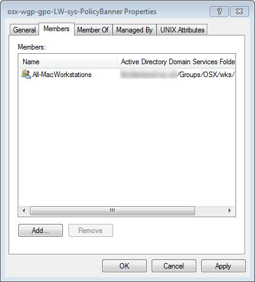
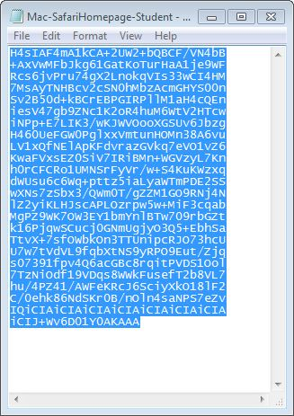

# LabWarden

## Brief

Custom Policies for MacOS that can be distributed via AD or an MDM

## Introduction

LabWarden is a suite of policy scripts that control different aspects of MacOS.

These policies use mobileconfig files as a way to specify policy "options" and to determine how the policy is "triggered".

LabWarden policies can be triggered by various system events - such as System Boot, User Login, Application Launch, Application Quit, etc.

In an AD setup, LabWarden allows mobileconfig files to be stored directly within AD without having to extend the AD schema. This provides a mechanism to "scope" policies to specific users and workstations.

In a non-AD setup, LabWarden mobileconfigs can be installed manually - or by your MDM server.

See "Quick Demo 1" below to get a quick idea of what LabWarden is all about.

## Installation

Download the LoginHookWarden zip archive from <https://github.com/execriez/LabWarden>, then unzip the archive on a Mac workstation.

Ideally, to install - you should double-click the following installer package which can be found in the "SupportFiles" directory.

	LabWarden.pkg
	
If the installer package isn't available, you can run the command-line installer which can be found in the "util" directory:

	sudo Install

The installer will install the following files and directories:

	/Library/LaunchAgents/com.github.execriez.labwarden.appwarden.plist
	/Library/LaunchAgents/com.github.execriez.labwarden.Sys-LoginWindow.plist
	/Library/LaunchAgents/com.github.execriez.labwarden.Sys-LoginWindowPoll.plist
	/Library/LaunchAgents/com.github.execriez.labwarden.Usr-AtDesktop.plist
	/Library/LaunchAgents/com.github.execriez.labwarden.Usr-Poll.plist
	/Library/LaunchDaemons/com.github.execriez.labwarden.ADwarden.plist
	/Library/LaunchDaemons/com.github.execriez.labwarden.ConsoleUserWarden.plist
	/Library/LaunchDaemons/com.github.execriez.labwarden.NetworkStatusWarden.plist
	/Library/LaunchDaemons/com.github.execriez.labwarden.Sys-Boot.plist
	/Library/LaunchDaemons/com.github.execriez.labwarden.Sys-Poll.plist
	/usr/LabWarden/

You should note that by default, LabWarden does not make use of Login and Logout hooks - so can be installed side-by-side with projects that do.

After installation, you should reboot.

## Uninstalling

To uninstall you should double-click the following uninstaller package which can be found in the "SupportFiles" directory.

	LabWarden-Uninstaller.pkg
	
If the uninstaller package isn't available, you can uninstall from a shell by typing the following:

	sudo /usr/local/LabWarden/util/Uninstall

The uninstaller will uninstall the following files and directories:

	/Library/LaunchAgents/com.github.execriez.labwarden.appwarden.plist
	/Library/LaunchAgents/com.github.execriez.labwarden.Sys-LoginWindow.plist
	/Library/LaunchAgents/com.github.execriez.labwarden.Sys-LoginWindowPoll.plist
	/Library/LaunchAgents/com.github.execriez.labwarden.Usr-AtDesktop.plist
	/Library/LaunchAgents/com.github.execriez.labwarden.Usr-Poll.plist
	/Library/LaunchDaemons/com.github.execriez.labwarden.ADwarden.plist
	/Library/LaunchDaemons/com.github.execriez.labwarden.ConsoleUserWarden.plist
	/Library/LaunchDaemons/com.github.execriez.labwarden.NetworkStatusWarden.plist
	/Library/LaunchDaemons/com.github.execriez.labwarden.Sys-Boot.plist
	/Library/LaunchDaemons/com.github.execriez.labwarden.Sys-Poll.plist
	/usr/LabWarden/

After you uninstall, you should reboot.
	

## Quick Demo 1

The following is a quick demo that attempts to show what LabWarden is all about - so that you can quickly decide if it's of any use to you. 

This demo shows how to manually deploy the "Gen-ExamplePolicy" policy to a workstation.

The "Gen-ExamplePolicy" policy is an example policy that uses the 'say' command to speak when it receives different events.

This demonstrates how the LabWarden provided custom policies work - how they only execute when triggered by an event, and how they initiate a different action depending on the event

It also hints at how you could use LabWarden to deploy your own custom policy script that does something specific when triggered by a particular event.

* Download, then install LabWarden as per the installation instructions.
* Open the directory "/SupportFiles/Examples/MobileConfig/LabWarden"
* Double-click the file "LW-Gen-ExamplePolicy.mobileconfig".

You will be asked if you wish to install the mobileconfig...

>

* Click "Continue".

The "Gen-ExamplePolicy" will be installed... policies are activated as soon as you install their associated mobileconfig files. 

>

Now that the policy is activated - we can test it - try the following.

* Log out
* Log in
* Launch an application
* Quit an application
* Switch to another user
* Log out
* Reboot

When you are done testing - uninstall the "Gen-ExamplePolicy" mobileconfig. This will deactivate the associated policy.
	
A quick description of the available policies can be found in the "LabWarden Policies (brief)" section later.

Please read this section and if you decide you have no use for LabWarden, follow the uninstall instructions from the "Uninstalling" section above.

## Quick Demo 2

This example shows how to deploy a PolicyBanner to a group of AD bound workstations.

Download, then install LabWarden as per the installation instructions.

Look in the "/SupportFiles/Examples/MobileConfig/LabWarden/" directory for the file "LW-Sys-PolicyBanner.mobileconfig".

Open the file in a text editor.

	<?xml version="1.0" encoding="UTF-8"?>
	<!DOCTYPE plist PUBLIC "-//Apple//DTD PLIST 1.0//EN" "http://www.apple.com/DTDs/PropertyList-1.0.dtd">
	<plist version="1.0">
	<dict>
		<key>PayloadContent</key>
		<array>
			<dict>
				<key>5FA0F0B2-2B68-4ACD-B650-5B44AE436C75</key>
				<dict>
					<key>Config</key>
					<dict>
						<key>Text</key>
						<string>Anyone whose behaviour
	is not in accordance with this Code of Practice
	may be subject to withdrawal of network access
	and subject to the disciplinary procedure.
	
	This is in keeping with the
	Disciplinary regulations.</string>
						<key>Title</key>
						<string>By clicking Accept,
	you are agreeing to abide by the
	Acceptable Use Policy.</string>
					</dict>
					<key>Name</key>
					<string>Sys-PolicyBanner</string>
					<key>TriggeredBy</key>
					<array>
					<string>Sys-Boot</string>
					</array>
				</dict>
				<key>PayloadEnabled</key>
				<true/>
				<key>PayloadIdentifier</key>
				<string>5FA0F0B2-2B68-4ACD-B650-5B44AE436C75</string>
				<key>PayloadType</key>
				<string>com.github.execriez.LabWarden</string>
				<key>PayloadUUID</key>
				<string>5FA0F0B2-2B68-4ACD-B650-5B44AE436C75</string>
				<key>PayloadVersion</key>
				<integer>1</integer>
			</dict>
		</array>
		<key>PayloadDescription</key>
		<string></string>
		<key>PayloadDisplayName</key>
		<string>LW Sys-PolicyBanner</string>
		<key>PayloadIdentifier</key>
		<string>AD787CCA-C943-4B1F-A06C-CEAD6479EE57</string>
		<key>PayloadOrganization</key>
		<string></string>
		<key>PayloadRemovalDisallowed</key>
		<true/>
		<key>PayloadScope</key>
		<string>System</string>
		<key>PayloadType</key>
		<string>Configuration</string>
		<key>PayloadUUID</key>
		<string>AD787CCA-C943-4B1F-A06C-CEAD6479EE57</string>
		<key>PayloadVersion</key>
		<integer>1</integer>
	</dict>
	</plist>
	
Edit the file to reflect your own acceptable use or IT policy, then save the changes.

Next, in a shell type:

	/usr/local/LabWarden/util/PackForDeployment ~/Desktop/LabWarden/SupportFiles/Examples/MobileConfig/LabWarden/LW-Sys-PolicyBanner.mobileconfig
	
Replace ~/Desktop/... with the location of the "LW-Sys-PolicyBanner.mobileconfig" file.

This will create a subfolder containing the packed version of the mobileconfig file. Take a look at the file.

>The file contains a compressed version of the policy in a form that can be copied into the Notes field of an AD group.
>
>

Move to a PC containing the "Microsoft Management Console" (MMC).

Open up the text file that we just created, then copy all the text.

>

Run an MMC as a user who has permission to create and edit AD groups.

Create an AD group in a convenient OU.

In the example, I have named the group "osx-wgp-gpo-LW-Sys-PolicyBanner". The name doesn't matter (except to yourself and other sysadmins).

Open up the properties for the group. In the "General" tab, paste the text into the "Notes" field.

>

Select the "Members" tab and add a workstation, or group of workstations that you want to apply the policy to. This is the "Scope" of the policy.

>

Click "OK"

There is generally a delay (typically 10 minutes) between updating AD and experiencing the changes.

Also, LabWarden generally only updates it's policies at defined intervals. If you want to see the changes applied to a workstation immediately - do the following:

	Wait 10 minutes (typically)
	Or in a Terminal, type the following:
		sudo /usr/local/LabWarden/util/gpupdate -force

>The Policy Banner will be shown on the login window of all associated workstations:
>
>
>

## Quick Demo 3

This example shows how to deploy the Mac-SafariHomepage MacOS mobileconfig to a user or group of users. This particular file is a standard MacOS mobileconfig.

Look in the "/SupportFiles/Examples/MobileConfig/MacOS" directory for the file "Mac-SafariHomepage.mobileconfig".

Open the file in a text editor.

Edit the file to change the "HomePage", then save as a new file called "Mac-SafariHomepage-student.mobileconfig".

	<key>mcx_preference_settings</key>
	<dict>
		<key>LastSafariVersionWithWelcomePage</key>
		<string>999.0</string>
		<key>HomePage</key>
		<string>https://github.com/execriez</string>
		<key>NewTabBehavior</key>
		<integer>4</integer>
		<key>NewWindowBehavior</key>
		<integer>0</integer>
	</dict>

Next, in a shell type:

	/usr/local/LabWarden/util/PackForDeployment ~/Desktop/LabWarden/SupportFiles/Examples/MobileConfig/MacOS/Mac-SafariHomepage.mobileconfig
	
Replace ~/Desktop/... with the location of the modified mobileconfig.

This will create a subfolder containing the packed version of the mobileconfig file. Take a look at the file.

>The file contains a compressed version of the policy in a form that can be copied into the Notes field of an AD group.
>
>

Move to a PC containing the "Microsoft Management Console" (MMC).

Open up the text file that we just created, then copy all the text.

>

Run an MMC as a user who has permission to create and edit AD groups.

Create an AD group in a convenient OU.

In the example, I have named the group "osx-wgp-gpo-Mac-SafariHomepage-Student". The name doesn't matter (except to yourself and other sysadmins).

Open up the properties for the group. In the "General" tab, paste the text into the "Notes" field.

>

Select the "Members" tab and add a user, or group of users that you want to apply the policy to. This is the "Scope" of the policy.

>

Click "OK"

There is generally a delay (typically 10 minutes) between updating AD and experiencing the changes.

Also, LabWarden generally only updates it's policies at defined intervals. If you want to see the changes applied to a workstation immediately - do the following:

	Wait 10 minutes (typically)
	In a Terminal, type the following:
		sudo /usr/local/LabWarden/util/gpupdate -force

>Because you chose to apply the policy to a user or group of users - the mobileconfig will be pulled down as a "User Profile" and installed when an associated user logs in.
>
>
>
>If you had chosen to apply the policy to a workstation, or group of workstations - the mobileconfig would be pulled down as a "Device Profile".

## Quick Demo 4

The Notes field in AD is limited to 1024 characters - so what do you do when you have a config that is too big to fit within this limit?

Take a look at the mobileconfig called **Mac-NoWebSpotlight.mobileconfig**

In a shell type 

	/usr/local/LabWarden/util/PackForDeployment ~/Desktop/LabWarden/SupportFiles/SupportFiles/Examples/MobileConfig/MacOS/Mac-NoWebSpotlight.mobileconfig
	
Replace ~/Desktop/... with the location of the example mobileconfig.

This will create a subfolder containing the packed version of the mobileconfig file. 

Take a look at in the folder. There are two files "Mac-NoWebSpotlight-0.txt" and "Mac-NoWebSpotlight-1.txt". The mobileconfig was too big to compress into a single 1024 byte file - so was split into two.

This is OK, we just need to copy the text into the Notes field of two groups and then make sure that the user or workstation is a member of both groups.

The most logical solution is actually to create three groups.

Run an MMC as a user who has permission to create and edit AD groups. Create the following two groups and copy the appropriate text into the relevant notes field:

	osx-wgp-gpo-Mac-NoWebSpotlight-0
	osx-wgp-gpo-Mac-NoWebSpotlight-1

Next create the following group, and make it a member of the previous two groups:

	osx-wgp-gpo-Mac-NoWebSpotlight

Any user or workstation that is a member of the osx-wgp-gpo-Mac-NoWebSpotlight group, will get the complete mobileconfig.

## MacOS mobileconfig files

Here is a list of standard MacOS mobileconfig files included with LabWarden.

	Mac-NoDSStoreOnNetwork.mobileconfig     - Stops .DS_Store files from being written to a network drive
	Mac-NoNewDiskBackupOffer.mobileconfig   - Stops Time Machine from asking to use new drives as a backup
	Mac-NoOffice2011Updates.mobileconfig    - Stops the initial Setup in MS Office 2011
	Mac-NoReopenWindows.mobileconfig        - Stops open windows being re-opened at next login
	Mac-NoWebSpotlight.mobileconfig         - Stops Spotlight from searching the web
	Mac-NoiCloudOrSiriSetup.mobileconfig    - Stops the initial iCloud and Siri setup
	Mac-NoiCloudSetup-10v9.mobileconfig     - Stops the initial iCloud setup (Legacy - OS specific)
	Mac-NoiCloudSetup-10v10.mobileconfig
	Mac-NoiCloudSetup-10v11.mobileconfig
	Mac-NoiCloudSetup-10v12.mobileconfig
	Mac-NoiCloudSetup-10v13.mobileconfig
	Mac-RightClick.mobileconfig            - Enables right click on the mouse
	Mac-SafariHomepage.mobileconfig        - Sets the homepage in Safari
	Mac-UKLocale.mobileconfig              - Enables the UK locale

You can find other examples of OS X specific mobileconfigs on the web, these are good references (as of writing):

<https://github.com/gregneagle/profiles>

<https://github.com/nmcspadden/profiles>

<https://github.com/amsysuk/public_config_profiles>

## LabWarden mobileconfig files

The goal of a LabWarden policy is to do things that cannot yet be achieved via a standard MacOS mobileconfig.

A LabWarden Policy is a script and an associated custom mobileconfig file that holds the script options.

LabWarden Policy Scripts can be triggered by system events or user events. They will run as root if triggered by a system event, or as a normal user if triggered by a user event.

Here is a list of example LabWarden specific mobileconfig files included with LabWarden:

	LW-App-DeleteDataOnQuit.mobileconfig                    - Deletes various Adobe Premiere Pro, Chrome and Chromium application data files when the application quits.
	LW-App-ExamplePolicy.mobileconfig                       - Activates the example Application Policy script (A blank canvas)
	LW-App-FirefoxFirstSetup.mobileconfig                   - Creates a blank Firefox profile at first launch.
	LW-App-FirefoxFixForNetworkHomes.mobileconfig           - Sets up Firefox so that it can run on network homes.
	LW-App-Restrict.mobileconfig                            - Restricts the use of the Terminal.app and prevents application launches from user home areas and external drives.
	LW-App-ShowHints.mobileconfig                           - Shows application specific hints when Logic Pro X or Adobe Premiere Pro are launched.
	LW-Gen-Debug.mobileconfig                               - Writes internal variable debug info to a config file at "Sys-Boot" and "Usr-AtDesktop" events
	LW-Gen-ExamplePolicy.mobileconfig                       - Activates the example General Policy script (A blank canvas)
	LW-Gen-OfficeHours.mobileconfig                         - Enforces User Access to specific Opening Hours and collects usage stats
	LW-Gen-UnloadAgentsAndDaemons-proxypopups.mobileconfig  - Unloads the "com.apple.UserNotificationCenter" Daemon to prevent proxy-popups. Does not work on 10.12+ when SIP is enabled.
	LW-Sys-ADCompCert8021XWiFi.mobileconfig                 - When modified, can request and install a computer certificate from a certificate authority server and then set up Wi-Fi for 802.1X.
	LW-Sys-ADTrustAccountProxyAccess.mobileconfig           - Gives certain processes access through a proxy using AD workstation credentials.
	LW-Sys-ADUserExperience-HomeForceLocal.mobileconfig     - Enables "Force local home directory on startup disk" as determined by the "User Experience" tab of the Directory Utility app.
	LW-Sys-ADUserExperience-HomeOnNetwork.mobileconfig      - Enforces network homes by disabling "Force local home directory on startup disk".
	LW-Sys-ADUserExperience-Mobile.mobileconfig             - Enforces mobile accounts by enabling "Create mobile account at login".
	LW-Sys-AddEntriesToHostsFile.mobileconfig               - Adds entries to the /etc/hosts file.
	LW-Sys-AddPrinter-MarketingLaser2020.mobileconfig       - Example of how to Add a SMB printer
	LW-Sys-AddPrinter-MarketingLaser2020direct.mobileconfig - Example of how to Add a network printer
	LW-Sys-Defaults-Debug.mobileconfig                      - Over-rides inbuilt hard-coded defaults to enable debug messages in the log.
	LW-Sys-Defaults.mobileconfig                            - Over-rides inbuilt hard-coded defaults.
	LW-Sys-DeleteFiles-FlashPlayer.mobileconfig             - Deletes files from the system volume - in this example, Adobe Flash Player. It will reboot after the files have been deleted.
	LW-Sys-DeleteOldUserProfiles.mobileconfig               - Deletes network user local homes when they havent been accessed for 62 days, or when the disk space is less than 2 Gigabytes.
	LW-Sys-ExamplePolicy.mobileconfig                       - Activates the example System Policy script (A blank canvas)
	LW-Sys-InstallPackageFromFolder.mobileconfig            - Installs packages from /usr/local/Updates when the system is idle at the LoginWindow
	LW-Sys-NetworkProxy-AutoProxy.mobileconfig              - Sets system Network Proxy options to auto.
	LW-Sys-PolicyBanner.mobileconfig                        - Sets a policy banner which is displayed at the Login Window.
	LW-Sys-RemoteManagement.mobileconfig                    - Sets up remote access for local users, network users and network groups.
	LW-Sys-RestartIfNetMount.mobileconfig                   - Will reboot if the workstation is at the LoginWindow and the system detects that there is a network drive mounted.
	LW-Sys-SleepSettings-10mins.mobileconfig                - Sets the screen to sleep after 10 mins.
	LW-Sys-SleepSettings-never.mobileconfig                 - Sets the screen to never sleep.
	LW-Sys-TimeServer-Apple.mobileconfig                    - Sets the system time (ntp) server
	LW-Sys-Update-Radmind.mobileconfig                      - Sets the custom update script.
	LW-Sys-UpdatePackage.mobileconfig                       - Updates an installed package to a later version, in this example LabWarden itself.
	LW-Sys-WirelessForgetSSID.mobileconfig                  - Forgets a list of wireless SSIDs and associated passwords.
	LW-Sys-WirelessSetState-off.mobileconfig                - Turns wireless off.
	LW-Sys-WirelessSetState-on.mobileconfig                 - Turns wireless on and allows non admins to switch networks.
	LW-Sys-WorkstationInfo.mobileconfig                     - Updates the loginwindow text and RemoteDesktop Info Fields with workstation info.
	LW-Usr-CheckQuotaOnNetHome.mobileconfig                 - Checks if a users network drive is getting full.
	LW-Usr-CreateFolder.mobileconfig                        - Creates folders in the users home folder at login.
	LW-Usr-DefaultHandlers.mobileconfig                     - Sets the default handlers for specific file types.
	LW-Usr-DesktopWallpaperURI.mobileconfig                 - Sets the user Desktop Wallpaper to be a file on a server.
	LW-Usr-DockContent.mobileconfig                         - Sets the user Dock content (makes use of dockutil).
	LW-Usr-ExamplePolicy.mobileconfig                       - Activates the example User Policy script (A blank canvas)
	LW-Usr-HomeMakePathRedirections.mobileconfig            - Creates symbolic links between a network users network home and local home at login.
	LW-Usr-KeychainFix.mobileconfig                         - Attempts to fix Keychain issues caused by password reset issues.
	LW-Usr-SidebarContent.mobileconfig                      - Sets the user sidebar contents (makes use of mysides).
	LW-Usr-SpotlightSettingOnNetHome-off.mobileconfig       - Disables Spotlight on a users network home
	LW-Usr-SpotlightSettingOnNetHome-on.mobileconfig        - Enables Spotlight on a users network home
	LW-Usr-SyncLocalHomeToNetwork.mobileconfig              - Syncs specified folders between the users local home and his network home.

## System Events (system policy triggers)

System events trigger policies that run as the root user:

### Sys-Boot
Triggered at boot up

### Sys-LoginWindow
Triggered at the login window

### Sys-LoginWindowPoll
Triggered every 5 minutes when at the login window

### Sys-LoginWindowIdle
Triggered after 5 minutes of no user interaction when at the login window. If the user remains idle, the event will retrigger every 5 minutes.

### Sys-NetworkUp
Triggered when the primary network comes up, or changes.

### Sys-NetworkDown
Triggered when the primary network goes down.

### Sys-ConsoleUserLoggedIn
Triggered after a user logs in.

### Sys-ConsoleUserLoggedOut
Triggered after a user logs out.

### Sys-ConsoleUserSwitch
Triggered when fast user switching to a new user.

### Sys-Poll
Triggered every 4 minutes

### Sys-Idle
Triggered after 4 minutes of no user interaction. If the user remains idle, the event will retrigger every 4 minutes.

### Sys-ActiveDirectoryUp
Triggered when Active Directory becomes available

### Sys-ActiveDirectoryDown
Triggered when Active Directory becomes unavailable

### Sys-PolicyInstall
Passed to a policy as an event when the policy is first installed

### Sys-PolicyUninstall
Passed to a policy as an event when the policy is uninstalled

## User Events (user policy triggers)

User events trigger policies that run as a normal logged-in user:

### App-WillLaunch
Triggered as an application is launching.

### App-DidLaunch
Triggered after an application has launched.

### App-DidTerminate
Triggered after an application has quit.

### Usr-ConsoleUserLoggedIn
Triggered after a user logs in.

### Usr-AtDesktop
Triggered when the desktop loads just after a user logs in.

### Usr-Poll
Triggered every 3 minutes when a user is logged in

### Usr-Idle
Triggered every 3 minutes when a user is logged and there has been no user interaction for over 3 minutes

### Usr-PolicyInstall
Passed to a policy as an event when the policy is first installed

### Usr-PolicyUninstall
Passed to a policy as an event when the policy is uninstalled

## LabWarden Policies

Following is a detailed list of policy scripts. Policy script options are contained in an associated mobileconfig file.

### App-DeleteDataOnQuit
This policy script deletes application data when an application quits. It is called as the user and triggered by an **App-DidTerminate** event.

	<key>Config</key>
	<dict>
		<key>AppData</key>
		<array>
			<dict>
				<key>ApplicationBundleIdentifier</key>
				<string>com.adobe.AdobePremierePro</string>
				<key>Path</key>
				<array>
					<string>/Library/Application Support/Adobe/Common/Media Cache Files/</string>
					<string>/Library/Application Support/Adobe/Common/Media Cache/</string>
				</array>
			</dict>
			<dict>
				<key>ApplicationBundleIdentifier</key>
				<string>org.chromium.Chromium</string>
				<key>Path</key>
				<array>
					<string>/Library/Application Support/Chromium/Default/Pepper Data/</string>
				</array>
			</dict>
			<dict>
				<key>ApplicationBundleIdentifier</key>
				<string>com.google.Chrome</string>
				<key>Path</key>
				<array>
					<string>/Library/Application Support/Google/Chrome/Default/Pepper Data/</string>
				</array>
			</dict>
		</array>
	</dict>
	<key>Name</key>
	<string>App-DeleteDataOnQuit</string>
	<key>TriggeredBy</key>
	<array>
		<string>App-DidTerminate</string>
	</array>

The **AppData** array contains an **ApplicationBundleIdentifier** followed by a **Path** array containing the paths that should be deleted when the stated application quits. Paths are relative to the user home.

In the above example, the ApplicationBundleIdentifier **com.apple.finder** is followed by the Path **/.Trash/**. This will cause the contents of **~/.Trash/** to be deleted when the Finder quits (at user log out).

The config also contains entries for Google Chrome, Chromium and Adobe Premiere that will delete application data when each of these applications is quit.

The example policy config should be configured to your own needs.

### App-ExamplePolicy
This is an example Application Policy script (A blank canvas). It is called as the user and triggered by the **App-WillLaunch** , **App-DidLaunch** and **App-DidTerminate** events.

	<key>Config</key>
	<dict>
		<key>ExampleArray</key>
		<array>
			<string>First</string>
			<string>Second</string>
			<string>Third</string>
		</array>
		<key>ExampleBool</key>
		<true/>
		<key>ExampleNum</key>
		<integer>42</integer>
		<key>ExampleString</key>
		<string>Example</string>
	</dict>
	<key>Name</key>
	<string>App-ExamplePolicy</string>
	<key>TriggeredBy</key>
	<array>
		<string>App-WillLaunch</string>
		<string>App-DidLaunch</string>
		<string>App-DidTerminate</string>
	</array>
	
### App-FirefoxFirstSetup
This policy script sets up Firefox first run behaviour. It is called as the user and triggered by an **App-WillLaunch** event.

	<key>Name</key>
	<string>App-FirefoxFirstSetup</string>
	<key>TriggeredBy</key>
	<array>
		<string>App-WillLaunch</string>
	</array>
	
The policy creates a blank Firefox profile at first launch - so that users aren't asked to create one.

There are no configurable parameters.

### App-FirefoxFixForNetworkHomes
This policy script sets up Firefox so that it can run on network homes. It is called as the user and triggered by the **App-WillLaunch** and **App-DidTerminate** events.

	<key>Name</key>
	<string>App-FirefoxFixForNetworkHomes</string>
	<key>TriggeredBy</key>
	<array>
		<string>App-WillLaunch</string>
		<string>App-DidTerminate</string>
	</array>

When user homes are on the network (i.e. not forced local) - then Firefox has trouble placing file locks on the files places.sqlite-shm, webappsstore.sqlite-shm and cookies.sqlite-shm - preventing the Firefox from loading.

This policy creates symbolic links to local versions of the files during application launch, and then deletes the symbolic links when the application quits.

There are no configurable parameters.

### App-Restrict
This policy script restricts application usage depending on a blacklist or whitelist. It is called as the user and triggered by an **App-WillLaunch** event.

The example config contains the following:

	<key>Config</key>
	<dict>
		<key>BlackList</key>
		<array>
			<dict>
				<key>ApplicationBundleIdentifier</key>
				<string>com\.apple\.Terminal</string>
				<key>ApplicationName</key>
				<string>Terminal</string>
			</dict>
		</array>
		<key>ExceptionList</key>
		<array>
			<dict>
				<key>ApplicationBundleIdentifier</key>
				<string>com\.apple\.print\.PrinterProxy</string>
				<key>ApplicationName</key>
				<string>PrinterProxy</string>
			</dict>
			<dict>
				<key>ApplicationBundleIdentifier</key>
				<string>com\.google\.Chrome\.app\..*</string>
				<key>ApplicationName</key>
				<string>.*</string>
			</dict>
			<dict>
				<key>ApplicationBundleIdentifier</key>
				<string>com\.citrixonline\.mac\.WebDeploymentApp</string>
				<key>ApplicationName</key>
				<string>Citrix Online Launcher</string>
			</dict>
			<dict>
				<key>ApplicationBundleIdentifier</key>
				<string>com\.citrixonline\.GoToMeeting</string>
				<key>ApplicationName</key>
				<string>GoToMeeting.*</string>
			</dict>
		</array>
		<key>OnlyAllowLocalApps</key>
		<true/>
		<key>PathBlackList</key>
		<array>
			<string>~/.*</string>
		</array>
	</dict>
	<key>Name</key>
	<string>App-Restrict</string>
	<key>TriggeredBy</key>
	<array>
		<string>App-WillLaunch</string>
	</array>

This policy restricts what Apps users can launch.

If the **WhiteList** is not null, then these Applications (and only these) are allowed. When the WhiteList is not null, then it should at least contain:

		<key>WhiteList</key>
		<array>
			<dict>
				<key>ApplicationBundleIdentifier</key>
				<string>com\.apple\.Finder</string>
				<key>ApplicationName</key>
				<string>Finder</string>
			</dict>
		</array>

Any Application in the **BlackList** is always disallowed for non-admins. The example BlackList contains the following, which prevents non-admins from launching the Terminal App:

		<key>BlackList</key>
		<array>
			<dict>
				<key>ApplicationBundleIdentifier</key>
				<string>com\.apple\.Terminal</string>
				<key>ApplicationName</key>
				<string>Terminal</string>
			</dict>
		</array>

Any Application defined in the **ExceptionList** is exempt from Whitelist/BlackList checking. This allows you to have Apps that will run from any location without having to implement a whitelist.

The example ExceptionList contains the following, which allows the Printer Proxy App to run. The printer proxy App always runs from the user home - without this entry - the user would not be able to print.

		<key>ExceptionList</key>
		<array>
			<dict>
				<key>ApplicationBundleIdentifier</key>
				<string>com\.apple\.print\.PrinterProxy</string>
				<key>ApplicationName</key>
				<string>PrinterProxy</string>
			</dict>
		</array>

Regular expressions can be used.

If the path **WhiteList** is not null, then Applications at the specified paths (and only these paths) are allowed. When the path WhiteList is not null, it should at least contain:
	
		<key>PathWhiteList</key>
		<array>
			<string>^/Applications/.*$</string>
			<string>^/System/Library/CoreServices/.*$</string>
		</array>

Regular expressions should be used. ~/ is expanded to the current user home before comparison.

Any application located at a path in the **PathBlackList** is always disallowed for non-admins.

The example PathBlackList contains the following, which prevents users from launching Applications from their home area.

		<key>PathBlackList</key>
		<array>
			<string>~/.*</string>
		</array>

Regular expressions can be used. ~/ is expanded to the current user home before comparison.

Finally, the **OnlyAllowLocalApps** key prevents Apps from running from mounted Volumes/Filesystems (USB sticks and network stores).

		<key>OnlyAllowLocalApps</key>
		<true/>

The example policy config should be configured to your own needs.

### App-ShowHints
This policy script shows a hint when a specified application opened. It is called as the user and triggered by an **App-WillLaunch** event. This script uses CocoaDialog.

The config consista of a single array called **AppHint**. 

Each entry in the array should contain at least an **ApplicationBundleIdentifier** key, a **MessageTitle** key and a **MessageContent** key.

You can also optionally define **IsAdmin**, **IsLocalAccount** and **IsLocalHome**. The message hint will only be shown if the status of these keys (true/false) match the status of the current user.

	<key>Config</key>
	<dict>
		<key>AppHint</key>
		<array>
			<dict>
				<key>ApplicationBundleIdentifier</key>
				<string>com.apple.logic10</string>
				<key>IsAdmin</key>
				<false/>
				<key>IsLocalAccount</key>
				<false/>
				<key>IsLocalHome</key>
				<false/>
				<key>MessageContent</key>
				<string>APPNAME works better off network</string>
			</dict>
			<dict>
				<key>ApplicationBundleIdentifier</key>
				<string>com.adobe.AdobePremierePro</string>
				<key>MessageContent</key>
				<string>Setup your Media Cache File location (Premiere&gt;Preferences&gt;Media)</string>
			</dict>
		</array>
	</dict>
	<key>Name</key>
	<string>App-ShowHints</string>
	<key>TriggeredBy</key>
	<array>
		<string>App-DidLaunch</string>
	</array>

The example policy config should be configured to your own needs.

### Gen-Debug

Writes internal global variables info to the policy prefs. You should modify the **TriggeredBy** array to catch the events that you wish to debug.

	<key>Name</key>
	<string>Gen-Debug</string>
	<key>TriggeredBy</key>
	<array>
		<string>Sys-Boot</string>
		<string>Usr-AtDesktop</string>
	</array>

### Gen-ExamplePolicy

This is an example General Policy script which could be used as a blank canvas for your own general policy. A general policy is one that could be called as root or user. This policy uses the 'say' command to speak whenever it is triggered by an event - and is useful in its current form as a way to determine when and if events are actually happening.

	<key>Config</key>
	<dict>
		<key>ExampleArray</key>
		<array>
			<string>First</string>
			<string>Second</string>
			<string>Third</string>
		</array>
		<key>ExampleBool</key>
		<true/>
		<key>ExampleNum</key>
		<integer>42</integer>
		<key>ExampleString</key>
		<string>Example</string>
	</dict>
	<key>Name</key>
	<string>Gen-ExamplePolicy</string>
	<key>TriggeredBy</key>
	<array>
		<string>App-WillLaunch</string>
		<string>App-DidLaunch</string>
		<string>App-DidTerminate</string>
		<string>Usr-AtDesktop</string>
		<string>Usr-Poll</string>
		<string>Usr-Idle</string>
		<string>Sys-Boot</string>
		<string>Sys-ConsoleUserLoggedIn</string>
		<string>Sys-ConsoleUserLoggedOut</string>
		<string>Sys-ConsoleUserSwitch</string>
		<string>Sys-Poll</string>
		<string>Sys-Idle</string>
		<string>Sys-LoginWindow</string>
		<string>Sys-LoginWindowPoll</string>
		<string>Sys-LoginWindowIdle</string>
		<string>Sys-NetworkUp</string>
		<string>Sys-NetworkDown</string>
		<string>Sys-ActiveDirectoryUp</string>
	</array>

### Gen-OfficeHours

This policy can restrict user logins to defined office-hours. It can also produce some simple stats that show how much a workstation is used during those hours. 

This policy is useful to force log-outs at the end of the day, and to determine which are your most and least used machines.

To use this policy, you need to define normal office-hours, office-hours during breaks, and dates when the office is not open at all.

The **ActiveForDates** key determines the dates for which the policy is active. 

The ActiveForDates **Start** key defines the day/month/year on which to activate the policy. Once the policy is activated, it begins restricting logins and collecting usage data. 

Once deployed, if you change the 'Start' key, all data collection will be reset to zero.

The ActiveForDates **End** key defines the day/month/year on which to de-activate the policy. Once the policy is de-activated, it stops restricting logins and collecting usage data.

You should change the 'End' key whenever you update the info for breaks and closed periods. It should match the last known date at which your office-hours info is valid.

Defining an 'End' key prevents users from being logged out in error, and makes the stats more accurate - should you forget to update the office-hours info on time. 

	<key>ActiveForDates</key>
	<dict>
		<key>Start</key>
		<dict>
			<key>Day</key>
			<integer>25</integer>
			<key>Month</key>
			<integer>11</integer>
			<key>Year</key>
			<integer>2016</integer>
		</dict>
		<key>End</key>
		<dict>
			<key>Day</key>
			<integer>28</integer>
			<key>Month</key>
			<integer>8</integer>
			<key>Year</key>
			<integer>2017</integer>
		</dict>
	</dict>

The **LogoutUserOutOfHours** key specifies whether or not we should restrict usage to office-hours.

		<key>LogoutUserOutOfHours</key>
		<true/>

The **LogoutWarningSecs** specifies what to do when we are approaching closing time. A value of 600 means that users will get warnings about being logged-off, 10 minutes before closing.

		<key>LogoutWarningSecs</key>
		<integer>600</integer>

The **ForceLogoutExceptionGroup** array contains a list of user groups that will never be logged off.

		<key>ForceLogoutExceptionGroup</key>
		<array>
			<string>All-Staff</string>
		</array>

The **LoginEarlySecs** key specifiies how many seconds before office opening we should allow user logins. The **LogoutEarlySecs** key specifies how many seconds before office closing, we should log users out. 

In the example below, we allow logins an hour before opening time - and we log users out 10 minutes before closing time.

		<key>LoginEarlySecs</key>
		<integer>3600</integer>
		<key>LogoutEarlySecs</key>
		<integer>600</integer>

The **UnrestrictedHoursOnClosedDays** key specifies whether we should relax all restrictions on days when the office is defined as closed. This is useful during long closed periods to allow occasional drop-in sessions.

		<key>UnrestrictedHoursOnClosedDays</key>
		<true/>

The **LogoutUsr-IdleSecs** key specifies how long a user is allowed to be idle before being logged out. The value 1800 below means that users will be logged out after 30 mins of idleness. A value of 0 means that users will never be logged out. Users that are members of a group defined in the ForceLogoutExceptionGroup array will not be logged out.

		<key>LogoutUsr-IdleSecs</key>
		<integer>1800</integer>

You should note that idle user logout can also be achieved via a mobileconfig.

The **AuditHideUntilAgeSecs** key specifies how long we should collect data before displaying stats in the LoginWindow. The value below means that we collect data for 7 days before displaying 'Avg Use' percentages.

		<key>AuditHideUntilAgeSecs</key>
		<integer>604800</integer>

The **NormalHours** dict specifies opening times for Monday (Day1) through Sunday (Day7). In this example, the lab is open 8:30 until 21:00 Mon-Thu, 8:30 until 17:00 on Fri, and closed on Saturday and Sunday.

	<key>NormalHours</key>
	<dict>
		<key>Day1</key>
		<dict>
			<key>CloseTime</key>
			<string>21:00</string>
			<key>OpenTime</key>
			<string>8:30</string>
		</dict>
		<key>Day2</key>
		<dict>
			<key>CloseTime</key>
			<string>21:00</string>
			<key>OpenTime</key>
			<string>8:30</string>
		</dict>
		<key>Day3</key>
		<dict>
			<key>CloseTime</key>
			<string>21:00</string>
			<key>OpenTime</key>
			<string>8:30</string>
		</dict>
		<key>Day4</key>
		<dict>
			<key>CloseTime</key>
			<string>21:00</string>
			<key>OpenTime</key>
			<string>8:30</string>
		</dict>
		<key>Day5</key>
		<dict>
			<key>CloseTime</key>
			<string>17:00</string>
			<key>OpenTime</key>
			<string>8:30</string>
		</dict>
		<key>Day6</key>
		<dict>
			<key>CloseTime</key>
			<string></string>
			<key>OpenTime</key>
			<string></string>
		</dict>
		<key>Day7</key>
		<dict>
			<key>CloseTime</key>
			<string></string>
			<key>OpenTime</key>
			<string></string>
		</dict>
	</dict>

The **ClosedDays** array specifies periods when a lab is closed. The array contains a list of **start** days and **end** days.

	<key>ClosedDays</key>
	<array>
		<dict>
			<key>Start</key>
			<dict>
				<key>Day</key>
				<integer>23</integer>
				<key>Month</key>
				<integer>12</integer>
				<key>Year</key>
				<integer>2016</integer>
			</dict>
			<key>End</key>
			<dict>
				<key>Day</key>
				<integer>8</integer>
				<key>Month</key>
				<integer>1</integer>
				<key>Year</key>
				<integer>2017</integer>
			</dict>
		</dict>
		<dict>
			<key>Start</key>
			<dict>
				<key>Day</key>
				<integer>14</integer>
				<key>Month</key>
				<integer>4</integer>
				<key>Year</key>
				<integer>2017</integer>
			</dict>
			<key>End</key>
			<dict>
				<key>Day</key>
				<integer>14</integer>
				<key>Month</key>
				<integer>4</integer>
				<key>Year</key>
				<integer>2017</integer>
			</dict>
		</dict>
	</array>	

The **HolidayHours** array specifies periods when a lab has modified opening times. The array contains one or more dicts that contain a **Daterange** array followed by alternate opening hours. In the example below, on the dates 29 Oct 2016 to 6 Nov 2016, and 14 Jan 2017 to 22 Jan 2017, the lab is open Mon-Fri 8:30-16:00.

	<key>HolidayHours</key>
	<array>
		<dict>
			<key>DateRange</key>
			<array>
				<dict>
					<key>Start</key>
					<dict>
						<key>Day</key>
						<integer>29</integer>
						<key>Month</key>
						<integer>10</integer>
						<key>Year</key>
						<integer>2016</integer>
					</dict>
					<key>End</key>
					<dict>
						<key>Day</key>
						<integer>6</integer>
						<key>Month</key>
						<integer>11</integer>
						<key>Year</key>
						<integer>2016</integer>
					</dict>
				</dict>
				<dict>
					<key>Start</key>
					<dict>
						<key>Day</key>
						<integer>14</integer>
						<key>Month</key>
						<integer>1</integer>
						<key>Year</key>
						<integer>2017</integer>
					</dict>
					<key>End</key>
					<dict>
						<key>Day</key>
						<integer>22</integer>
						<key>Month</key>
						<integer>1</integer>
						<key>Year</key>
						<integer>2017</integer>
					</dict>
				</dict>
			</array>
			<key>Day1</key>
			<dict>
				<key>CloseTime</key>
				<string>16:00</string>
				<key>OpenTime</key>
				<string>8:30</string>
			</dict>
			<key>Day2</key>
			<dict>
				<key>CloseTime</key>
				<string>16:00</string>
				<key>OpenTime</key>
				<string>8:30</string>
			</dict>
			<key>Day3</key>
			<dict>
				<key>CloseTime</key>
				<string>16:00</string>
				<key>OpenTime</key>
				<string>8:30</string>
			</dict>
			<key>Day4</key>
			<dict>
				<key>CloseTime</key>
				<string>16:00</string>
				<key>OpenTime</key>
				<string>8:30</string>
			</dict>
			<key>Day5</key>
			<dict>
				<key>CloseTime</key>
				<string>16:00</string>
				<key>OpenTime</key>
				<string>8:30</string>
			</dict>
			<key>Day6</key>
			<dict>
				<key>CloseTime</key>
				<string></string>
				<key>OpenTime</key>
				<string></string>
			</dict>
			<key>Day7</key>
			<dict>
				<key>CloseTime</key>
				<string></string>
				<key>OpenTime</key>
				<string></string>
			</dict>
		</dict>
	</array>

### Gen-UnloadAgentsAndDaemons
This policy unloads (disables) specific Agents and Daemons. It is called as root and triggered by the **Sys-Boot** and **Usr-ConsoleUserLoggedIn** events.

The example config unloads the UserNotificationCenter. This can be useful to prevent unwanted pop-ups if behind a internet proxy.

	<key>Config</key>
	<dict>
		<key>Unload</key>
		<array>
			<string>com.apple.UserNotificationCenter</string>
		</array>
	</dict>
	<key>Name</key>
	<string>Gen-UnloadAgentsAndDaemons</string>
	<key>TriggeredBy</key>
	<array>
		<string>Sys-Boot</string>
		<string>Usr-ConsoleUserLoggedIn</string>
	</array>

The example policy config should be configured to your own needs.

### Sys-ADCompCert8021XWiFi

This policy requests then installs a computer certificate from a certificate authority server, then sets up Wi-Fi for 802.1X. It is called as root and triggered by the **Sys-NetworkUp** event.

To successfully acquire a computer certificate from your certificate server, you need to configure the **CertAuthURL**, **CertTemplate** and **TLSTrustedServerNames** keys.

The **SSIDSTR** key is the SSID of the Wi-Fi network to be used. The **ProxyType** key value should be set to either 'None' or 'Auto'.

The **RenewCertBeforeDays** key allows the certificate to auto-renew when it is about to expire.

The **RevokeCertBeforeEpoch** key allows the certificate to be revoked and renewed if it was issued before a particular date.

	<key>Config</key>
	<dict>
		<key>CertAuthURL</key>
		<string>https://yourcaserver.yourdomain/certsrv</string>
		<key>CertTemplate</key>
		<string>Mac-Computer</string>
		<key>ProxyType</key>
		<string>Auto</string>
		<key>RenewCertBeforeDays</key>
		<integer>28</integer>
		<key>RevokeCertBeforeEpoch</key>
		<integer>0</integer>
		<key>SSIDSTR</key>
		<string>YourSSID</string>
		<key>TLSTrustedServerNames</key>
		<array>
			<string>yourtrustedserver.yourdomain</string>
		</array>
	</dict>
	<key>Name</key>
	<string>Sys-ADCompCert8021XWiFi</string>
	<key>TriggeredBy</key>
	<array>
		<string>Sys-NetworkUp</string>
	</array>

When the policy successfully completes, a device profile that is installed named after your Wi-Fi SSID. This profile contains the Wi-Fi settings and a Computer Certificate.

If there are issues getting a computer certificate, examine the LabWarden system log. The log can be found here: 

	/Library/Logs/com.github.execriez.labWarden.log

### Sys-AddEntriesToHostsFile

This policy adds entries to /etc/hosts. The policy is called as root and triggered by the **Sys-Boot** event.

The config consists of a **Entry** array, containing an **IP4** key (IP address) and a **Host** array. 

The entry will force the specified hosts to resolve to the specified IP address.

	<key>Config</key>
	<dict>
		<key>Entry</key>
		<array>
			<dict>
				<key>Host</key>
				<array>
					<string>prod-w.nexus.live.com.akadns.net</string>
					<string>odc.officeapps.live.com</string>
					<string>omextemplates.content.office.net</string>
					<string>officeclient.microsoft.com</string>
					<string>store.office.com</string>
					<string>nexusrules.officeapps.live.com</string>
					<string>nexus.officeapps.live.com</string>
				</array>
				<key>IP4</key>
				<string>127.0.0.1</string>
			</dict>
		</array>
	</dict>
	<key>Name</key>
	<string>Sys-AddEntriesToHostsFile</string>
	<key>TriggeredBy</key>
	<array>
		<string>Sys-Boot</string>
	</array>

The example config (may) be of help to prevent user being nagged by a log in window when using Office 2016 behind a proxy.

The example policy config should be configured to your own needs.

### Sys-AddPrinter

This policy adds a printer. The policy is called as root and triggered by the **Sys-Boot** and **Sys-Poll** events.

The **DisplayName**, **DeviceURI**, **PPDURI**, **Options** and **Location** keys define printer options. 

The **DeviceURI** key is the address of the printer queue, for example "lpd://192.168.0.5/" or "mdns://someprinter%20%40%20yourprintserver._ipp._tcp.local."

The **PPDURI** key is the address of the printer PPD file, for example "file://localhost/Library/Printers/PPDs/Contents/Resources/printermodel.gz" or "http://yourprintserver:631/printers/someprinter.ppd"

	<key>Config</key>
	<dict>
		<key>DeviceURI</key>
		<string>smb://PRINTSRV.example.com/Marketing-Laser2020</string>
		<key>DisplayName</key>
		<string>Marketing-Laser2020</string>
		<key>Location</key>
		<string>Marketing</string>
		<key>Options</key>
		<string>-o printer-is-shared=false -o printer-error-policy=abort-job -o PageSize=A4 -o HPBookletPageSize=A4</string>
		<key>PPDURI</key>
		<string>file://localhost/Library/Printers/PPDs/Contents/Resources/HP Color LaserJet CP2020 Series.gz</string>
	</dict>
	<key>Name</key>
	<string>Sys-AddPrinter</string>
	<key>TriggeredBy</key>
	<array>
		<string>Sys-Boot</string>
		<string>Sys-Poll</string>
	</array>

The example policy config should be configured to your own needs.

### Sys-ADTrustAccountProxyAccess

This policy gives specific processes access to the internet through a proxy using the Active Directory workstation credentials. The policy is only active when on the AD network to which the workstation is bound.

It is called as root and triggered by the **Sys-Boot** event.

The config consists of an two arrays.

The array called **process** is an array of processes that will be given workstation credentials when accessing the internet via the proxy.

The array called **Proxy** contains **ProxyAddress**, **ProxyPort**, and **ProxyProtocol** which details the proxy settings. 

	<key>Config</key>
	<dict>
		<key>Process</key>
		<array>
			<string>/System/Library/CoreServices/AppleIDAuthAgent</string>
			<string>/System/Library/CoreServices/Software Update.app/Contents/Resources/softwareupdated</string>
			<string>/System/Library/CoreServices/Spotlight.app/Contents/MacOS/Spotlight</string>
			<string>/System/Library/CoreServices/mapspushd</string>
			<string>/System/Library/PrivateFrameworks/ApplePushService.framework/apsd</string>
			<string>/System/Library/PrivateFrameworks/AuthKit.framework/Versions/A/Support/akd</string>
			<string>/System/Library/PrivateFrameworks/CommerceKit.framework/Versions/A/Resources/storeaccountd</string>
			<string>/System/Library/PrivateFrameworks/GeoServices.framework/Versions/A/XPCServices/com.apple.geod.xpc</string>
			<string>/System/Library/PrivateFrameworks/HelpData.framework/Versions/A/Resources/helpd</string>
			<string>/System/Library/PrivateFrameworks/IDS.framework/identityservicesd.app</string>
			<string>/System/Library/PrivateFrameworks/PassKitCore.framework/passd</string>
			<string>/usr/libexec/captiveagent</string>
			<string>/usr/libexec/keyboardservicesd</string>
			<string>/usr/libexec/locationd</string>
			<string>/usr/libexec/nsurlsessiond</string>
			<string>/usr/libexec/rtcreportingd</string>
			<string>/usr/sbin/ocspd</string>
		</array>
		<key>Proxy</key>
		<array>
			<dict>
				<key>Address</key>
				<string>PROXYADDRESS</string>
				<key>Port</key>
				<string>PROXYPORT</string>
				<key>Protocol</key>
				<string>http</string>
			</dict>
			<dict>
				<key>Address</key>
				<string>PROXYADDRESS</string>
				<key>Port</key>
				<string>PROXYPORT</string>
				<key>Protocol</key>
				<string>htps</string>
			</dict>
		</array>
	</dict>
	<key>Name</key>
	<string>Sys-ADTrustAccountProxyAccess</string>
	<key>TriggeredBy</key>
	<array>
		<string>Sys-Boot</string>
	</array>

The example policy config should be configured to your own needs.

### Sys-ADUserExperience

This policy sets how user homes on network accounts are handled. These are the options from the "User Experience" tab of the Directory Utility app. It is called as root and triggered by the **Sys-Boot** event.

The **ActiveForDomain** array limits the policy to the specified domain(s) as determined by the DHCP server (option 15). Valid settings for the domain are null, "NONE", "ADDOMAIN", "your.company.domain" or "ALL". null and "NONE" will only match when there is no domain specified by DHCP. "ADDOMAIN" matches the active directory domain to which the workstation is bound. "ALL" matches all domains (including null).

Note, if the **alldomains** option is set to 'true', '/Search' and '/Search/Contacts' are both set to search 'All Domains'.

If **alldomains** is set to false, '/Search' and '/Search/Contacts' default are set to search the workstation domain.

	<key>Config</key>
	<dict>
		<key>ActiveForDomain</key>
		<array>
			<string>ADDOMAIN</string>
		</array>
		<key>alldomains</key>
		<true/>
		<key>localhome</key>
		<true/>
		<key>mobile</key>
		<false/>
		<key>mobileconfirm</key>
		<false/>
		<key>preferredserver</key>
		<string></string>
		<key>protocol</key>
		<string>smb</string>
		<key>sharepoint</key>
		<true/>
		<key>useuncpath</key>
		<true/>
	</dict>
	<key>Name</key>
	<string>Sys-ADUserExperience</string>
	<key>TriggeredBy</key>
	<array>
		<string>Sys-NetworkUp</string>
	</array>

The example policy config should be configured to your own needs.

### Sys-Defaults

This policy over-rides inbuilt hard-coded defaults. These are the current defaults that can be changed:

	UseLoginhook                    - Whether we should use the com.apple.loginwindow LoginHook & LogoutHook (false)
	LoadConfigsFromADnotes          - Whether we should load policy configs from the AD notes field (true)
	MaxLogSizeBytes                 - Maximum length of LabWarden logs (81920 bytes)
	LogIsActive                     - Whether we should log by default (true) 
	GPforceAgeMinutes               - How old the policies need to be for gpupdate -force to do updates (1 minute)
	GPquickAgeMinutes               - How old the policies need to be for gpupdate -quick to do updates (259200 minutes = 180 days)
	GPdefaultAgeMinutes             - How old the policies need to be for gpupdate to do updates (360 minutes = 6 hours)
	LogLevelTrap                    - The default logging level (6 = info)
	NotifyLevelTrap                 - The default logging level (6 = info)

Logs and notifications will not be shown unless the message has a level less than or equal to the relevant **LogLevelTrap** or **NotifyLevelTrap**

Theses are the log level values.

	(0) Emergency, system is unusable
	(1) Alert, should be corrected immediately
	(2) Critical, critical conditions (some kind of failure in the systems primary function)
	(3) Error, error conditions
	(4) Warning, may indicate that an error will occur if no action is taken
	(5) Notice, events that are unusual, but not error conditions
	(6) Informational, normal operational messages that require no action
	(7) Debug, information useful for developing and debugging

If you wish to show debug messages in the log files, change **LogLevelTrap** to 7 (Debug). If you wish to only show errors, change **LogLevelTrap** to 3 (Error).

	<key>Config</key>
	<dict>
		<key>GPdefaultAgeMinutes</key>
		<integer>360</integer>
		<key>GPforceAgeMinutes</key>
		<integer>1</integer>
		<key>GPquickAgeMinutes</key>
		<integer>259200</integer>
		<key>LoadConfigsFromADnotes</key>
		<true/>
		<key>LogIsActive</key>
		<true/>
		<key>LogLevelTrap</key>
		<integer>6</integer>
		<key>MaxLogSizeBytes</key>
		<integer>81920</integer>
		<key>NotifyLevelTrap</key>
		<integer>6</integer>
		<key>UseLoginhook</key>
		<false/>
	</dict>
	<key>Name</key>
	<string>Sys-Defaults</string>
	<key>TriggeredBy</key>
	<array>
		<string>Sys-Boot</string>
	</array>

The example policy config should be configured to your own needs.

### Sys-DeleteFiles

**USE WITH CAUTION**

This policy deletes files from /. It will reboot after the files have been successfully deleted. It is called as root and triggered by the **Sys-Boot** event.

The config consists of a **Path** array, containing a list of files and directories that should be deleted. Useful if you want to quickly delete a bunch of files from a number of workstations.

	<key>Config</key>
	<dict>
		<key>Path</key>
		<array>
			<string>/Applications/Utilities/Adobe Flash Player Install Manager.app/</string>
			<string>/Library/Application Support/Adobe/Flash Player Install Manager/</string>
			<string>/Library/Internet Plug-Ins/Flash Player.plugin/</string>
			<string>/Library/Internet Plug-Ins/PepperFlashPlayer/</string>
			<string>/Library/LaunchDaemons/com.adobe.fpsaud.plist</string>
			<string>/Library/PreferencePanes/Flash Player.prefPane/</string>
		</array>
	</dict>
	<key>Name</key>
	<string>Sys-DeleteFiles</string>
	<key>TriggeredBy</key>
	<array>
		<string>Sys-Boot</string>
	</array>

The example policy config should be configured to your own needs.

### Sys-DeleteOldUserProfiles

**USE WITH CAUTION**

This policy deletes outdated local user profile folders from /Users and from /private/var/folders for network accounts. It is called as root and triggered by the  **Sys-Boot** event.

The **LoginMinAgeDays** key defines a minimum age below which user folders should never be deleted. The example below sets this at 8. This means that user folders for accounts that have been logged in to within the last 8 days will not be considered for deletion.

The **LoginMaxAgeDays** key defines the maximum age above which user folders will automatically be deleted. The example below sets this at 62. This means that if a user does not log in for over 62 days, his local user folders will be deleted.

The **MinDiskSpaceMegs** defines the minimum disk space below which user folders will be automatically deleted. The policy deletes the oldest folders first, one by one, until the available disk space is greater than this value.

The **UserCacheEarliestEpoch** key sets a value for the earliest profile creation epoch. Any user folders in /private/var/folders created before this epoch will be deleted. This is useful when updating from one OS to another - since old user profiles can cause issues.

	<key>Config</key>
	<dict>
		<key>LoginMaxAgeDays</key>
		<integer>62</integer>
		<key>LoginMinAgeDays</key>
		<integer>8</integer>
		<key>MinDiskSpaceMegs</key>
		<integer>2048</integer>
		<key>UserCacheEarliestEpoch</key>
		<integer>1462365175</integer>
	</dict>
	<key>Name</key>
	<string>Sys-DeleteOldUserProfiles</string>
	<key>TriggeredBy</key>
	<array>
		<string>Sys-Boot</string>
	</array>

The example policy config should be configured to your own needs.

### Sys-ExamplePolicy

This is an example System Policy script which could be used as a blank canvas for your own system policy. A system policy is one that is called as the root user. This policy uses the 'say' command to speak whenever it is triggered by an event - and is useful in its current form as a way to determine when and if events are actually happening.

	<key>Config</key>
	<dict>
		<key>ExampleArray</key>
		<array>
			<string>First</string>
			<string>Second</string>
			<string>Third</string>
		</array>
		<key>ExampleBool</key>
		<true/>
		<key>ExampleNum</key>
		<integer>42</integer>
		<key>ExampleString</key>
		<string>Example</string>
	</dict>
	<key>Name</key>
	<string>Sys-ExamplePolicy</string>
	<key>TriggeredBy</key>
	<array>
		<string>Sys-Boot</string>
		<string>Sys-ConsoleUserLoggedIn</string>
		<string>Sys-ConsoleUserLoggedOut</string>
		<string>Sys-ConsoleUserSwitch</string>
		<string>Sys-Poll</string>
		<string>Sys-Idle</string>
		<string>Sys-LoginWindow</string>
		<string>Sys-LoginWindowPoll</string>
		<string>Sys-LoginWindowIdle</string>
		<string>Sys-NetworkUp</string>
		<string>Sys-NetworkDown</string>
		<string>Sys-ActiveDirectoryUp</string>
	</array>

### Sys-InstallPackageFromFolder

This policy installs packages from a specified folder. It is called as root and triggered by the **Sys-Boot** event.

The config consists of a **Path** array, containing a list of folders that contain packages to install. A record of package installs is kept so that the same package is not installed more than once.

	<key>Config</key>
	<dict>
		<key>Path</key>
		<array>
			<string>/usr/local/Updates</string>
		</array>
	</dict>
	<key>Name</key>
	<string>Sys-InstallPackageFromFolder</string>
	<key>TriggeredBy</key>
	<array>
		<string>Sys-LoginWindowIdle</string>
	</array>

The policy allows you install packages that have been tar gzipped and split into multiple parts (e.g. Install.pkg.tgz.1 Install.pkg.tgz.2 etc). This is useful if there is a 4GB file size limit on the path containing the packages.

The example policy config should be configured to your own needs.

### Sys-UpdatePackage
This policy updates an installed package to a later version. It is called as root and triggered by the **Sys-NetworkUp** event.

The **PackageID** specifies the id for the package.

The **VersionString** key specifies the a minimum version of the package that should be running.

If the running version is less than the **VersionString**, then the policy will attempt to install the update package from the location specified in the **URI** key.

	<key>Config</key>
	<dict>
		<key>PackageID</key>
		<string>com.github.execriez.labwarden</string>
		<key>URI</key>
		<string>https://raw.githubusercontent.com/execriez/LabWarden/master/SupportFiles/LabWarden.pkg</string>
		<key>VersionString</key>
		<string>2.0.10</string>
	</dict>
	<key>Name</key>
	<string>Sys-UpdatePackage</string>
	<key>TriggeredBy</key>
	<array>
		<string>Sys-NetworkUp</string>
	</array>

The package URI could point to a package on the internet, or on your local network. The package needs to be in a location that is accessible.

The example config shows how the running version of LabWarden can be updated to a a later version. Once an updated version of LabWarden is published, an updated policy config should be pushed to your workstations (i.e. via an MDM or AD). The policy will then install the update from the published location. 

### Sys-NetworkProxy
This policy sets the web proxy. It is called as root and triggered by the **Sys-NetworkUp** and **Sys-Boot** events.

The **ActiveForDomain** key limits the policy to a specified domain as determined by the DHCP server (option 15).

The config contains the usual proxy options.

	<key>Config</key>
	<dict>
		<key>ActiveForDomain</key>
		<array>
			<string>ALL</string>
		</array>
		<key>ExceptionsList</key>
		<array>
			<string>*.local</string>
			<string>169.254/16</string>
			<string>127.0.0.1</string>
			<string>localhost</string>
		</array>
		<key>FTPEnable</key>
		<false/>
		<key>FTPPort</key>
		<integer>8080</integer>
		<key>FTPProxy</key>
		<string></string>
		<key>GopherEnable</key>
		<false/>
		<key>GopherPort</key>
		<integer>8080</integer>
		<key>GopherProxy</key>
		<string></string>
		<key>HTTPEnable</key>
		<false/>
		<key>HTTPPort</key>
		<integer>8080</integer>
		<key>HTTPProxy</key>
		<string></string>
		<key>HTTPSEnable</key>
		<false/>
		<key>HTTPSPort</key>
		<integer>8080</integer>
		<key>HTTPSProxy</key>
		<string></string>
		<key>ProxyAutoConfigEnable</key>
		<false/>
		<key>ProxyAutoConfigURLString</key>
		<string></string>
		<key>ProxyAutoDiscoveryEnable</key>
		<true/>
		<key>RTSPEnable</key>
		<false/>
		<key>RTSPPort</key>
		<integer>8080</integer>
		<key>RTSPProxy</key>
		<string></string>
		<key>SOCKSEnable</key>
		<false/>
		<key>SOCKSPort</key>
		<integer>8080</integer>
		<key>SOCKSProxy</key>
		<string></string>
	</dict>
	<key>Name</key>
	<string>Sys-NetworkProxy</string>
	<key>TriggeredBy</key>
	<array>
		<string>Sys-NetworkUp</string>
		<string>Sys-Boot</string>
	</array>

### Sys-PolicyBanner

This policy sets a policy banner which is displayed at the Login Window. It is called as root and triggered by the **Sys-Boot** event.

The config consists of a **Title** key and a **Text** key. The banner displays the title in bold followed by the text in plain type.

	<key>Config</key>
	<dict>
		<key>Title</key>
		<string>By clicking Accept,
	you are agreeing to abide by the
	Acceptable Use Policy.</string>
		<key>Text</key>
		<string>Anyone whose behaviour
	is not in accordance with this Code of Practice
	may be subject to withdrawal of network access
	and subject to the disciplinary procedure.

	This is in keeping with the
	Disciplinary regulations.</string>
	</dict>
	<key>Name</key>
	<string>Sys-PolicyBanner</string>
	<key>TriggeredBy</key>
	<array>
		<string>Sys-Boot</string>
	</array>

### Sys-RemoteManagement

This policy sets up remote user access via Apple's "Remote Desktop" application and via screen sharing using the Finder menu's "connect to Server..." with the address "vnc://someworkstation.local". 

It can set up access for local users, and for directory users.

It is called as root and triggered by the **Sys-Boot** and **Sys-NetworkUp** events.

	<key>Config</key>
	<dict>
		<key>Groups</key>
		<array>
			<dict>
				<key>Access</key>
				<string>admin</string>
				<key>Name</key>
				<string>dirgroup1</string>
			</dict>
			<dict>
				<key>Access</key>
				<string>interact</string>
				<key>Name</key>
				<string>dirgroup2</string>
			</dict>
		</array>
		<key>LocalUsers</key>
		<array>
			<dict>
				<key>Name</key>
				<string>localuser1</string>
				<key>Privs</key>
				<array>
					<string>all</string>
				</array>
			</dict>
			<dict>
				<key>Name</key>
				<string>localuser2</string>
				<key>Privs</key>
				<array>
					<string>DeleteFiles</string>
					<string>ControlObserve</string>
					<string>TextMessages</string>
					<string>ShowObserve</string>
					<string>OpenQuitApps</string>
					<string>GenerateReports</string>
					<string>RestartShutDown</string>
					<string>SendFiles</string>
					<string>ChangeSettings</string>
					<string>ObserveOnly</string>
				</array>
			</dict>
		</array>
		<key>Users</key>
		<array>
			<dict>
				<key>Access</key>
				<string>admin</string>
				<key>Name</key>
				<string>diruser1</string>
			</dict>
			<dict>
				<key>Access</key>
				<string>reports</string>
				<key>Name</key>
				<string>diruser4</string>
			</dict>
		</array>
	</dict>
	<key>Name</key>
	<string>Sys-RemoteManagement</string>
	<key>TriggeredBy</key>
	<array>
		<string>Sys-Boot</string>
		<string>Sys-NetworkUp</string>
	</array>

The **LocalUsers** array holds a list of local users who have access to ARD. This list contains a **Name** key and a **Privs** array. 

The **Name** key holds the name of the local user. 

**Privs** can be any comination of the following values: all, DeleteFiles, ControlObserve, TextMessages, ShowObserve, OpenQuitApps, GenerateReports, RestartShutDown, SendFiles, ChangeSettings, ObserveOnly, none. 

The meaning of these keys is explained in the ARD kickstart help page, which can be found by typing the following in a shell: 

	/System/Library/CoreServices/RemoteManagement/ARDAgent.app/Contents/Resources/kickstart -help
	
The **Users** key holds a list of directory users who have access to ARD. This contains a **Name** key and a **Access** key. **Name** is the name of the directory user. **Access** can be one of the following values: admin, interact, manage, reports.

The **Groups** key holds a list of directory groups who have access to ARD. This contains a **Name** key and a **Access** key. **Name** is the name of the directory group. **Access** can be one of the following values: admin, interact, manage, reports.

The 'Access' values are equivalent to the following 'Privs' values:

**admin**: GenerateReports, OpenQuitApps, ChangeSettings, SendFiles, DeleteFiles, TextMessages, RestartShutDown, ControlObserve, ShowObserve (all)

**interact**: TextMessages, ControlObserve, ShowObserve

**manage**: GenerateReports, OpenQuitApps, ChangeSettings, SendFiles, DeleteFiles, TextMessages, RestartShutDown

**reports**: GenerateReports

This policy is also useful for setting up ARD screen sharing.

If you have some directory users who need to remotely view and control other peoples screens - add them via the Users or Groups key, and give them **interact** access. 

They will then be able to connect to the remote screens of affected workstations via the Finder menu "connect to Server..." with the address "vnc://someworkstation.local".

### Sys-RestartIfNetMounts
This policy reboots if the workstation is at the LoginWindow and the system detects that there is a network drive mounted. This could indicate that a user has not been logged out properly - or that a screen is locked and someone has clicked "Switch User". It is called as root and triggered by the **Sys-LoginWindow** event.

The policy has no configurable options.

	<key>Name</key>
	<string>Sys-RestartIfNetMount</string>
	<key>TriggeredBy</key>
	<array>
		<string>Sys-LoginWindow</string>
	</array>

### Sys-SleepSettings
This policy system sleep options. It is called as root and triggered by the **Sys-LoginWindow** and **Sys-ConsoleUserLoggedIn** events.

This allows different Battery/Power, DiskSleep, DisplaySleep, and SystemSleep options to be set depending on whether or not a user is logged in (Sys-ConsoleUserLoggedIn key) or whether the system is at the login window (Sys-LoginWindow key). The option units are specified in minutes.

	<key>Config</key>
	<dict>
		<key>Sys-ConsoleUserLoggedIn</key>
		<dict>
			<key>Battery</key>
			<dict>
				<key>DiskSleep</key>
				<integer>3</integer>
				<key>DisplaySleep</key>
				<integer>2</integer>
				<key>SystemSleep</key>
				<integer>10</integer>
			</dict>
			<key>Power</key>
			<dict>
				<key>DiskSleep</key>
				<integer>15</integer>
				<key>DisplaySleep</key>
				<integer>10</integer>
				<key>SystemSleep</key>
				<integer>0</integer>
			</dict>
		</dict>
		<key>Sys-LoginWindow</key>
		<dict>
			<key>Battery</key>
			<dict>
				<key>DiskSleep</key>
				<integer>3</integer>
				<key>DisplaySleep</key>
				<integer>2</integer>
				<key>SystemSleep</key>
				<integer>0</integer>
			</dict>
			<key>Power</key>
			<dict>
				<key>DiskSleep</key>
				<integer>15</integer>
				<key>DisplaySleep</key>
				<integer>10</integer>
				<key>SystemSleep</key>
				<integer>0</integer>
			</dict>
		</dict>
	</dict>
	<key>Name</key>
	<string>Sys-SleepSettings</string>
	<key>TriggeredBy</key>
	<array>
		<string>Sys-LoginWindow</string>
		<string>Sys-ConsoleUserLoggedIn</string>
	</array>

The example policy config should be configured to your own needs.

### Sys-TimeServer
This policy sets the system time (ntp) server. It is called as root and triggered by the **Sys-Boot** event.

It has three configurable keys, **ActiveForDomain**, **TimeServer** and **TimeZone**.

The **ActiveForDomain** array limits the policy to the specified domain(s) as determined by the DHCP server (option 15).

	<key>Config</key>
	<dict>
		<key>ActiveForDomain</key>
		<array>
			<string></string>
		</array>
		<key>TimeServer</key>
		<string>time.euro.apple.com</string>
		<key>TimeZone</key>
		<string>Europe/London</string>
	</dict>
	<key>Name</key>
	<string>Sys-TimeServer</string>
	<key>TriggeredBy</key>
	<array>
		<string>Sys-NetworkUp</string>
	</array>

The example policy config should be configured to your own needs.

### Sys-Update

This policy script handles software updates. It is called as root and triggered by the **Sys-LoginWindowIdle** and **ManualUpdate** events.

The **ActiveForDomain** key limits the policy to a specified domain as determined by the DHCP server (option 15). Valid settings for the domain are null, "NONE", "ADDOMAIN", "your.company.domain" or "ALL". null and "NONE" will only match when there is no domain specified by DHCP. "ADDOMAIN" matches the active directory domain to which the workstation is bound. "ALL" matches all domains (including null).

	<key>Config</key>
	<dict>
		<key>Sys-LoginWindowIdleShutdownSecs</key>
		<integer>1200</integer>
		<key>OutOfHoursEndTime</key>
		<string>05:00</string>
		<key>OutOfHoursPowerOn</key>
		<true/>
		<key>OutOfHoursStartTime</key>
		<string>22:00</string>
		<key>UpdateScript</key>
		<dict>
			<key>ActiveForDomain</key>
			<array>
				<string>ALL</string>
			</array>
			<key>Exe</key>
			<array>
				<string>file://localhost/usr/local/LabWarden/lib/RadmindUpdate</string>
				<string>192.168.0.3,sha1,0,-I,42000</string>
			</array>
		</dict>
	</dict>
	<key>Name</key>
	<string>Sys-Update</string>
	<key>TriggeredBy</key>
	<array>
		<string>Sys-LoginWindowIdle</string>
		<string>ManualUpdate</string>
	</array>

Updates are generally done out-of-hours. The policy config defines the start and end of the out-of-hours period via **OutOfHoursStartTime** and **OutOfHoursEndTime**.

	<key>OutOfHoursStartTime</key>
	<string>22:00</string>
	<key>OutOfHoursEndTime</key>
	<string>05:00</string>
	
The **OutOfHoursPowerOn** variable defines whether or not we the policy schedules a power-on during the out-of hours period. If true, the workstation will power-on at a random time between the start and end of out-of-hours.

	<key>OutOfHoursPowerOn</key>
	<true/>
	
When a Mac is switched on out-of-hours, and then left idle at the log in screen - a software update will be performed. If a workstation is never switched on out-of-hours, then software updates will never be performed.

The software update mechanism is determined from the **Script** key. This key holds an **Exe** array that consists of a script location, followed by script arguments.

	<key>Script</key>
	<dict>
		<key>Exe</key>
		<array>
			<string>file://localhost/usr/local/LabWarden/lib/RadmindUpdate</string>
			<string>192.168.0.3,sha1,0,-I,42000</string>
		</array>
	</dict>

In the example above, a scheduled update will execute the following command:

	/usr/local/LabWarden/lib/RadmindUpdate "192.168.0.3,sha1,0,-I, 42000"

The purpose of the **Script** key is to define a script that deploys software to the workstation. There is no fixed mechanism imposed by LabWarden. You may use munki or you may use Radmind. This is all left to you and your own custom script.

Finally, the **Sys-LoginWindowIdleShutdownSecs** key specifies how long we can be idle at the LoginWindow before performing a shutdown. You should note that a **gpupdate -force** will be performed before an idle shut-down.  

	<key>Sys-LoginWindowIdleShutdownSecs</key>
	<integer>1200</integer>

A value of 0, indicates that we should not power off when idle.

The example policy config should be configured to your own needs.

### Sys-WirelessForgetSSID
This policy script forgets wireless SSIDs and passwords. It is called as root and triggered by an **Sys-Boot** event.

The config contains a single array called **SSID** containing the networks that should be forgotten.

	<key>Config</key>
	<dict>
		<key>SSID</key>
		<array>
			<string>College</string>
			<string>virginmedia1234567</string>
		</array>
	</dict>
	<key>Name</key>
	<string>Sys-WirelessForgetSSID</string>
	<key>TriggeredBy</key>
	<array>
		<string>Sys-Boot</string>
	</array>

### Sys-WirelessSetState
This policy script turns wireless on or off, and defines whether non-admins can change the wireless state. It is called as root and triggered by an **Sys-Boot** event.

The **RequireAdminIBSS** key defines whether you need to be an admin to create computer-to-computer networks.

The **RequireAdminNetworkChange** key defines whether you need to be an admin to choose a different wireless SSID networks.

The **RequireAdminPowerToggle** key defines whether you need to be an admin to turn wireless on or off.

The **WirelessState** key should be set to either **on** or **off**.

	<key>Config</key>
	<dict>
		<key>RequireAdminIBSS</key>
		<false/>
		<key>RequireAdminNetworkChange</key>
		<false/>
		<key>RequireAdminPowerToggle</key>
		<true/>
		<key>WirelessState</key>
		<string>on</string>
	</dict>
	<key>Name</key>
	<string>Sys-WirelessSetState</string>
	<key>TriggeredBy</key>
	<array>
		<string>Sys-Boot</string>
	</array>

### Sys-WorkstationInfo
This policy updates the loginwindow text and RemoteDesktop Info Fields with workstation info. It is called as root and triggered by the **Sys-Boot** and **Sys-ActiveDirectoryUp** events.

The **ShowHostnameAtLoginwindow** key defines whether the hostname is shown on line #1 of the login window text.

The **ShowADpathAtLoginwindow** key defines whether the AD OU is shown on line #2 of the login window text.

The **ShowADpathInRemoteDesktopInfo** key defines whether the AD OU is advertised in Computer Info 1, 2 & 3 of Remote Desktop.

	<key>Config</key>
	<dict>
		<key>ShowADpathAtLoginwindow</key>
		<true/>
		<key>ShowADpathInRemoteDesktopInfo</key>
		<true/>
		<key>ShowHostnameAtLoginwindow</key>
		<true/>
	</dict>
	<key>Name</key>
	<string>Sys-WorkstationInfo</string>
	<key>TriggeredBy</key>
	<array>
		<string>Sys-Boot</string>
		<string>Sys-ActiveDirectoryUp</string>
	</array>

### Usr-CheckQuotaOnNetHome
This policy script checks if a users network drive is getting full. It is called as the user and triggered by an **Usr-Poll** event.

There are no configurable options.

	<key>Name</key>
	<string>Usr-CheckQuotaOnNetHome</string>
	<key>TriggeredBy</key>
	<array>
		<string>Usr-Poll</string>
	</array>

### Usr-CreateFolder
This policy creates folders in the users home folder. It is called as the user and triggered by an **Usr-ConsoleUserLoggedIn** event.

The config contains a single array called **Path** containing the folders that should be created.

Passing '/NETWORKHOME' as an option will create a link to the users network home in the root of the users local home. '/Desktop/NETWORKHOME' will create the link on the users local desktop, etc...

	<key>Config</key>
	<dict>
		<key>Path</key>
		<array>
			<string>/Desktop/</string>
			<string>/Documents/</string>
			<string>/Downloads/</string>
			<string>/Library/Preferences/</string>
			<string>/Movies/</string>
			<string>/Music/</string>
			<string>/Pictures/</string>
			<string>/NETWORKHOME/</string>
		</array>
	</dict>
	<key>Name</key>
	<string>Usr-CreateFolder</string>
	<key>TriggeredBy</key>
	<array>
		<string>Usr-ConsoleUserLoggedIn</string>
	</array>

The example policy config should be configured to your own needs.

### Usr-DefaultHandlers
This policy sets the default handlers for specific file types. It is called as the user and triggered by an **Usr-AtDesktop** event. 

This script uses **duti**. See the duti documentation for an explanation of the keys.

	<key>Config</key>
	<dict>
		<key>Handler</key>
		<array>
			<dict>
				<key>BundleID</key>
				<string>com.apple.Safari</string>
				<key>Role</key>
				<string>all</string>
				<key>UTI</key>
				<string>public.html</string>
			</dict>
			<dict>
				<key>BundleID</key>
				<string>com.apple.Safari</string>
				<key>Role</key>
				<string>all</string>
				<key>UTI</key>
				<string>public.xhtml</string>
			</dict>
			<dict>
				<key>BundleID</key>
				<string>com.apple.Safari</string>
				<key>UTI</key>
				<string>http</string>
			</dict>
			<dict>
				<key>BundleID</key>
				<string>com.apple.Safari</string>
				<key>UTI</key>
				<string>https</string>
			</dict>
			<dict>
				<key>BundleID</key>
				<string>cx.c3.theunarchiver</string>
				<key>Role</key>
				<string>all</string>
				<key>UTI</key>
				<string>zip</string>
			</dict>
		</array>
	</dict>
	<key>Name</key>
	<string>Usr-DefaultHandlers</string>
	<key>TriggeredBy</key>
	<array>
		<string>Usr-AtDesktop</string>
	</array>

### UserDesktopWallpaperURI
This policy allows you to set the user Desktop Wallpaper. 

The policy is triggered by an **Usr-AtDesktop** event. This means that the policy will be called as the user, after login, as the desktop loads.

Desktop wallpaper can be set using a standard mobileconfig, however this policy allows you to define a URI for the wallpaper image, which allows the image to be pulled from a server. 

If a server location is specified in **UserDesktopWallpaperURI**, then it is important that the user has access to that resource without being asked for credentials. 

	<key>Config</key>
	<dict>
		<key>DesktopWallpaperURI</key>
		<string>smb://YOURSERVER/YOURSHARE/YOURFOLDER/desktop.bmp</string>
	</dict>
	<key>Name</key>
	<string>Usr-DesktopWallpaperURI</string>
	<key>TriggeredBy</key>
	<array>
		<string>Usr-AtDesktop</string>
	</array>

The example policy config should be configured to your own needs.

### Usr-DockContent
This policy allows you to set the user Dock and makes use of **dockutil**.

The policy is triggered by an **Usr-AtDesktop** event. This means that the policy will be called as the user, after login, as the desktop loads.

The config contains two arrays, **Add** and **Remove** that contain the items to add or remove from the users dock, in the form of a **URI** key and a **Label** key.

The **Replace** key determines whether or not an item will be replaced it already exists in the dock.

	<key>Config</key>
	<dict>
		<key>Add</key>
		<array>
			<dict>
				<key>Label</key>
				<string></string>
				<key>URI</key>
				<string>file://HOMEDIR</string>
			</dict>
			<dict>
				<key>Label</key>
				<string></string>
				<key>URI</key>
				<string>file://HOMEDIR/Downloads</string>
			</dict>
		</array>
		<key>Remove</key>
		<array>
			<dict>
				<key>Label</key>
				<string>Mail</string>
				<key>URI</key>
				<string></string>
			</dict>
			<dict>
				<key>Label</key>
				<string>Contacts</string>
				<key>URI</key>
				<string></string>
			</dict>
			<dict>
				<key>Label</key>
				<string>Calendar</string>
				<key>URI</key>
				<string></string>
			</dict>
		</array>
		<key>Replace</key>
		<false/>
	</dict>
	<key>Name</key>
	<string>Usr-DockContent</string>
	<key>TriggeredBy</key>
	<array>
		<string>Usr-AtDesktop</string>
	</array>

### Usr-ExamplePolicy

This is an example User Policy script which could be used as a blank canvas for your own user policy. A user policy is one that is called as a normal user. This policy uses the 'say' command to speak whenever it is triggered by an event - and is useful in its current form as a way to determine when and if events are actually happening.

	<key>Config</key>
	<dict>
		<key>ExampleArray</key>
		<array>
			<string>First</string>
			<string>Second</string>
			<string>Third</string>
		</array>
		<key>ExampleBool</key>
		<true/>
		<key>ExampleNum</key>
		<integer>42</integer>
		<key>ExampleString</key>
		<string>Example</string>
	</dict>
	<key>Name</key>
	<string>Usr-ExamplePolicy</string>
	<key>TriggeredBy</key>
	<array>
		<string>Usr-AtDesktop</string>
		<string>Usr-Poll</string>
		<string>Usr-Idle</string>
	</array>

### Usr-HomeMakePathRedirections

This policy creates symbolic links at a path within a network users home folder that points to files/folders in an "alternative" home. 

With "Force local home directory on startup disk" enabled, the "alternate" home is the network home. For network homes, the alternate home is the local home.

It is called as the user and triggered by the **Usr-AtDesktop** and **Usr-ConsoleUserLoggedIn** events.

If the **MakePathRedirections** key in the config is set to **false**, then this policy will actively attempt to remove any existing redirections from the user home. This is useful if you have been using folder redirections, and then change your mind.

If the **MakePathRedirections** key in the config is set to **true**, then this policy will act differently, depending on whether or not "Force local home directory on startup disk" is enabled.

If "Force local home directory on startup disk" is enabled in the "User experience" tab of "Directory Utility" then it is serviced by the **Usr-AtDesktop** event.

In this situation the user home is local, so the policy will attempt to create symbolic links at a path within the user local home that point to files/directories in the users network home. These paths are defined in the config by the **Path** array within the **HomeIsLocal** key.

If "Force local home directory on startup disk" is disabled in the "User experience" tab of "Directory Utility" then it is serviced by the **Usr-ConsoleUserLoggedIn** event.

In this situation the user home is on the networkso the policy will attempt to create symbolic links at a path within the user network home that point to files/directories in the users local home. These paths are defined in the config by the **Path** array within the **HomeIsOnNetwork** key.

The policy will never apply path redirections on a mobile user account as this would make no sense.

	<key>Config</key>
	<dict>
		<key>HomeIsLocal</key>
		<dict>
			<key>Path</key>
			<array>
				<string>/Desktop/</string>
				<string>/Documents/</string>
				<string>/Downloads/</string>
				<string>/Movies/</string>
				<string>/Music/</string>
				<string>/Pictures/</string>
			</array>
		</dict>
		<key>HomeIsOnNetwork</key>
		<dict>
			<key>Path</key>
			<array>
				<string>/Library/Application Support/audacity/.audacity.sock</string>
				<string>/Library/Application Support/CrashReporter/</string>
				<string>/Library/Caches/com.apple.helpd/</string>
				<string>/Library/Calendars/</string>
				<string>/Library/com.apple.nsurlsessiond/</string>
				<string>/Library/Containers/</string>
				<string>/Library/IdentityServices/</string>
				<string>/Library/Keychains/</string>
				<string>/Library/Logs/DiagnosticReports/</string>
				<string>/Library/Messages/</string>
			</array>
		</dict>
		<key>MakePathRedirections</key>
		<true/>
	</dict>
	<key>Name</key>
	<string>Usr-HomeMakePathRedirections</string>
	<key>TriggeredBy</key>
	<array>
		<string>Usr-ConsoleUserLoggedIn</string>
		<string>Usr-AtDesktop</string>
	</array>

The example policy config should be configured to your own needs.

### Usr-KeychainFix
This policy attempts to fix Keychain issues caused by password reset issues. Users can be locked out of their keychain if they change their password on a PC, or on a workstation that has no access to the keychain in question. 

This policy is no more or less successful than other solutions. It is called as the user and triggered by an **Usr-AtDesktop** event.

There are no configurable options.

	<key>Name</key>
	<string>Usr-KeychainFix</string>
	<key>TriggeredBy</key>
	<array>
		<string>Usr-AtDesktop</string>
	</array>

### Usr-SidebarContent
This policy allows you to set the user sidebar and makes use of **mysides**.

The policy is triggered by an **Usr-AtDesktop** event. This means that the policy will be called as the user, after login, as the desktop loads.

The config contains two arrays, **Add** and **Remove** that contain the items to add or remove from the users sidebar, in the form of a **URI** key and a **Label** key.

The **Replace** key determines whether or not an item will be replaced it already exists in the sidebar.

	<key>Config</key>
	<dict>
		<key>Add</key>
		<array>
			<dict>
				<key>Label</key>
				<string></string>
				<key>URI</key>
				<string>file://HOMEDIR</string>
			</dict>
			<dict>
				<key>Label</key>
				<string></string>
				<key>URI</key>
				<string>file://HOMEDIR/Desktop</string>
			</dict>
			<dict>
				<key>Label</key>
				<string></string>
				<key>URI</key>
				<string>file://HOMEDIR/Documents</string>
			</dict>
			<dict>
				<key>Label</key>
				<string></string>
				<key>URI</key>
				<string>file://HOMEDIR/Downloads</string>
			</dict>
			<dict>
				<key>Label</key>
				<string></string>
				<key>URI</key>
				<string>file://HOMEDIR/Movies</string>
			</dict>
			<dict>
				<key>Label</key>
				<string></string>
				<key>URI</key>
				<string>file://HOMEDIR/Music</string>
			</dict>
			<dict>
				<key>Label</key>
				<string></string>
				<key>URI</key>
				<string>file://HOMEDIR/Pictures</string>
			</dict>
		</array>
		<key>Remove</key>
		<array>
			<dict>
				<key>Label</key>
				<string>All My Files</string>
				<key>URI</key>
				<string></string>
			</dict>
			<dict>
				<key>Label</key>
				<string>iCloud</string>
				<key>URI</key>
				<string></string>
			</dict>
			<dict>
				<key>Label</key>
				<string>AirDrop</string>
				<key>URI</key>
				<string></string>
			</dict>
		</array>
		<key>Replace</key>
		<false/>
	</dict>
	<key>Name</key>
	<string>Usr-SidebarContent</string>
	<key>TriggeredBy</key>
	<array>
		<string>Usr-AtDesktop</string>
	</array>

The example policy config should be configured to your own needs.

### Usr-SpotlightSettingOnNetHome

This policy enables or disables spotlight indexing on a users network home. 

It is called as the user and triggered by an **Usr-AtDesktop** event.

On early MacOS versions, allowing multiple users to Build Spotlight indices on network volumes could cause a network volume DDOS. It's uncertain as to whether this is still the case, as Spotlight now caches some settings locally.

The policy has a one configurable key **SpotlightEnabled**, that determines whether or not Spotlight is enabled for the user home.

	<key>Config</key>
	<dict>
		<key>SpotlightEnabled</key>
		<false/>
	</dict>
	<key>Name</key>
	<string>Usr-SpotlightSettingOnNetHome</string>
	<key>TriggeredBy</key>
	<array>
		<string>Usr-AtDesktop</string>
	</array>

### Usr-SyncLocalHomeToNetwork

This policy syncs specified folders from the users local home to network home. It is only relevant for network accounts where "Force local home directory on startup disk" is enabled in the "User experience" tab of "Directory Utility".

It is called as the user. Files are synced down from the network at a **Usr-AtDesktop** event. Files are synced back up to the network at a **Usr-Poll** event.

	<key>Config</key>
	<dict>
		<key>Path</key>
		<array>
			<string>/Library/Fonts/</string>
			<string>/Library/Application Support/Firefox/</string>
			<string>/Library/Application Support/Google/Chrome/Default</string>
			<string>/Library/Application Support/Chromium/Default</string>
			<string>/Library/Safari/</string>
			<string>/Library/Application Support/Microsoft/</string>
			<string>/Library/Application Support/Spotify/</string>
			<string>/Library/Caches/com.apple.helpd/</string>
			<string>/Library/Group Containers/</string>
			<string>/Library/Preferences/com.microsoft.autoupdate2.plist</string>
			<string>/Library/Preferences/com.microsoft.error_reporting.plist</string>
			<string>/Library/Preferences/com.microsoft.office.plist</string>
			<string>/Library/Preferences/com.microsoft.outlook.databasedaemon.plist</string>
			<string>/Library/Preferences/com.microsoft.Word.plist</string>
			<string>/Library/Preferences/com.microsoft.office.plist</string>
			<string>/Library/Preferences/com.microsoft.Powerpoint.plist</string>
			<string>/Library/Preferences/com.microsoft.Excel.plist</string>
			<string>/Library/Preferences/com.microsoft.office.plist</string>
			<string>/Library/Preferences/com.microsoft.outlook.office_reminders.plist</string>
			<string>/Library/Preferences/com.microsoft.Outlook.plist</string>
		</array>
	</dict>
	<key>Name</key>
	<string>Usr-SyncLocalHomeToNetwork</string>
	<key>TriggeredBy</key>
	<array>
		<string>Usr-AtDesktop</string>
		<string>Usr-Poll</string>
	</array>

The example policy config should be configured to your own needs.

## Your Custom Policies

If you have a custom script that you need to run - you can turn it into a custom LabWarden policy.

A LabWarden policy is just a script and an associated mobileconfig.

The script config contains the script options and a list of event(s) that trigger the script. 

LabWarden Policy Scripts can be triggered by system events or user events. They will run as root if triggered by a system event, or as a normal user if triggered by a user event.

You should note that when an event happens, every script that is triggered by that event is run together. Scripts don't wait around for other scripts to finish - they are all run at the same time (multitasking).

Custom policies should be stored in the directory "/usr/local/LabWarden/Custom-Policies/". This prevents the policy from being deleted, should you update LabWarden by installing a new LabWarden package.

For a custom policy called 'MyPolicy', the policy script should be '/usr/local/LabWarden/Custom-Policies/MyPolicy'.

The accompanying mobileconfig file should be called 'MyPolicy.mobileconfig'. All policy options should be stored in the mobileconfig file.

Take a look at the example custom policies and associated mobileconfigs for inspiration ( App-ExamplePolicy, Usr-ExamplePolicy, Sys-ExamplePolicy and Gen-ExamplePolicy ).

If you need to deploy your custom policy via AD, then use '/usr/local/LabWarden/util/PackForDeployment' to pack the script config ready for pasting into an AD groups 'Notes' field as described in the Quick Demo sections.

## References

LabWarden makes use of the following tools:

* [AppWarden](https://github.com/execriez/AppWarden/ "AppWarden")
* [CocoaDialog](https://mstratman.github.io/cocoadialog/ "CocoaDialog")
* [ConsoleUserWarden](https://github.com/execriez/ConsoleUserWarden/ "ConsoleUserWarden")
* [duti](https://github.com/moretension/duti "duti")
* [dockutil](https://github.com/kcrawford/dockutil "dockutil")
* [iHook](https://sourceforge.net/projects/ihook/ "iHook")
* [LoginHookWarden](https://github.com/execriez/LoginHookWarden "LoginHookWarden")
* [mysides](https://github.com/mosen/mysides "mysides")
* [NetworkStatusWarden](https://github.com/execriez/NetworkStatusWarden/ "NetworkStatusWarden")
* [rsync](https://rsync.samba.org "rsync")

## History

2.0.13 - 06-Aug-2017

* Updated the readme.

2.0.13 - 03-Aug-2017

* Added "TLSTrustedServerNames" key to the policy "Sys-ADCompCert8021XWiFi" for compatibility with MacOS Sierra.

* Changed the format of the mobileconfig for the policy "Sys-ADTrustAccountProxyAccess". Updated the documentation and example mobileconfig file.

* The policy "Sys-InstallPackageFromFolder" now checks if the package(s) installed correctly. 

* The policy "Sys-InstallPackageFromFolder" now lets you install split tgz packages - i.e. packages that have been tar gzipped and split into multiple files (Install.pkg.tgz.1 Install.pkg.tgz.2 etc). Useful for me.

* Added the example mobileconfig "Mac-NoiCloudOrSiriSetup.mobileconfig".

* Installing a LabWarden policy mobileconfig now applies the policy immediately.

* The default MaxLogSizeBytesDefault is now 655360 bytes.

2.0.12 - 27-June-2017

* Fixed issue with Sys-DeleteOldUserProfiles. The policy had the trigger Sys-Boot defined in the policy code, but had Sys-LoginWindowIdle in the policy config. This meant that the policy would never be triggered. Config fixed.

* Added MinDiskSpaceMegs and LoginMinAgeDays options to the policy Sys-DeleteOldUserProfiles that will remove user folders when disk space gets low - but will never remove user folders less than the specified minimum age.

2.0.11 - 15-June-2017

* Fixed a bug in the installer that might not have completely removed LabWarden version 1 installations prior to the installation of LabWarden version 2.

2.0.10 - 12-June-2017

* Created the policy 'Sys-UpdatePackage' as a way to update already installed packages to a later version. Added an example 'LW-Sys-UpdatePackage.mobileconfig' that shows how to use the policy to update LabWarden to the latest version. Added a policy description to the Readme.

* Fixed bug in gpupdate that would attempt to call a policy script with 'Sys-PolicyInstall' or 'Sys-PolicyUninstall' events even if the policy script didn't actually exist.

* Fixed bug in gpupdate that could make LabWarden-Events.plist inaccessible to normal users after a policy was uninstalled. Symptom was that user policies did always not run after a policy was updated.

* Fixed a bug in common.sh that would incorrectly calculate the 'UserDefinedName' of a network interface if there were more than one interface. This caused an issue with the policy 'Sys-NetworkProxy'

* mysides binary updated.

* The policy 'Usr-CreateFolder' now doesn't create folders if they already exist.

* Install, Uninstall and MakePackage.command no longer leave temporary files hanging around.

* Commented out the trigger at the bottom of each policy, that triggered an event with an event name equal to the policy name. Seems like code for the sake of code at the moment. Might uncomment at some point if it becomes useful. 

* The internal function 'GLB_sf_ResolveFilename' in 'common.sh' is renamed as 'GLB_sf_ResolveFileURItoPath' which better describes its purpose. References in 'Sys-AddPrinter', 'Sys-Update' and 'Usr-DesktopWallpaperURI' are all updated accordinglyly.

2.0.9 - 03-June-2017

* Policies 'Usr-DockContent' and 'Usr-SidebarContent' fixed for an unlikely situation that might have caused them to get stuck in a loop if 'mysides' or 'dockutil' didn't do what was expected when removing items.

* Policies 'Usr-DockContent' and 'Usr-SidebarContent' are now less intrusive, so once the dock or sidebar is setup they are less likely to be reloaded. The 'replace' option will no longer add an entry to the dock or sidebar if an identical entry already exists. File object entries will no longer be added if the file object doesn't actually exist.

* Updated the versions of AppWarden, ConsoleUserWarden and NetworkStatusWarden to be backward compatible with MacOS 10.7 and later

* The root user is now excluded from gpupdate user policy updates

* Fix in gpupdate to cater for early versions of the "profiles -o" command that always added ".plist" to the end of a supplied filename.

* Policy 'Sys-WorkstationInfo' now clears AD info from login window text and remote desktop info fields on workstations that are unbound.

* A couple of function name changes in some policies for naming consistancy.

2.0.8 - 30-May-2017

* Fixed a keyboard-mash-typo at the begining of 'Sys-ADUserExperience' (I suspect my cat walked across the keyboard).

* Fixed a rare case where 'Sys-PolicyBanner' might fail to apply.

2.0.7 - 28-May-2017

* Updated the readme and fixed some typos. 

2.0.7 - 27-May-2017

* If a user policy was installed while a user was logged in, the policy did not always take effect if the events that triggered the policy had already passed. This version introduces the 'Usr-PolicyInstall' and 'Usr-PolicyUninstall' events. These are triggered if a user is logged in when a policy is installed or updated - the policy itself should decide what to do in this situation.

* Updated all policies to recognise the 'Usr-PolicyInstall' and 'Usr-PolicyUninstall' events.

* Updated 'LW-Sys-Defaults-Debug.mobileconfig' as it was missing 'UseLoginhook' and 'LoadConfigsFromADnotes' keys (which would have defaulted to the hard-coded values)

* Fixed a bug in common.sh that meant default values were not being read from the Sys-Default policy.

2.0.6 - 27-May-2017

* First public version 2 release.

* Policies are now controlled via mobileconfig files. The old LabWarden.plist configs have been dropped and are no-longer supported.

* The core code has been altered to allow policies to run independently of AD wherever possible. This allows LabWarden to be installed on systems that are not bound to AD.

* Use of login hooks is now optional, allowing LabWarden to be installed side-by-side with systems that already use login hooks. Login hooks provide the events Sys-Login, Usr-Login, Usr-Logout and Sys-Logout. Use of standard login hooks can be enabled via the Sys-Defaults policy. 

* Use of Sys-Login, Usr-Login and Sys-Logout events have be replaced by Sys-ConsoleUserLoggedIn, Usr-ConsoleUserLoggedIn and Sys-ConsoleUserLoggedOut events. Usr-Logout was trickier to replace because during this event, the user home is guaranteed to be available - which is not the case when the console user has logged out. 

* Events have been renamed to more easily distinguish user events from system events. This is the current list of events: Sys-Boot, Sys-LoginWindow, Sys-NetworkUp, Sys-NetworkDown, Sys-Logout, Sys-LoginWindowPoll, Sys-LoginWindowIdle, Sys-LoginWindowRestartOrShutdown, Sys-Poll, Sys-Idle, Sys-ConsoleUserLoggedIn, Sys-ConsoleUserLoggedOut, Sys-ConsoleUserSwitch, Sys-ActiveDirectoryUp, Sys-ActiveDirectoryDown, App-WillLaunch, App-DidLaunch, App-DidTerminate, Usr-ConsoleUserLoggedIn, Usr-AtDesktop, Usr-Poll, Usr-Idle, Usr-Logout

* Policies have been renamed. For example, AppExamplePolicy is now App-ExamplePolicy, SystemExamplePolicy is now Sys-ExamplePolicy, and UserExamplePolicy is now Usr-ExamplePolicy.

* The policy parameter order is changed in this version. The order is now ${1}=ConfigFilePath, ${2}=ConfigEntryName, ${3}=EventHistory, ${4}=LoggedInUser, ${5}=OptionalParam. For this reason, old policies are no-longer supported. If you have written your own custom policy, please update it using the example policies as reference.

* Policy parameter ${5} is currently used to pass the following info: Application info during a AppWillLaunch, AppDidLaunch or AppDidTerminate event. User info during a Sys-ConsoleUserLoggedIn, Sys-ConsoleUserLoggedOut, Sys-ConsoleUserSwitch, Sys-Login or Sys-Logout event.

* LabWarden global variable names have changed from LW_ to GLB_ for compatibility with other projects.

* Logging is more consistent, following a syslog approach. Log entries include a log level word - Emergency, Alert, Critical, Error, Warning, Notice, Information or Debug. This allows you to filter log results better in the console app.

* Logs now have a maximum size. When they hit the limit, they are renamed as ".log.previous" and the log is started afresh.

* Install, Uninstall and MakePackage.command altered to be more generic for compatibility with other projects.

* Fixed issue with Makepackage.command that generated an uninstaller that was inconsistant when removing LabWarden LaunchAgents & LaunchDaemons.

* Fixed bug that didn't allow spaces in filenames passed to 'PackForDeployment'

* 'mobileconfig-shrink' now preserves newlines in property values

* 'Constants' and 'CommonLib' moved from /lib to /inc and renamed to 'Constants.sh' and 'Common.sh' - in case some of the code is ever written in another language.
 
* Makes use of 'ConsoleUserWarden', in order to provide the events Sys-ConsoleUserLoggedIn, Sys-ConsoleUserLoggedOut and Sys-ConsoleUserSwitch.

* Makes use of 'ADWarden', in order to provide the events Sys-ActiveDirectoryUp and Sys-ActiveDirectoryDown

* Added Sys-Defaults policy so that specific hard-coded constants can be altered by policy

* Added Sys-AddPrinter policy.

* Added Sys-PolicyBanner policy.

* Added Sys-WorkstationInfo policy. This policy sets the loginwindow text and RemoteDesktop Info Fields with workstation info - which includes hostname and AD OU info. Equivalent code has been removed from gpupdate and the Sys-RemoteManagement policy.

* gpupdate no longer attempts to update policies for all known users, it now only updates policies for users who are currently logged in.

* Added Gen-ExamplePolicy policy, which is an example of a general policy that is not specifically system, user or application. This type of policy can be triggered by system or user triggers, meaning that it can be run as either root or a normal user.

* Updated 'App-ExamplePolicy', 'Usr-ExamplePolicy' and 'Sys-ExamplePolicy' for consistancy and readability.

* GLB_sv_LoggedInUserName is now set properly during a Sys-ConsoleUserLoggedIn, Sys-ConsoleUserLoggedOut, Sys-ConsoleUserSwitch, Sys-Login or Sys-Logout event.

* 'Debug' and 'Sys-OfficeHours' policies are renamed to 'Gen-Debug' and 'Gen-OfficeHours'

* Sys-GiveSystemProxyAccess is renamed to Sys-ADTrustAccountProxyAccess and altered to allow muliple mobileconfig installs.

* Added "ActiveForDomain" array key to "Sys-NetworkProxy", "Gen-OfficeHours", "Sys-TimeServer" and "Sys-Update" allowing you to have the policies active for specified domains. Valid domains are "", "ALL", "NONE", "ADDOMAIN", or "your.company.domain".

* Sys-Establish8021XWiFi renamed to Sys-ADGet8021XCertForWiFi and trigger changed from Sys-Boot to Sys-ActiveDirectoryUp.

* Sys-UserExperience renamed to Sys-ADUserExperience and trigger changed from Sys-Boot to Sys-ActiveDirectoryUp.

* Sys-ADTrustAccountProxyAccess trigger Sys-NetworkUp changed to Sys-ActiveDirectoryUp.

* The Usr-NoSpotlightOnNetHome policy is renamed to Usr-SpotlightSettingOnNetHome and altered so it can enable or disable spotlight on a users network home.

* Policy Usr-CreateFolder altered so that passing 'NETWORKHOME' will create a link to the users network home.

* The 'Legacy' and 'Custom' folders are now named 'Legacy-Policies', 'Custom-Policies' and 'Custom-PayloadHandlers'; and are in the root of the Labwarden folder. The 'Legacy-Policies' and 'Custom-PayloadHandlers' directories are currently empty.

* There are probably other changes that I have forgotten.

1.0.101 - 09-Dec-2016

* The 'Legacy' and 'Custom' folders have been moved into the root of the Labwarden folder.

* The 'Maintenance' policy has been split in two, to form a 'SystemUpdate' policy and a 'SystemOfficeHours' policy. The now legacy 'Maintenance' policy has been moved into the legacy folder. 

* Created a new 'SystemUpdate' policy that handles software updates. If you have deployed the older 'Maintenance' policy you should consider deploying the 'SystemUpdate' policy instead.

* Replaced /usr/local/LabWarden/util/Maintenance with /usr/local/LabWarden/util/Update. The code  simply triggers a 'ManualUpdate' event which the new 'SystemUpdate' policy handles.

* Updated RadmindUpdate, which is currently the only example software update script.

* Created the 'SystemOfficeHours' policy. This policy can restrict logins to defined office-hours, and can also do some simple auditing of usage - which is displayed as a percentage at the LoginWindow. This policy is useful to force log-outs at the end of the day, and to determine which are your most and least used machines

* The 'UserKeyChainFix' policy is changed slightly. It now logs off after deleting the keychain if it is found that the users keychain is locked due to password issues. Previously it did not log off. When a user logs in again, the system will create a new keychain.

* Updated the documentation to include entries for the new 'SystemUpdate' and 'SystemOfficeHours' policies.

* Updated 'CommonLib' to prevent policies being called more than once, should a 'TriggeredBy' entry in the main LabWarden config have duplicate entries (in error).

* Updated 'LabWarden-plist-install' to fix an error that could happen when installing a printer. The error prevented any setuptool defined in a PPD from running when there were spaces in a PPD filename. If there was no setuptool, the error was not noticable (except in the logs). (Reported by Lawrence Howlett)

1.0.100 - 27-Oct-2016

* Created the file '/usr/local/LabWarden/lib/Constants' that holds common LabWarden constants. Moved these constants out of 'ComonLib'. This allows me to keep track of LabWarden hard coded values.

* gpupdate now sets an error message on the loginwindow if the workstation gets an AD trust relationship failure that requires the workstation to be rebound to AD.

* Added the 'SystemRemoteManagement' policy. This policy sets up remote user access via Apple's "Remote Desktop" application and via screen sharing using the Finder menu's "connect to Server..." with the address "vnc://someworkstation.local". ARD access can be set for local users and directory users.

* gpupdate no longer updates the RemoteDesktop Computer Info Fields, this is handled by the 'SystemRemoteManagement' policy.

* Fixed bug in CommonLib that sometimes set 'LW_sv_ADDomainNameFlat' to null - causing the 'SystemUserExperience' policy to incorrectly set the Search and Contacts path - which in turn prevented network users from logging in.

1.0.99 - 13-Oct-2016

* Altered the SystemUserExperience policy. If the 'preferredserver' option is null, the policy actively sets "dsconfigad -nopreferred". Previously, if the option was null it did nothing.

* The Maintenance routine got broke in 1.0.98 because the Maintenance policy calls the external utility "/usr/local/LabWarden/util/Maintenance" which has no access to the name of the config that was triggered. Fixed in this version.

1.0.98 - 11-Oct-2016

* Lots of internal changes. Suppose you have a 'UserDockContent' policy config associated with an 'All-Users' group that adds the home folder to the dock. Suppose also that you have a 'UserDockContent' policy config associated with a 'All-Staff' group that adds 'System Preferences' to the dock. Members of both groups should get both policy configs, resulting in both items in the dock. These changes allow this. Previously you could only have one active config per named policy.

* An extra parameter (ConfigEntryName) is now passed to policy scripts. If you have written your own custom policy script - please take a look at the examples again to check if you need to make changes.

* /usr/local/LabWarden/util/PackForDeployment has some slight internal changes that make it easier to track policy config updates. You may like to repack your policies.

* rtf-install is now called policybanner-rtf-install. The uninstall and verify scripts have also been renamed and a new policybanner-rtf-shrink script has been added.

* Altered gpupdate -force to force updates when policies are more than 1 minute old. Previously, the force option updated policies when they were more than 5 minutes old. 

* Fixed bug in gpupdate that set the LoginWindow Text incorrectly when a computer was in an OU that contained a space character. (Reported by Lawrence Howlett)

* Altered the SystemUserExperience policy. If the 'alldomains' option is set to true, '/Search' and '/Search/Contacts' are both set to 'All Domains'. If 'alldomains' is set to false, '/Search' and '/Search/Contacts' default to the workstation domain. 

1.0.97 - 28-Sep-2016

* Fixed bug in 'gpupdate'. It did not use the policy cache contents as a failover, if it happened to fail to update a policy from from AD.

* Fixed bug in 'gpupdate'. 'gpupdate -force' occassionally did not update the Computer policies.

* Added the '/Policies/legacy' folder to allow the retirement of out-dated policy scripts.

* Created a new 'UserHomeMakePathRedirections' policy that handles both 'forced local' and network homes. This replaces the now legacy 'UserRedirNetworkHomeToLocal' and 'UserRedirLocalHomeToNetwork' policies. The config includes a new key called 'MakePathRedirections' that can be set to true or false. When true, the policy will create redirections. When false, the policy will remove any existing redirections. This is useful if you have been using folder redirections, and then change your mind.

* Moved the 'UserRedirNetworkHomeToLocal' and 'UserRedirLocalHomeToNetwork' policies into the legacy folder. Existing policy deployments will still work, but you should switch to using 'UserHomeMakePathRedirections' as soon as you are able.

* Added the 'UserSidebarContent' policy. This replaces the older 'UserSidebarList' policy. This newer policy allows sidebar labels. Also, when replacing an existing entry, it removes all items with the specified name - not just the first one it finds.

* Moved the 'UserSidebarList' policy into the legacy folder. Existing policy deployments will still work, but you should switch to using 'UserSidebarContent' as soon as you are able.

* Added the 'UserDockContent' policy. This makes use of dockutil.

1.0.96 - 05-Sep-2016

* Fixed bug in the Poll routine that could cause some polled events to be ignored. Bug was introduced in update 1.0.93.

* Minor changes to allow custom payload handlers.
 
1.0.95 - 01-Sep-2016

* Fixed bugs in rtf-verify, LabWarden-plist-verify and LabWarden-plist-install that meant that some policy updates were ignored. Bug was introduced in update 1.0.93.

* Updated the example SystemSleepSettings policy config to increase the system sleep delay in order to service some idle events before sleep occurs.

* The code that sets the Login window message and Remote Management strings has been moved from Maintenance to gpupdate.

1.0.94 - 31-Aug-2016

* Fix - A typo in the installer for update 1.0.93 meant that the Sys-LoginWindowPoll and Sys-LoginWindowIdle events were not installed.

1.0.93 - 20-Aug-2016

* Added Sys-Poll, Sys-Idle, Sys-LoginWindowPoll and Usr-Idle events. Idle events triggered during poll events - when there has been no user input for over 11 minutes.

* Removed the 'FLUSHCACHE' option from gpupdate.

* Improved 'gpupdate' with better optimisation and caching. Existing policies are only renewed during idle events, hopefully reducing delays during boot or login.

* 'gpupdate' with no options runs a group policy update. Policy information is cached. Policies that are already cached, whos cache is less than 1 day old are not updated. On its own, gpudate updates computer policies. If a user name is passed, or if it is called without root privileges, then gpupdate will update user polies.

* 'gpupdate -force' forces a group policy update. Existing policy caches are renewed.

* 'gpupdate -quick' runs a quick group policy update. Policies that are already cached are not updated.

* Removed escalated user trigger, which handled installing user based mobileconfigs on systems 10.10 and earlier. This is now done via an improved gpupdate.

* Variable name changes. LW\_sv\_ThisScriptStartEpoch becomes LW\_iv\_ThisScriptStartEpoch. LW\_sv\_ConfigDirPath becomes LW\_sv\_SettingsDirPath.

* Bug fix in 'SystemInstallPackageFromFolder' which didn't handle non-flat packages very well.

1.0.92 - 21 JUL 2016

* Policy 'SystemInstallPackageFromFolder' altered to update its local vars before the installation, as the package might reboot.

* Replaced every occurence of the 'srm' command with 'rm -P' because it's possible that 'srm' will not ship with 10.12.

* Printer add code (not yet documented) no longer adds a printer from a CUPS print server if the print server returns an error when downloading the printer PPD.

* Fixed issue with install.command to prevent you running the script from the install location.

1.0.91 - 05 JUL 2016

* MakePackage.command now creates an installation package with a payload. Previously it created a package with no payload that ran the installer script (Install.command).

* Package installer/uninstaller now correctly handle choosing an alternative installation location.

1.0.90 - 01 JUL 2016

* Renamed every variable to make the code more readable should you want to develop your own custom policies. This is quite a big change without any intentional change to functionality.

* Bug fix to 'UserRedirLocalHomeToNetwork' and 'UserRedirNetworkHomeToLocal' to prevent existing links being copied to a back-up folder.

1.0.89 - 30 JUN 2016

* Fixed bug in 'LabWarden-plist-install' script introduced in 1.0.88.

1.0.88 - 27 JUN 2016

* Added /Policies/custom/ directory to allow custom (non-standard) policies.
* Altered installer/uninstaller scripts so that custom (non-standard) policies are not deleted during an update.
* Added example custom policies 'AppExamplePolicy' , 'SystemExamplePolicy' and 'UserExamplePolicy'.
* Updated documentation.

1.0.87 - 22 JUN 2016

* Fix to 'SystemGiveSystemProxyAccess' policy to allow spaces in process names.
* Added policy 'SystemAddEntriesToHostsFile' that adds entries to the hosts file.

1.0.86 - 15 JUN 2016

* Corrections to the ReadMe file.

1.0.86 - 10 JUN 2016

* Added SystemEstablish8021XWiFi policy. This policy requests and installs a computer certificate from a CA server, then sets up Wi-Fi for 802.1X.

1.0.85 - 08 JUN 2016

* Added RequireAdminIBSS (computer-to-computer networks), RequireAdminNetworkChange and RequireAdminPowerToggle options to SystemWirelessSetState policy.

1.0.84 - 06 JUN 2016

* Added Sys-NetworkUp and Sys-NetworkDown triggers.
* Changed TriggeredBy property on SystemNetworkProxy policy script to be 'Sys-NetworkUp'.

1.0.82 - 27 MAY 2016

* First public release.

