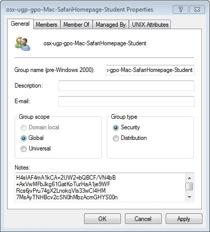
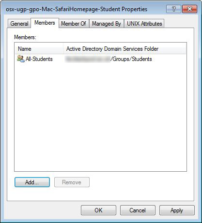
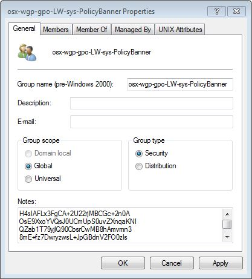
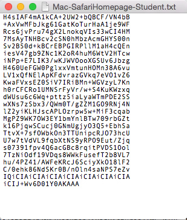

# LabWarden

## Brief

LabWarden applies Mac policies to users and workstations.

These policies are controlled via Active Directory without having to extend the AD schema.

Each policy "setting" is determined by a config that is stored directly within an AD groups notes field. Policy "scope" is determined by AD group membership.

Currently, a policy config can be a .mobileconfig file, a .labwarden.plist file or a PolicyBanner.rtf file.

The .labwarden.plist config controls LabWarden specific policy scripts. This config specifies policy script options and how the policy is "triggered". LabWarden policies can be triggered by various system events - such as System Boot, User Login, Application Launch, Application Quit, etc.

## Introduction

The standard Mac policy config is the mobileconfig and there is an increasing number of mobileconfigs for the Mac, that are able to control an increasing number of Mac settings.
It's preferable to use a mobileconfig wherever possible, however not all aspects of a Mac are configurable via a mobileconfig - and this is where sysadmins tend to deploy custom scripts.

LabWarden provides a mechanism for deploying a custom script as if it were a policy - based on scopes and triggers. This allows future sysadmins to retire the script easily when an equivalent mobileconfig appears.

There are a number of custom scripts included with LabWarden that do a bunch of stuff that is currently not possible via a mobileconfig. These scripts are controlled via an associated configuration file of type .LabWarden.plist. that holds the script options (much like a .mobileconfig file).

There are many custom policy scripts included in LabWarden – but the beauty of LabWarden is the ability to deploy your own custom scripts just like policies.

Both .mobileconfig and .LabWarden.plist configurations are stored directly within Active Directory.

>Policy configurations are compressed, and stored in the “Notes” field of an AD group
>
>
>
>The scope of the policy is determined by group membership.
>
>

With the a simple combination of AD group notes, and AD group membership, you are able to apply OS X specific group policies to workstations or users - without the need to extend the AD schema.

## Installation

Download the LabWarden zip archive from <https://github.com/execriez/LabWarden>

* Unzip the archive on a Mac workstation.

* Double-click the file "/SupportFiles/LabWarden.pkg".

* Reboot

The installer installs the following files and directories:

* /Library/LaunchAgents/...LabWarden.appwarden.plist
* /Library/LaunchAgents/...LabWarden.LoginWindow.plist
* /Library/LaunchAgents/...LabWarden.LoginWindowPoll.plist
* /Library/LaunchAgents/...LabWarden.UserAtDesktop.plist
* /Library/LaunchAgents/...LabWarden.UserPoll.plist
* /Library/LaunchDaemons/...LabWarden.Boot.plist
* /Library/LaunchDaemons/...LabWarden.SystemPoll.plist
* /usr/LabWarden/

You should note that LabWarden overwrites any existing Login and Logout hooks 

There are a number of example mobileconfigs, policy configs and printer configs included with LabWarden. These can be found in the following directory.

	/SupportFiles/LabWardenConfigs/Examples
	

## Quick Demo 1

This example shows how to deploy a PolicyBanner to a group of workstations.

Download, then install LabWarden as per the installation instructions.

Look in the "/SupportFiles/LabWardenConfigs/Examples/PolicyBanner" directory for the file "PolicyBanner.rtf".

Open the file in a text editor.

>
	
Edit the file to reflect your own acceptable use or IT policy, then save the changes.

Next, in a shell type:

	/usr/local/LabWarden/util/PackForDeployment ~/Desktop/LabWarden/SupportFiles/LabWardenConfigs/Examples/PolicyBanner/PolicyBanner.rtf
	
Replace ~/Desktop/... with the location of the PolicyBanner.rtf file.

This will create a subfolder containing the packed version of the mobileconfig file. Take a look at the file.

>The file contains a compressed version of the policy in a form that can be copied into the Notes field of an AD group.
>
>

Move to a PC containing the "Microsoft Management Console" (MMC).

Open up the text file that we just created, then copy all the text.

>

Run an MMC as a user who has permission to create and edit AD groups.

Create an AD group in a convenient OU.

In the example, I have named the group "osx-wgp-gpo-PolicyBanner". The name doesn't matter (except to yourself and other sysadmins).

Open up the properties for the group. In the "General" tab, paste the text into the "Notes" field.

>

Select the "Members" tab and add a workstation, or group of workstations that you want to apply the policy to. This is the "Scope" of the policy.

>

Click "OK"

There is generally a delay (typically 10 minutes) between updating AD and experiencing the changes.

Also, LabWarden generally only updates it's policies at defined intervals. If you want to see the changes applied to a workstation immediately - do the following:

	Wait 10 minutes (typically)
	In a Terminal, type the following:
		sudo /usr/local/LabWarden/util/gpupdate -force

>The Policy Banner will be shown on the login window of all associated workstations:
>
>
>

## Quick Demo 2

This example shows how to deploy the SetSafariHomepage mobileconfig to a user or group of users.

Look in the "/SupportFiles/LabWardenConfigs/Examples/mobileconfig" directory for the file "SetSafariHomepage.mobileconfig".

Open the file in a text editor.

Edit the file to change the "HomePage", then save as a new file called "SetSafariHomepage-Student.mobileconfig".

	<key>mcx_preference_settings</key>
	<dict>
		<key>LastSafariVersionWithWelcomePage</key>
		<string>999.0</string>
		<key>HomePage</key>
		<string>https://github.com/execriez</string>
		<key>NewTabBehavior</key>
		<integer>4</integer>
		<key>NewWindowBehavior</key>
		<integer>0</integer>
	</dict>

Next, in a shell type:

	/usr/local/LabWarden/util/PackForDeployment ~/Desktop/LabWarden/SupportFiles/LabWardenConfigs/Examples/mobileconfig/SetSafariHomepage-Student.mobileconfig
	
Replace ~/Desktop/... with the location of the modified mobileconfig.

This will create a subfolder containing the packed version of the mobileconfig file. Take a look at the file.

>The file contains a compressed version of the policy in a form that can be copied into the Notes field of an AD group.
>
>

Move to a PC containing the "Microsoft Management Console" (MMC).

Open up the text file that we just created, then copy all the text.

>

Run an MMC as a user who has permission to create and edit AD groups.

Create an AD group in a convenient OU.

In the example, I have named the group "osx-wgp-gpo-SetSafariHomepage-Student". The name doesn't matter (except to yourself and other sysadmins).

Open up the properties for the group. In the "General" tab, paste the text into the "Notes" field.

>

Select the "Members" tab and add a user, or group of users that you want to apply the policy to. This is the "Scope" of the policy.

>

Click "OK"

There is generally a delay (typically 10 minutes) between updating AD and experiencing the changes.

Also, LabWarden generally only updates it's policies at defined intervals. If you want to see the changes applied to a workstation immediately - do the following:

	Wait 10 minutes (typically)
	In a Terminal, type the following:
		sudo /usr/local/LabWarden/util/gpupdate -force

>Because you chose to apply the policy to a user or group of users - the mobileconfig will be pulled down as a "User Profile" and installed when an associated user logs in.
>
>
>
>If you had chosen to apply the policy to a workstation, or group of workstations - the mobileconfig would be pulled down as a "Device Profile".

## Quick Demo 3

This example shows how to deploy the "AppRestrict" script as a policy in order to prevent all non-admins from running a specific application.

AppRestrict is one of a number of example policy scripts that are included with LabWarden. 

Look in the "/SupportFiles/LabWardenConfigs/Examples/PolicyConfig" directory for the file "AppRestrict.LabWarden.plist".

Open the file in a text editor.

Edit the file as necessary. 

In this example we are restricting access to the Terminal, and are preventing Apps from running from the user home or from a non-local (mounted) drive. There is an exception for "PrinterProxy" and "Chrome" apps, because these are usually run from the users Library folder.

		<key>BlackList</key>
		<array>
			<dict>
				<key>ApplicationBundleIdentifier</key>
				<string>com\.apple\.Terminal</string>
				<key>ApplicationName</key>
				<string>Terminal</string>
			</dict>
		</array>
		<key>ExceptionList</key>
		<array>
			<dict>
				<key>ApplicationBundleIdentifier</key>
				<string>com\.apple\.print\.PrinterProxy</string>
				<key>ApplicationName</key>
				<string>PrinterProxy</string>
			</dict>
			<dict>
				<key>ApplicationBundleIdentifier</key>
				<string>com\.google\.Chrome\.app\..*</string>
				<key>ApplicationName</key>
				<string>.*</string>
			</dict>
		</array>
		<key>OnlyAllowLocalApps</key>
		<true/>
		<key>PathBlackList</key>
		<array>
			<string>~/.*</string>
		</array>

In a shell type 

	/usr/local/LabWarden/util/PackForDeployment ~/Desktop/LabWarden/SupportFiles/LabWardenConfigs/Examples/PolicyConfig/AppRestrict.LabWarden.plist
	
Replace ~/Desktop/... with the location of the example .LabWarden.plist file.

This will create a subfolder containing the packed version of the script config file. Take a look at the file.

Move to a PC containing the "Microsoft Management Console" (MMC).

Open up the text file that we just created, then copy all the text.

Run an MMC as a user who has permission to create and edit AD groups.

Create an AD group in a convenient OU.

In the example, I have named the group "osx-wgp-gpo-AppRestrict". The name doesn't matter (except to yourself and other sysadmins).

Open up the properties for the group. In the "General" tab, paste the text into the "Notes" field.

>

Select the "Members" tab and add a workstation, or group of workstations that you want to apply the policy to. This is the "Scope" of the policy.

>

Click "OK"

There is generally a delay (typically 10 minutes) between updating AD and experiencing the changes.

Also, LabWarden generally only updates it's policies at defined intervals. If you want to see the changes applied to a workstation immediately - do the following:

	Wait 10 minutes (typically)
	In a Terminal, type the following:
		sudo /usr/local/LabWarden/util/gpupdate -force

>Because you chose to apply the policy to a workstation or group of workstations - the policy will affect every user who logs in.

>

## Quick Demo 4
The Notes field in AD is limited to 1024 characters - so what do you do when you have a config that is too big to fit within this limit?

Take a look at the mobileconfig called **DisableSpotlightWeb.mobileconfig**

In a shell type 

	/usr/local/LabWarden/util/PackForDeployment ~/Desktop/LabWarden/SupportFiles/LabWardenConfigs/Examples/mobileconfig/DisableSpotlightWeb.mobileconfig
	
Replace ~/Desktop/... with the location of the example mobileconfig.

This will create a subfolder containing the packed version of the mobileconfig file. 

Take a look at in the folder. There are two files "DisableSpotlightWeb-0.txt" and "DisableSpotlightWeb-1.txt". The mobileconfig was too big to compress into a single 1024 byte file - so was split into two.

This is OK, we just need to copy the text into the Notes field of two groups and then make sure that the user or workstation is a member of both groups.

The most logical solution is actually to create three groups.

Run an MMC as a user who has permission to create and edit AD groups. Create the following two groups and copy the appropriate text into the relevant notes field:

	osx-wgp-gpo-DisableSpotlightWeb-0
	osx-wgp-gpo-DisableSpotlightWeb-1

Next create the following group, and make it a member of the previous two groups:

	osx-wgp-gpo-DisableSpotlightWeb

Any user or workstation that is a member of the osx-wgp-gpo-DisableSpotlightWeb group, will get the complete mobileconfig.

## Updating policy configs

If you want to update an already deployed mobileconfig or LabWarden  policy config then you need to also update the config UUID. If the UUID is not altered, then any update will not take effect.

For mobileconfigs, you should update the last "PayloadUUID" key.

	<key>PayloadUUID</key>
	<string>17E2B85F-E46D-4E8E-85F6-BC7BF63B031B</string>

For LabWarden configs, you should update the "UUID" key.

	<key>UUID</key>
	<string>8FB255B2-B9C9-424A-9135-22C3F7065F70</string>

A new UUID can be generated by typing the following in a shell.

	uuidgen
	
Once a config is updated, and the UUID is renewed - you should deploy the config as normal. i.e. use **PackForDeployment** to package up the config, then copy the packed text into the Notes field of the relevant group.

## Custom scripts and custom policies

If you have a custom script that you need to run - you should turn it into a custom policy.

A policy is just a script and an associated script config.

The script config contains the script options and a list of event(s) that trigger the script. 

Policy Scripts can be triggered by the following System events:

* Boot
* LoginWindow
* NetworkUp
* NetworkDown
* LoginBegin
* LogoutEnd
* LoginWindowPoll
* LoginWindowIdle
* LoginWindowRestartOrShutdown

...and by the following User events:

* UserLogin
* UserAtDesktop
* AppWillLaunch
* AppDidLaunch
* AppDidTerminate
* UserPoll
* UserIdle
* UserLogout

If the script is triggered by a system event, it will be called as root.

If the script is triggered by a user event, it will be called as that user.

You should note that when an event happens, every script that is triggered by that event is run together. Scripts don't wait around for other scripts to finish - they are all run at the same time (multitasking).

Custom policies should be stored in the directory "/usr/local/LabWarden/Policies/custom/". This prevents the policy from being deleted, should you update LabWarden by installing a new LabWarden package.

For a custom policy called 'MyPolicy', the policy script should be '/usr/local/LabWarden/Policies/custom/MyPolicy'.

The accompanying config file (which is stored in AD) should be called 'MyPolicy.LabWarden.plist'.

Use '/usr/local/LabWarden/util/PackForDeployment' to pack the script config ready for pasting into an AD groups 'Notes' field.

Take a look at the example custom policies for inspiration ( AppExamplePolicy , SystemExamplePolicy and UserExamplePolicy ).

Each policy has a line that includes the common library. This library (/usr/local/LabWarden/lib/CommonLib) sets up a number of useful LabWarden global variables. These are documented at the start of the CommonLib code (see below).

	# 'CommonLib' should be included into scripts as follows:
	#   . /usr/local/LabWarden/lib/CommonLib
	#
	# Take a look at the example policy scripts before getting bogged down with detail.
	#  (AppExamplePolicy, SystemExamplePolicy and UserExamplePolicy)
	#
	# Enter 'CommonLib' with the following globals already defined
	#  LW_sv_LoggedInUserName                - The name of the logged-in user, a null string signifies no-one is logged in
	#                                        - The logged-in user may or may not be the user who is running the script
	#
	# 'CommonLib' calculates the following LabWarden globals:
	#
	#  LW_sv_LabWardenVersion                - Main code version
	#  LW_sv_LabWardenSignature              - LabWarden signature (com.github.execriez.LabWarden)
	#
	#  LW_iv_LogMaxLength                    - Maximum length of LabWarden log(s)
	#  LW_bv_LogIsActiveDefault              - Whether we should log by default (true/false)
	#  LW_bv_LogIsActiveStatus               - Whether the log is currently active (true/false)
	#
	#  LW_sv_BinDirPath                      - Path to binaries such as rsync or CocoaDialog
	#  LW_sv_SettingsDirPath                 - Path to main LabWarden settings files
	#
	#  LW_iv_ThisScriptStartEpoch            - When the script started running
	#  LW_sv_ThisScriptFilePath              - Full source path of running script
	#  LW_sv_ThisScriptDirPath               - Directory location of running script
	#  LW_sv_ThisScriptFileName              - filename of running script
	#  LW_sv_ThisScriptName                  - Filename without extension
	#  LW_iv_ThisScriptPID                   - Process ID of running script
	#
	#  LW_sv_ThisScriptTempDirPath           - Temporary Directory for the currently running script
	#
	#  LW_sv_ThisUserTempDirPath             - Temporary Directory for the current user
	#  LW_sv_ThisUserLogDirPath              - Directory where the user log is stored
	#  LW_sv_ThisUserPrefDirPath             - Directory for user configs
	#
	#  LW_sv_ThisUserName                    - The name of the user that is running this script
	#  LW_iv_ThisUserID                      - The user ID of the user that is running this script
	#
	#  LW_iv_LoggedInUserID                  - The user ID of the logged-in user
	#  LW_bv_LoggedInUserIsAdmin             - Whether the logged-in user is an admin (true/false)
	#  LW_bv_LoggedInUserIsLocal             - Whether the logged-in user account is local (true/false)
	#  LW_bv_LoggedInUserIsMobile            - Whether the logged-in user account is mobile (true/false)
	#
	#  LW_sv_LoggedInUserHomeDirPath         - Home directory for the logged-in user
	#  LW_sv_LoggedInUserLocalHomeDirPath    - Local home directory for the logged-in user (in /Users)
	#  LW_sv_LoggedInUserHomeNetworkDirPath  - Network home directory path, i.e. /Volumes/staff/t/testuser
	#  LW_sv_LoggedInUserHomeNetworkURI      - Network home directory URI, i.e smb://yourserver.com/staff/t/testuser
	#  LW_bv_LoggedInUserHomeIsLocal         - Whether the logged-in user account is local (true/false)
	#
	#                                        - The logged-in user may or may not be the user who is running the script
	#
	#  LW_iv_BuildVersionStampAsNumber       - The build version represented as a number, i.e. 14F1808 translates to 29745664
	#  LW_sv_BuildVersionStampAsString       - The build version represented as a string, i.e. 14F1808
	#  LW_iv_SystemVersionStampAsNumber      - The system version represented as a number, i.e. 10.10.5 translates to 168428800
	#  LW_sv_SystemVersionStampAsString      - The system version represented as a string, i.e. 10.10.5
	#
	#  LW_sv_IPv4PrimaryService              - A uuid like 9804EAB2-718C-42A7-891D-79B73F91CA4B
	#  LW_sv_NetworkServiceDHCPOption15      - The domain advertised by DHCP
	#  LW_sv_NetworkServiceInterfaceName     - i.e. Wi-Fi
	#  LW_sv_NetworkServiceInterfaceDevice   - i.e. en1
	#  LW_sv_NetworkServiceInterfaceHardware - i.e. Airport
	#
	#  LW_sv_ADTrustAccount                  - This is the account used by the workstation for AD services - i.e. workstationname$
	#  LW_sv_ADComputerName                  - i.e. workstationname
	#  LW_sv_ADDomainNameFlat                - i.e. yourdomain.yourcompany.com
	#  LW_sv_ADDomainNameDNS                 - i.e. YOURDOMAIN
	# And when LW_sv_ThisUserName=root, the following global is defined
	#  LW_sv_ADTrustPassword                 - This is the password used by the workstation for AD services
	#
	# 'CommonLib' defines the following LabWarden functions:
	#
	#  LW_if_SystemIdleSecs
	#  LW_sf_urlencode <string>                                        - URL encode a string
	#  LW_sf_urldecode <string>                                        - URL decode a string
	#  LW_nf_logmessage <messagetxt>                                   - Output message text to the log file
	#  LW_nf_ShowNotification <Title> <Text>                           - Show a notification dialog
	#  LW_nf_SetPlistProperty <plistfile> <property> <value>           - Set a property to a value in a plist file
	#  LW_sf_GetPlistProperty <plistfile> <property> [defaultvalue]    - Get a property value from a plist file
	#  LW_if_GetPlistArraySize <plistfile> <property>                  - Get an array property size from a plist file
	#  LW_nf_schedule4epoch <TAG> <WAKETYPE> <EPOCH>                   - Schedule a wake or power on for a given epoch
	#  LW_sf_ResolveFilename <fileuri>                                 - Resolve a file URI to a local path (downloading the file if necessary)
	#  LW_nf_QuickExit                                                 - Quickly exit a script
	#  LW_nf_TriggerEvent <eventHistory> <event> [OptionalParam]       - Internal private function
	#
	#  Key:
	#    LW_ - LabWarden global variable
	#
	#    bv_ - string variable with the values "true" or "false"
	#    iv_ - integer variable
	#    sv_ - string variable
	#
	#    nf_ - null function    (doesn't return a value)
	#    bf_ - boolean function (returns string values "true" or "false"
	#    if_ - integer function (returns an integer value)
	#    sf_ - string function  (returns a string value)

## Example mobileconfig files

Here is a list of mobileconfig files included with LabWarden.

	DisableDSStoreOnNetwork.mobileconfig      - Stops .DS_Store files from being written to a network drive
	DisableOfferDisksForBackup.mobileconfig   - Stops Time Machine from asking to use new drives as a backup
	DisableOffice2011Updates.mobileconfig     - Stops the initial Setup in MS Office 2011
	DisableReopenWindowsOnLogin.mobileconfig  - Stops open windows being re-opened at next login
	DisableSpotlightWeb.mobileconfig          - Stops Spotlight from searching the web
	DisableiCloudSetup-10v9.mobileconfig      - Stops the initial iCloud setup
	DisableiCloudSetup-10v10.mobileconfig
	DisableiCloudSetup-10v11.mobileconfig
	DisableiCloudSetup-10v12.mobileconfig
	DisableiCloudSetup-10v13.mobileconfig
	EnableRightClick.mobileconfig             - Enables right click on the mouse
	EnableUKLocale.mobileconfig               - Enables the UK locale
	SetSafariHomepage.mobileconfig            - Sets the homepage in Safari

You can find other examples of OS X specific mobileconfigs on the web, these are good references (as of writing):

<https://github.com/gregneagle/profiles>

<https://github.com/nmcspadden/profiles>

<https://github.com/amsysuk/public_config_profiles>

## Example Policy Scripts

LabWarden includes a number of custom Policy scripts that do things that a mobileconfig currently cannot do.

Policy Scripts can be triggered by the following System events:

* Boot
* LoginWindow
* NetworkUp
* NetworkDown
* LoginBegin
* LogoutEnd
* LoginWindowPoll
* LoginWindowIdle
* LoginWindowRestartOrShutdown
* SystemPoll
* SystemIdle

...and by the following User events:

* UserLogin
* UserAtDesktop
* AppWillLaunch
* AppDidLaunch
* AppDidTerminate
* UserPoll
* UserIdle
* UserLogout

Policy scripts are controlled via an associated configuration file of type .LabWarden.plist that holds script options (As seen in "Quick Demo 3").

Following is a list of policy scripts and associated example configs...

###AppDeleteDataOnQuit
This policy script deletes application data when an application quits. It is called as the user and triggered by an **AppDidTerminate** event.

	<?xml version="1.0" encoding="UTF-8"?>
	<!DOCTYPE plist PUBLIC "-//Apple//DTD PLIST 1.0//EN" "http://www.apple.com/DTDs/PropertyList-1.0.dtd">
	<plist version="1.0">
	<dict>
		<key>Config</key>
		<dict>
			<key>AppData</key>
			<array>
				<dict>
					<key>ApplicationBundleIdentifier</key>
					<string>com.apple.finder</string>
					<key>Path</key>
					<array>
						<string>/.Trash/</string>
					</array>
				</dict>
				<dict>
					<key>ApplicationBundleIdentifier</key>
					<string>com.adobe.AdobePremierePro</string>
					<key>Path</key>
					<array>
						<string>/Library/Application Support/Adobe/Common/Media Cache Files/</string>
						<string>/Library/Application Support/Adobe/Common/Media Cache/</string>
					</array>
				</dict>
				<dict>
					<key>ApplicationBundleIdentifier</key>
					<string>org.chromium.Chromium</string>
					<key>Path</key>
					<array>
						<string>/Library/Application Support/Chromium/Default/Pepper Data/</string>
					</array>
				</dict>
				<dict>
					<key>ApplicationBundleIdentifier</key>
					<string>com.google.Chrome</string>
					<key>Path</key>
					<array>
						<string>/Library/Application Support/Google/Chrome/Default/Pepper Data/</string>
					</array>
				</dict>
			</array>
		</dict>
		<key>Name</key>
		<string>AppDeleteDataOnQuit</string>
		<key>TriggeredBy</key>
		<array>
			<string>AppDidTerminate</string>
		</array>
		<key>Type</key>
		<string>Policy</string>
	</dict>
	</plist>

The **AppData** array contains an **ApplicationBundleIdentifier** followed by a **Path** array containing the paths that should be deleted when the stated application quits. Paths are relative to the user home.

In the above example, the ApplicationBundleIdentifier **com.apple.finder** is followed by the Path **/.Trash/**. This will cause the contents of **~/.Trash/** to be deleted when the Finder quits (at user log out).

The config also contains entries for Google Chrome, Chromium and Adobe Premiere that will delete application data when each of these applications is quit.

The example policy config should be configured to your own needs.

###AppFirstSetupFirefox
This policy script sets up Firefox first run behaviour. It is called as the user and triggered by an **AppWillLaunch** event.

	<?xml version="1.0" encoding="UTF-8"?>
	<!DOCTYPE plist PUBLIC "-//Apple//DTD PLIST 1.0//EN" "http://www.apple.com/DTDs/PropertyList-1.0.dtd">
	<plist version="1.0">
	<dict>
		<key>Name</key>
		<string>AppFirstSetupFirefox</string>
		<key>TriggeredBy</key>
		<array>
			<string>AppWillLaunch</string>
		</array>
		<key>Type</key>
		<string>Policy</string>
	</dict>
	</plist>
	
The policy creates a blank Firefox profile at first launch - so that users aren't asked to create one.

There are no configurable parameters.

###AppNetworkFixFirefox
This policy script sets up Firefox so that it can run on network homes. It is called as the user and triggered by the **AppWillLaunch** and **AppDidTerminate** events.

	<?xml version="1.0" encoding="UTF-8"?>
	<!DOCTYPE plist PUBLIC "-//Apple//DTD PLIST 1.0//EN" "http://www.apple.com/DTDs/PropertyList-1.0.dtd">
	<plist version="1.0">
	<dict>
		<key>Name</key>
		<string>AppNetworkFixFirefox</string>
		<key>TriggeredBy</key>
		<array>
			<string>AppWillLaunch</string>
			<string>AppDidTerminate</string>
		</array>
		<key>Type</key>
		<string>Policy</string>
	</dict>
	</plist>

When user homes are on the network (i.e. not forced local) - then Firefox has trouble placing file locks on the files places.sqlite-shm, webappsstore.sqlite-shm and cookies.sqlite-shm - preventing the Firefox from loading.

This policy creates symbolic links to local versions of the files during application launch, and then deletes the symbolic links when the application quits.

There are no configurable parameters.

###AppRestrict
This policy script restricts application usage depending on a blacklist or whitelist. It is called as the user and triggered by an **AppWillLaunch** event.

The example config contains the following:

	<?xml version="1.0" encoding="UTF-8"?>
	<!DOCTYPE plist PUBLIC "-//Apple//DTD PLIST 1.0//EN" "http://www.apple.com/DTDs/PropertyList-1.0.dtd">
	<plist version="1.0">
	<dict>
		<key>Config</key>
		<dict>
			<key>BlackList</key>
			<array>
				<dict>
					<key>ApplicationBundleIdentifier</key>
					<string>com\.apple\.Terminal</string>
					<key>ApplicationName</key>
					<string>Terminal</string>
				</dict>
			</array>
			<key>ExceptionList</key>
			<array>
				<dict>
					<key>ApplicationBundleIdentifier</key>
					<string>com\.apple\.print\.PrinterProxy</string>
					<key>ApplicationName</key>
					<string>PrinterProxy</string>
				</dict>
				<dict>
					<key>ApplicationBundleIdentifier</key>
					<string>com\.google\.Chrome\.app\..*</string>
					<key>ApplicationName</key>
					<string>.*</string>
				</dict>
				<dict>
					<key>ApplicationBundleIdentifier</key>
					<string>com\.citrixonline\.mac\.WebDeploymentApp</string>
					<key>ApplicationName</key>
					<string>Citrix Online Launcher</string>
				</dict>
				<dict>
					<key>ApplicationBundleIdentifier</key>
					<string>com\.citrixonline\.GoToMeeting</string>
					<key>ApplicationName</key>
					<string>GoToMeeting.*</string>
				</dict>
			</array>
			<key>OnlyAllowLocalApps</key>
			<true/>
			<key>PathBlackList</key>
			<array>
				<string>~/.*</string>
			</array>
		</dict>
		<key>Name</key>
		<string>AppRestrict</string>
		<key>TriggeredBy</key>
		<array>
			<string>AppWillLaunch</string>
		</array>
		<key>Type</key>
		<string>Policy</string>
	</dict>
	</plist>

This policy restricts what Apps users can launch.

If the **WhiteList** is not null, then these Applications (and only these) are allowed. When the WhiteList is not null, then it should at least contain:

		<key>WhiteList</key>
		<array>
			<dict>
				<key>ApplicationBundleIdentifier</key>
				<string>com\.apple\.Finder</string>
				<key>ApplicationName</key>
				<string>Finder</string>
			</dict>
		</array>

Any Application in the **BlackList** is always disallowed for non-admins. The example BlackList contains the following, which prevents non-admins from launchin the Terminal App:

		<key>BlackList</key>
		<array>
			<dict>
				<key>ApplicationBundleIdentifier</key>
				<string>com\.apple\.Terminal</string>
				<key>ApplicationName</key>
				<string>Terminal</string>
			</dict>
		</array>

Any Application defined in the **ExceptionList** is exempt from Whitelist/BlackList checking. This allows you to have Apps that will run from any location without having to implement a whitelist.

The example ExceptionList contains the following, which allows the Printer Proxy App to run. The printer proxy App always runs from the user home - without this entry - user would not be able to print.

		<key>ExceptionList</key>
		<array>
			<dict>
				<key>ApplicationBundleIdentifier</key>
				<string>com\.apple\.print\.PrinterProxy</string>
				<key>ApplicationName</key>
				<string>PrinterProxy</string>
			</dict>
		</array>

Regular expressions can be used.

If the path **WhiteList** is not null, then Applications at the specified paths (and only these paths) are allowed. When the path WhiteList is not null, it should at least contain:
	
		<key>PathWhiteList</key>
		<array>
			<string>^/Applications/.*$</string>
			<string>^/System/Library/CoreServices/.*$</string>
		</array>

Regular expressions should be used. ~/ is expanded to the current user home before comparison.

Any application located at a path in the **PathBlackList** is always disallowed for non-admins.

The example PathBlackList contains the following, which prevents users from launchin Applications from their home area.

		<key>PathBlackList</key>
		<array>
			<string>~/.*</string>
		</array>

Regular expressions can be used. ~/ is expanded to the current user home before comparison.

Finally, the **OnlyAllowLocalApps** key prevents Apps from running from mounted Volumes/Filesystems (USB sticks and network stores).

		<key>OnlyAllowLocalApps</key>
		<true/>

The example policy config should be configured to your own needs.

###AppShowHints
This policy script shows a hint when a specified application opened. It is called as the user and triggered by an **AppWillLaunch** event. This script uses CocoaDialog.

The config consista of a single array called **AppHint**. 

Each entry in the array should contain at least an **ApplicationBundleIdentifier** key, a **MessageTitle** key and a **MessageContent** key.

You can also optionally define **IsAdmin**, **IsLocalAccount** and **IsLocalHome**. The message hint will only be shown if the status of these keys (true/false) match the status of the current user.

	<?xml version="1.0" encoding="UTF-8"?>
	<!DOCTYPE plist PUBLIC "-//Apple//DTD PLIST 1.0//EN" "http://www.apple.com/DTDs/PropertyList-1.0.dtd">
	<plist version="1.0">
	<dict>
		<key>Config</key>
		<dict>
			<key>AppHint</key>
			<array>
				<dict>
					<key>ApplicationBundleIdentifier</key>
					<string>com.apple.logic10</string>
					<key>IsAdmin</key>
					<false/>
					<key>IsLocalAccount</key>
					<false/>
					<key>IsLocalHome</key>
					<false/>
					<key>MessageContent</key>
					<string>APPNAME works better off network</string>
					<key>MessageTitle</key>
					<string>ON NETWORK</string>
				</dict>
				<dict>
					<key>ApplicationBundleIdentifier</key>
					<string>com.adobe.AdobePremierePro</string>
					<key>MessageContent</key>
					<string>Setup your Media Cache File location (Premiere&gt;Preferences&gt;Media)</string>
					<key>MessageTitle</key>
					<string>NOW SET YOUR PREFS</string>
				</dict>
				<dict>
					<key>ApplicationBundleIdentifier</key>
					<string>com.apple.FinalCutPro</string>
					<key>MessageContent</key>
					<string>Final Cut Pro&gt;System Settings...&gt;Scratch Disks</string>
					<key>MessageTitle</key>
					<string>NOW SET YOUR PREFS</string>
				</dict>
			</array>
		</dict>
		<key>Name</key>
		<string>AppShowHints</string>
		<key>TriggeredBy</key>
		<array>
			<string>AppDidLaunch</string>
		</array>
		<key>Type</key>
		<string>Policy</string>
	</dict>
	</plist>

The example policy config should be configured to your own needs.

###SystemUpdate

This policy script handles software updates. It is called as root and triggered by the **LoginWindowIdle** and **ManualUpdate** events.

	<?xml version="1.0" encoding="UTF-8"?>
	<!DOCTYPE plist PUBLIC "-//Apple//DTD PLIST 1.0//EN" "http://www.apple.com/DTDs/PropertyList-1.0.dtd">
	<plist version="1.0">
	<dict>
		<key>Config</key>
		<dict>
			<key>LoginWindowIdleShutdownSecs</key>
			<integer>1200</integer>
			<key>OutOfHoursEndTime</key>
			<string>05:00</string>
			<key>OutOfHoursPowerOn</key>
			<true/>
			<key>OutOfHoursStartTime</key>
			<string>22:00</string>
			<key>Script</key>
			<dict>
				<key>Exe</key>
				<array>
					<string>file://localhost/usr/local/LabWarden/lib/RadmindUpdate</string>
					<string>192.168.0.3,sha1,0,-I,42000</string>
				</array>
			</dict>
		</dict>
		<key>Name</key>
		<string>SystemUpdate</string>
		<key>TriggeredBy</key>
		<array>
			<string>LoginWindowIdle</string>
			<string>ManualUpdate</string>
		</array>
		<key>Type</key>
		<string>Policy</string>
	</dict>
	</plist>

Updates are generally done out-of-hours. The policy config defines the start and end of the out-of-hours period via **OutOfHoursStartTime** and **OutOfHoursEndTime**.

	<key>OutOfHoursStartTime</key>
	<string>22:00</string>
	<key>OutOfHoursEndTime</key>
	<string>05:00</string>
	
The **OutOfHoursPowerOn** variable defines whether or not we the policy schedules a power-on during the out-of hours period. If true, the workstation will power-on at a random time between the start and end of out-of-hours.

	<key>OutOfHoursPowerOn</key>
	<true/>
	
When a Mac is switched on out-of-hours, and then left idle at the log in screen - a software update will be performed. If a workstation is never switched on out-of-hours, then software updates will never be performed.

The software update mechanism is determined from the **Script** key. This key holds an **Exe** array that consists of a script location, followed by script arguments.

	<key>Script</key>
	<dict>
		<key>Exe</key>
		<array>
			<string>file://localhost/usr/local/LabWarden/lib/RadmindUpdate</string>
			<string>192.168.0.3,sha1,0,-I,42000</string>
		</array>
	</dict>

In the example above, a scheduled update will execute the following command:

	/usr/local/LabWarden/lib/RadmindUpdate "192.168.0.3,sha1,0,-I, 42000"

The purpose of the **Script** key is to define a script that deploys software to the workstation. There is no fixed mechanism imposed by LabWarden. You may use munki or you may use Radmind. This is all left to you and your own custom script.

Finally, the **LoginWindowIdleShutdownSecs** key specifies how long we can be idle at the LoginWindow before performing the shutdown. You should note that a **gpupdate -force** will be performed before an idle shut-down.  

	<key>LoginWindowIdleShutdownSecs</key>
	<integer>1200</integer>

A value of 0, indicates that we should not power off when idle.

In order to get the SystemUpdate policy working for you, you should:

* Create a custom software update script and make it available on the workstation.
* Customise the SystemUpdate config.
* Use PackForDeployment on the config.
* Create a group, then copy the packed text to the group Notes field
* Make your workstation(s) a member of the group

The example policy config should be configured to your own needs.

###SystemAddEntriesToHostsFile

This policy adds entries to /etc/hosts. The policy is called as root and triggered by the **Boot** event.

The config consists of a **Entry** array, containing an **IP4** key (IP address) and a **Host** array. 

The specified hosts will resolve to the specified IP address.

The example config may be of help to prevent user being nagged by a log in window when using Office 2016 behind a proxy.

	<?xml version="1.0" encoding="UTF-8"?>
	<!DOCTYPE plist PUBLIC "-//Apple//DTD PLIST 1.0//EN" "http://www.apple.com/DTDs/PropertyList-1.0.dtd">
	<plist version="1.0">
	<dict>
		<key>Config</key>
		<dict>
			<key>Entry</key>
			<array>
				<dict>
					<key>Host</key>
					<array>
						<string>prod-w.nexus.live.com.akadns.net</string>
						<string>odc.officeapps.live.com</string>
						<string>omextemplates.content.office.net</string>
						<string>officeclient.microsoft.com</string>
					</array>
					<key>IP4</key>
					<string>127.0.0.1</string>
				</dict>
			</array>
		</dict>
		<key>Name</key>
		<string>SystemAddEntriesToHostsFile</string>
		<key>TriggeredBy</key>
		<array>
			<string>Boot</string>
		</array>
		<key>Type</key>
		<string>Policy</string>
	</dict>
	</plist>

###SystemDeleteFiles

**USE WITH CAUTION**

This policy deletes files from /. It will reboot after the files have been successfully deleted. It is called as root and triggered by the **Boot** event.

The config consists of a **Path** array, containing a list of files and directories that should be deleted. Useful if you want to quickly delete a bunch of files from a number of workstations.

	<?xml version="1.0" encoding="UTF-8"?>
	<!DOCTYPE plist PUBLIC "-//Apple//DTD PLIST 1.0//EN" "http://www.apple.com/DTDs/PropertyList-1.0.dtd">
	<plist version="1.0">
	<dict>
		<key>Config</key>
		<dict>
			<key>Path</key>
			<array>
				<string>/Applications/Utilities/Adobe Flash Player Install Manager.app/</string>
				<string>/Library/Application Support/Adobe/Flash Player Install Manager/</string>
				<string>/Library/Internet Plug-Ins/Flash Player.plugin/</string>
				<string>/Library/Internet Plug-Ins/PepperFlashPlayer/</string>
				<string>/Library/LaunchDaemons/com.adobe.fpsaud.plist</string>
				<string>/Library/PreferencePanes/Flash Player.prefPane/</string>
			</array>
		</dict>
		<key>Name</key>
		<string>SystemDeleteFiles</string>
		<key>TriggeredBy</key>
		<array>
			<string>Boot</string>
		</array>
		<key>Type</key>
		<string>Policy</string>
	</dict>
	</plist>

The example policy config should be configured to your own needs.

###SystemDeleteOldUserProfiles

**USE WITH CAUTION**

This policy deletes outdated user profiles. It is called as root and triggered by the  **LoginWindowIdle** event.

The **LoginMaxAgeDays** key defines how long to wait between logins before deleting the profile. The example below sets this at 62. This means that if a user does not log in for over 62 days, the users' profile will be deleted from /Users and from /private/var/folders.

This LoginMaxAgeDays key deletes profiles for network users, not local users.

The **UserCacheEarliestEpoch** key sets a value for the earliest profile creation epoch. Any user folders in /private/var/folders created before this epoch will be deleted. This is useful when updating from one OS to another - since old user profiles can cause issues.

	<?xml version="1.0" encoding="UTF-8"?>
	<!DOCTYPE plist PUBLIC "-//Apple//DTD PLIST 1.0//EN" "http://www.apple.com/DTDs/PropertyList-1.0.dtd">
	<plist version="1.0">
	<dict>
		<key>Config</key>
		<dict>
			<key>LoginMaxAgeDays</key>
			<integer>62</integer>
			<key>UserCacheEarliestEpoch</key>
			<integer>1462365175</integer>
		</dict>
		<key>Name</key>
		<string>SystemDeleteOldUserProfiles</string>
		<key>TriggeredBy</key>
		<array>
			<string>LoginWindowIdle</string>
		</array>
		<key>Type</key>
		<string>Policy</string>
	</dict>
	</plist>

The example policy config should be configured to your own needs.

###SystemEstablish8021XWiFi

This policy requests then installs a computer certificate from a certificate authority server, then sets up Wi-Fi for 802.1X. It is called as root and triggered by the **NetworkUp** event.

To successfully acquire a computer certificate from your certificate server, you need to configure the **CertAuthURL**, **CertTemplate** keys.

The **SSIDSTR** key is the SSID of the Wi-Fi network to be used. The **ProxyType** key value should be set to either 'None' or 'Auto'.

The **RenewCertBeforeDays** key allows the certificate to auto-renew when it is about to expire.

The **RevokeCertBeforeEpoch** key allows the certificate to be revoked and renewed if it was issued before a particular date.

	<?xml version="1.0" encoding="UTF-8"?>
	<!DOCTYPE plist PUBLIC "-//Apple//DTD PLIST 1.0//EN" "http://www.apple.com/DTDs/PropertyList-1.0.dtd">
	<plist version="1.0">
	<dict>
		<key>Config</key>
		<dict>
			<key>CertAuthURL</key>
			<string>https://yourcaserer.yourdomain/certsrv</string>
			<key>CertTemplate</key>
			<string>Mac-Computer</string>
			<key>ProxyType</key>
			<string>Auto</string>
			<key>RenewCertBeforeDays</key>
			<integer>28</integer>
			<key>RevokeCertBeforeEpoch</key>
			<integer>0</integer>
			<key>SSIDSTR</key>
			<string>YourSSID</string>
		</dict>
		<key>Name</key>
		<string>SystemEstablish8021XWiFi</string>
		<key>TriggeredBy</key>
		<array>
			<string>NetworkUp</string>
		</array>
		<key>Type</key>
		<string>Policy</string>
	</dict>
	</plist>

When the policy successfully completes, a device profile that is installed named after your Wi-Fi SSID. This profile contains the Wi-Fi settings and a Computer Certificate.

If there are issues getting a computer certificate, examine the labwarden log. The log can be found here: 

	/Library/Logs/com.github.execriez.LabWarden/LabWarden.log

###SystemGiveSystemProxyAccess

This policy gives specific processes access to the internet through a proxy using the Active Directory workstation credentials. It is called as root and triggered by the **Boot** event.

The config consists of an array called **Proxy**. Each entry in the array contains **ProxyAddress**, **ProxyPort**, **ProxyProtocol** and **Process**. Process is an array of processes that will be given workstation credentials when accessing the internet via the proxy.

	<?xml version="1.0" encoding="UTF-8"?>
	<!DOCTYPE plist PUBLIC "-//Apple//DTD PLIST 1.0//EN" "http://www.apple.com/DTDs/PropertyList-1.0.dtd">
	<plist version="1.0">
	<dict>
		<key>Config</key>
		<dict>
			<key>Proxy</key>
			<array>
				<dict>
					<key>Process</key>
					<array>
						<string>/usr/sbin/ocspd</string>
					</array>
					<key>ProxyAddress</key>
					<string>PROXYADDRESS</string>
					<key>ProxyPort</key>
					<string>PROXYPORT</string>
					<key>ProxyProtocol</key>
					<string>http</string>
				</dict>
				<dict>
					<key>Process</key>
					<array>
						<string>/usr/sbin/ocspd</string>
					</array>
					<key>ProxyAddress</key>
					<string>PROXYADDRESS</string>
					<key>ProxyPort</key>
					<string>PROXYPORT</string>
					<key>ProxyProtocol</key>
					<string>htps</string>
				</dict>
			</array>
		</dict>
		<key>Name</key>
		<string>SystemGiveSystemProxyAccess</string>
		<key>TriggeredBy</key>
		<array>
			<string>Boot</string>
		</array>
		<key>Type</key>
		<string>Policy</string>
	</dict>
	</plist>

The example policy config should be configured to your own needs.

###SystemInstallPackageFromFolder

This policy installs packages from a specified folder. It is called as root and triggered by the **Boot** event.

The config consists of a **Path** array, containing a list of folders that contain packages to install. A record of package installs is kept so that the same package is not installed more than once.

	<?xml version="1.0" encoding="UTF-8"?>
	<!DOCTYPE plist PUBLIC "-//Apple//DTD PLIST 1.0//EN" "http://www.apple.com/DTDs/PropertyList-1.0.dtd">
	<plist version="1.0">
	<dict>
		<key>Config</key>
		<dict>
			<key>Path</key>
			<array>
				<string>/usr/local/Updates</string>
			</array>
		</dict>
		<key>Name</key>
		<string>SystemInstallPackageFromFolder</string>
		<key>TriggeredBy</key>
		<array>
			<string>Boot</string>
		</array>
		<key>Type</key>
		<string>Policy</string>
	</dict>
	</plist>

The example policy config should be configured to your own needs.

###SystemNetworkProxy
This policy sets the web proxy. It is called as root and triggered by the **NetworkUp** event.

The config contains the usual proxy options.

	<?xml version="1.0" encoding="UTF-8"?>
	<!DOCTYPE plist PUBLIC "-//Apple//DTD PLIST 1.0//EN" "http://www.apple.com/DTDs/PropertyList-1.0.dtd">
	<plist version="1.0">
	<dict>
		<key>Config</key>
		<dict>
			<key>AutoProxy</key>
			<dict>
				<key>Enabled</key>
				<false/>
				<key>URL</key>
				<string></string>
			</dict>
			<key>FTPProxy</key>
			<dict>
				<key>Address</key>
				<string></string>
				<key>Enabled</key>
				<false/>
				<key>Port</key>
				<integer>8080</integer>
			</dict>
			<key>GopherProxy</key>
			<dict>
				<key>Address</key>
				<string></string>
				<key>Enabled</key>
				<false/>
				<key>Port</key>
				<integer>8080</integer>
			</dict>
			<key>ProxyAutoDiscovery</key>
			<dict>
				<key>Enabled</key>
				<true/>
			</dict>
			<key>ProxyBypassDomains</key>
			<array>
				<string>*.local</string>
				<string>169.254/16</string>
				<string>127.0.0.1</string>
				<string>localhost</string>
			</array>
			<key>SOCKSProxy</key>
			<dict>
				<key>Address</key>
				<string></string>
				<key>Enabled</key>
				<false/>
				<key>Port</key>
				<integer>8080</integer>
			</dict>
			<key>SecureWebProxy</key>
			<dict>
				<key>Address</key>
				<string></string>
				<key>Enabled</key>
				<false/>
				<key>Port</key>
				<integer>8080</integer>
			</dict>
			<key>StreamingProxy</key>
			<dict>
				<key>Address</key>
				<string></string>
				<key>Enabled</key>
				<false/>
				<key>Port</key>
				<integer>8080</integer>
			</dict>
			<key>WebProxy</key>
			<dict>
				<key>Address</key>
				<string></string>
				<key>Enabled</key>
				<false/>
				<key>Port</key>
				<integer>8080</integer>
			</dict>
		</dict>
		<key>Name</key>
		<string>SystemNetworkProxy</string>
		<key>TriggeredBy</key>
		<array>
			<string>NetworkUp</string>
		</array>
		<key>Type</key>
		<string>Policy</string>
	</dict>
	</plist>

##SystemOfficeHours
This policy can restrict user logins to defined office-hours. It can also produce some simple stats that show how much a workstation is used during those hours. 

This policy is useful to force log-outs at the end of the day, and to determine which are your most and least used machines.

To use this policy, you need to define normal office-hours, office-hours during breaks, and dates when the office is not open at all.

The **ActiveForDates** key determines the dates for which the policy is active. 

The ActiveForDates **Start** key defines the day/month/year on which to activate the policy. Once the policy is activated, it begins restricting logins and collecting usage data. 

Once deployed, if you change the 'Start' key, all data collection will be reset to zero.

The ActiveForDates **End** key defines the day/month/year on which to de-activate the policy. Once the policy is de-activated, it stops restricting logins and collecting usage data.

You should change the 'End' key whenever you update the info for breaks and closed periods. It should match the last known date at which your office-hours info is valid.

Defining an 'End' key prevents users from being logged out in error, and makes the stats more accurate - should you forget to update the office-hours info on time. 

	<key>ActiveForDates</key>
	<dict>
		<key>Start</key>
		<dict>
			<key>Day</key>
			<integer>25</integer>
			<key>Month</key>
			<integer>11</integer>
			<key>Year</key>
			<integer>2016</integer>
		</dict>
		<key>End</key>
		<dict>
			<key>Day</key>
			<integer>28</integer>
			<key>Month</key>
			<integer>8</integer>
			<key>Year</key>
			<integer>2017</integer>
		</dict>
	</dict>

The **LogoutUserOutOfHours** key specifies whether or not we should restrict usage to office-hours.

		<key>LogoutUserOutOfHours</key>
		<true/>

The **LogoutWarningSecs** specifies what to do when we are approaching closing time. A value of 600 means that users will get warnings about being logged-off, 10 minutes before closing.

		<key>LogoutWarningSecs</key>
		<integer>600</integer>

The **ForceLogoutExceptionGroup** array contains a list of user groups that will never be logged off.

		<key>ForceLogoutExceptionGroup</key>
		<array>
			<string>All-Staff</string>
		</array>

The **LoginEarlySecs** key specifiies how many seconds before office opening we should allow user logins. The **LogoutEarlySecs** key specifies how many seconds before office closing, we should log users out. 

In the example below, we allow logins an hour before opening time - and we log users out 10 minutes before closing time.

		<key>LoginEarlySecs</key>
		<integer>3600</integer>
		<key>LogoutEarlySecs</key>
		<integer>600</integer>

The **UnrestrictedHoursOnClosedDays** key specifies whether we should relax all restrictions on days when the office is defined as closed. This is useful during long closed periods to allow occasional drop-in sessions.

		<key>UnrestrictedHoursOnClosedDays</key>
		<true/>

The **LogoutUserIdleSecs** key specifies how long a user is allowed to be idle before being logged out. The value 1800 below means that users will be logged out after 30 mins of idleness. A value of 0 means that users will never be logged out. Users that are members of a group defined in the ForceLogoutExceptionGroup array will not be logged out.

		<key>LogoutUserIdleSecs</key>
		<integer>1800</integer>

You should note that idle user logout can also be achieved via a mobileconfig.

The **AuditHideUntilAgeSecs** key specifies how long we should collect data before displaying stats in the LoginWindow. The value below means that we collect data for 7 days before displaying 'Avg Use' percentages.

		<key>AuditHideUntilAgeSecs</key>
		<integer>604800</integer>

The **NormalHours** dict specifies opening times for Monday (Day1) through Sunday (Day7). In this example, the lab is open 8:30 until 21:00 Mon-Thu, 8:30 until 17:00 on Fri, and closed on Saturday and Sunday.

	<key>NormalHours</key>
	<dict>
		<key>Day1</key>
		<dict>
			<key>CloseTime</key>
			<string>21:00</string>
			<key>OpenTime</key>
			<string>8:30</string>
		</dict>
		<key>Day2</key>
		<dict>
			<key>CloseTime</key>
			<string>21:00</string>
			<key>OpenTime</key>
			<string>8:30</string>
		</dict>
		<key>Day3</key>
		<dict>
			<key>CloseTime</key>
			<string>21:00</string>
			<key>OpenTime</key>
			<string>8:30</string>
		</dict>
		<key>Day4</key>
		<dict>
			<key>CloseTime</key>
			<string>21:00</string>
			<key>OpenTime</key>
			<string>8:30</string>
		</dict>
		<key>Day5</key>
		<dict>
			<key>CloseTime</key>
			<string>17:00</string>
			<key>OpenTime</key>
			<string>8:30</string>
		</dict>
		<key>Day6</key>
		<dict>
			<key>CloseTime</key>
			<string></string>
			<key>OpenTime</key>
			<string></string>
		</dict>
		<key>Day7</key>
		<dict>
			<key>CloseTime</key>
			<string></string>
			<key>OpenTime</key>
			<string></string>
		</dict>
	</dict>

The **ClosedDays** array specifies periods when a lab is closed. The array contains a list of **start** days and **end** days.

	<key>ClosedDays</key>
	<array>
		<dict>
			<key>Start</key>
			<dict>
				<key>Day</key>
				<integer>23</integer>
				<key>Month</key>
				<integer>12</integer>
				<key>Year</key>
				<integer>2016</integer>
			</dict>
			<key>End</key>
			<dict>
				<key>Day</key>
				<integer>8</integer>
				<key>Month</key>
				<integer>1</integer>
				<key>Year</key>
				<integer>2017</integer>
			</dict>
		</dict>
		<dict>
			<key>Start</key>
			<dict>
				<key>Day</key>
				<integer>14</integer>
				<key>Month</key>
				<integer>4</integer>
				<key>Year</key>
				<integer>2017</integer>
			</dict>
			<key>End</key>
			<dict>
				<key>Day</key>
				<integer>14</integer>
				<key>Month</key>
				<integer>4</integer>
				<key>Year</key>
				<integer>2017</integer>
			</dict>
		</dict>
	</array>	

The **HolidayHours** array specifies periods when a lab has modified opening times. The array contains one or more dicts that contain a **Daterange** array followed by alternate opening hours. In the example below, on the dates 29 Oct 2016 to 6 Nov 2016, and 14 Jan 2017 to 22 Jan 2017, the lab is open Mon-Fri 8:30-16:00.

	<key>HolidayHours</key>
	<array>
		<dict>
			<key>DateRange</key>
			<array>
				<dict>
					<key>Start</key>
					<dict>
						<key>Day</key>
						<integer>29</integer>
						<key>Month</key>
						<integer>10</integer>
						<key>Year</key>
						<integer>2016</integer>
					</dict>
					<key>End</key>
					<dict>
						<key>Day</key>
						<integer>6</integer>
						<key>Month</key>
						<integer>11</integer>
						<key>Year</key>
						<integer>2016</integer>
					</dict>
				</dict>
				<dict>
					<key>Start</key>
					<dict>
						<key>Day</key>
						<integer>14</integer>
						<key>Month</key>
						<integer>1</integer>
						<key>Year</key>
						<integer>2017</integer>
					</dict>
					<key>End</key>
					<dict>
						<key>Day</key>
						<integer>22</integer>
						<key>Month</key>
						<integer>1</integer>
						<key>Year</key>
						<integer>2017</integer>
					</dict>
				</dict>
			</array>
			<key>Day1</key>
			<dict>
				<key>CloseTime</key>
				<string>16:00</string>
				<key>OpenTime</key>
				<string>8:30</string>
			</dict>
			<key>Day2</key>
			<dict>
				<key>CloseTime</key>
				<string>16:00</string>
				<key>OpenTime</key>
				<string>8:30</string>
			</dict>
			<key>Day3</key>
			<dict>
				<key>CloseTime</key>
				<string>16:00</string>
				<key>OpenTime</key>
				<string>8:30</string>
			</dict>
			<key>Day4</key>
			<dict>
				<key>CloseTime</key>
				<string>16:00</string>
				<key>OpenTime</key>
				<string>8:30</string>
			</dict>
			<key>Day5</key>
			<dict>
				<key>CloseTime</key>
				<string>16:00</string>
				<key>OpenTime</key>
				<string>8:30</string>
			</dict>
			<key>Day6</key>
			<dict>
				<key>CloseTime</key>
				<string></string>
				<key>OpenTime</key>
				<string></string>
			</dict>
			<key>Day7</key>
			<dict>
				<key>CloseTime</key>
				<string></string>
				<key>OpenTime</key>
				<string></string>
			</dict>
		</dict>
	</array>

###SystemRemoteManagement

This policy sets up remote user access via Apple's "Remote Desktop" application and via screen sharing using the Finder menu's "connect to Server..." with the address "vnc://someworkstation.local". 

It can set up access for local users, and for directory users.

It is called as root and triggered by the **Boot** and **NetworkUp** events.

	<?xml version="1.0" encoding="UTF-8"?>
	<!DOCTYPE plist PUBLIC "-//Apple//DTD PLIST 1.0//EN" "http://www.apple.com/DTDs/PropertyList-1.0.dtd">
	<plist version="1.0">
	<dict>
		<key>Config</key>
		<dict>
			<key>Groups</key>
			<array>
				<dict>
					<key>Access</key>
					<string>admin</string>
					<key>Name</key>
					<string>dirgroup1</string>
				</dict>
				<dict>
					<key>Access</key>
					<string>interact</string>
					<key>Name</key>
					<string>dirgroup2</string>
				</dict>
			</array>
			<key>LocalUsers</key>
			<array>
				<dict>
					<key>Name</key>
					<string>localuser1</string>
					<key>Privs</key>
					<array>
						<string>all</string>
					</array>
				</dict>
				<dict>
					<key>Name</key>
					<string>localuser2</string>
					<key>Privs</key>
					<array>
						<string>DeleteFiles</string>
						<string>ControlObserve</string>
						<string>TextMessages</string>
						<string>ShowObserve</string>
						<string>OpenQuitApps</string>
						<string>GenerateReports</string>
						<string>RestartShutDown</string>
						<string>SendFiles</string>
						<string>ChangeSettings</string>
						<string>ObserveOnly</string>
					</array>
				</dict>
			</array>
			<key>Users</key>
			<array>
				<dict>
					<key>Access</key>
					<string>admin</string>
					<key>Name</key>
					<string>diruser1</string>
				</dict>
				<dict>
					<key>Access</key>
					<string>reports</string>
					<key>Name</key>
					<string>diruser4</string>
				</dict>
			</array>
		</dict>
		<key>Name</key>
		<string>SystemRemoteManagement</string>
		<key>TriggeredBy</key>
		<array>
			<string>Boot</string>
			<string>NetworkUp</string>
		</array>
		<key>Type</key>
		<string>Policy</string>
	</dict>
	</plist>

The **LocalUsers** array holds a list of local users who have access to ARD. This list contains a **Name** key and a **Privs** array. 

The **Name** key holds the name of the local user. 

**Privs** can be any comination of the following values: all, DeleteFiles, ControlObserve, TextMessages, ShowObserve, OpenQuitApps, GenerateReports, RestartShutDown, SendFiles, ChangeSettings, ObserveOnly, none. 

The meaning of these keys is explained in the ARD kickstart help page, which can be found by typing the following in a shell: 

	/System/Library/CoreServices/RemoteManagement/ARDAgent.app/Contents/Resources/kickstart -help
	
The **Users** key holds a list of directory users who have access to ARD. This contains a **Name** key and a **Access** key. **Name** is the name of the directory user. **Access** can be one of the following values: admin, interact, manage, reports.

The **Groups** key holds a list of directory groups who have access to ARD. This contains a **Name** key and a **Access** key. **Name** is the name of the directory group. **Access** can be one of the following values: admin, interact, manage, reports.

The 'Access' values are equivalent to the following 'Privs' values:

**admin**: GenerateReports, OpenQuitApps, ChangeSettings, SendFiles, DeleteFiles, TextMessages, RestartShutDown, ControlObserve, ShowObserve (all)

**interact**: TextMessages, ControlObserve, ShowObserve

**manage**: GenerateReports, OpenQuitApps, ChangeSettings, SendFiles, DeleteFiles, TextMessages, RestartShutDown

**reports**: GenerateReports

This policy is also useful for setting up ARD screen sharing.

If you have some directory users who need to remotely view and control other peoples screens - add them via the Users or Groups key, and give them **interact** access. 

They will then be able to connect to the remote screens of affected workstations via the Finder menu "connect to Server..." with the address "vnc://someworkstation.local".

###SystemRestartIfNetMount
This policy reboots if the workstation is at the LoginWindow and the system detects that there is a network drive mounted. This could indicate that a user has not been logged out properly - or that a screen is locked and someone has clicked "Switch User". It is called as root and triggered by the **LoginWindow** event.

The policy has no configurable options.

	<?xml version="1.0" encoding="UTF-8"?>
	<!DOCTYPE plist PUBLIC "-//Apple//DTD PLIST 1.0//EN" "http://www.apple.com/DTDs/PropertyList-1.0.dtd">
	<plist version="1.0">
	<dict>
		<key>Name</key>
		<string>SystemRestartIfNetMount</string>
		<key>TriggeredBy</key>
		<array>
			<string>LoginWindow</string>
		</array>
		<key>Type</key>
		<string>Policy</string>
	</dict>
	</plist>

###SystemSleepSettings
This policy system sleep options. It is called as root and triggered by the **LoginWindow** and **LoginBegin** events.

This allows different Battery/Power, DiskSleep, DisplaySleep, and SystemSleep options to be set depending on whether or not a user is logged in. The option units are specified in minutes.

	<?xml version="1.0" encoding="UTF-8"?>
	<!DOCTYPE plist PUBLIC "-//Apple//DTD PLIST 1.0//EN" "http://www.apple.com/DTDs/PropertyList-1.0.dtd">
	<plist version="1.0">
	<dict>
		<key>Config</key>
		<dict>
			<key>LoginBegin</key>
			<dict>
				<key>Battery</key>
				<dict>
					<key>DiskSleep</key>
					<integer>3</integer>
					<key>DisplaySleep</key>
					<integer>2</integer>
					<key>SystemSleep</key>
					<integer>15</integer>
				</dict>
				<key>Power</key>
				<dict>
					<key>DiskSleep</key>
					<integer>15</integer>
					<key>DisplaySleep</key>
					<integer>10</integer>
					<key>SystemSleep</key>
					<integer>0</integer>
				</dict>
			</dict>
			<key>LoginWindow</key>
			<dict>
				<key>Battery</key>
				<dict>
					<key>DiskSleep</key>
					<integer>3</integer>
					<key>DisplaySleep</key>
					<integer>2</integer>
					<key>SystemSleep</key>
					<integer>0</integer>
				</dict>
				<key>Power</key>
				<dict>
					<key>DiskSleep</key>
					<integer>15</integer>
					<key>DisplaySleep</key>
					<integer>10</integer>
					<key>SystemSleep</key>
					<integer>0</integer>
				</dict>
			</dict>
		</dict>
		<key>Name</key>
		<string>SystemSleepSettings</string>
		<key>TriggeredBy</key>
		<array>
			<string>LoginWindow</string>
			<string>LoginBegin</string>
		</array>
		<key>Type</key>
		<string>Policy</string>
	</dict>
	</plist>

The example policy config should be configured to your own needs.

###SystemTimeServer
This policy sets the system time (ntp) server. It is called as root and triggered by the **Boot** event.

It has two configurable keys, **TimeServer** and **TimeZone**.

	<?xml version="1.0" encoding="UTF-8"?>
	<!DOCTYPE plist PUBLIC "-//Apple//DTD PLIST 1.0//EN" "http://www.apple.com/DTDs/PropertyList-1.0.dtd">
	<plist version="1.0">
	<dict>
		<key>Config</key>
		<dict>
			<key>TimeServer</key>
			<string>time.euro.apple.com</string>
			<key>TimeZone</key>
			<string>Europe/London</string>
		</dict>
		<key>Name</key>
		<string>SystemTimeServer</string>
		<key>TriggeredBy</key>
		<array>
			<string>Boot</string>
		</array>
		<key>Type</key>
		<string>Policy</string>
	</dict>
	</plist>

The example policy config should be configured to your own needs.

###SystemUnloadAgentsAndDaemons
This policy unloads (disables) specific Agents and Daemons. It is called as root and triggered by the **Boot** event.

The example config unloads the UserNotificationCenter. This can be useful to prevent unwanted pop-ups if behind a internet proxy.

	<?xml version="1.0" encoding="UTF-8"?>
	<!DOCTYPE plist PUBLIC "-//Apple//DTD PLIST 1.0//EN" "http://www.apple.com/DTDs/PropertyList-1.0.dtd">
	<plist version="1.0">
	<dict>
		<key>Config</key>
		<dict>
			<key>Unload</key>
			<array>
				<string>/System/Library/LaunchDaemons/com.apple.UserNotificationCenter.plist</string>
			</array>
		</dict>
		<key>Name</key>
		<string>SystemUnloadAgentsAndDaemons</string>
		<key>TriggeredBy</key>
		<array>
			<string>Boot</string>
		</array>
		<key>Type</key>
		<string>Policy</string>
	</dict>
	</plist>

The example policy config should be configured to your own needs.

###SystemUserExperience
This policy sets how user homes on network accounts are be handled. These are the options from the "User Experience" tab of the Directory Utility app. It is called as root and triggered by the **Boot** event.

	<?xml version="1.0" encoding="UTF-8"?>
	<!DOCTYPE plist PUBLIC "-//Apple//DTD PLIST 1.0//EN" "http://www.apple.com/DTDs/PropertyList-1.0.dtd">
	<plist version="1.0">
	<dict>
		<key>Config</key>
		<dict>
			<key>alldomains</key>
			<true/>
			<key>localhome</key>
			<true/>
			<key>mobile</key>
			<false/>
			<key>mobileconfirm</key>
			<false/>
			<key>preferredserver</key>
			<string></string>
			<key>protocol</key>
			<string>smb</string>
			<key>sharepoint</key>
			<true/>
			<key>useuncpath</key>
			<true/>
		</dict>
		<key>Name</key>
		<string>SystemUserExperience</string>
		<key>TriggeredBy</key>
		<array>
			<string>Boot</string>
		</array>
		<key>Type</key>
		<string>Policy</string>
	</dict>
	</plist>

Note, if the 'alldomains' option is set to true, '/Search' and '/Search/Contacts' are both set to search 'All Domains'.

If 'alldomains' is set to false, '/Search' and '/Search/Contacts' default are set to search the workstation domain.

The example policy config should be configured to your own needs.

###SystemWirelessForgetSSID
This policy script forgets wireless SSIDs and passwords. It is called as root and triggered by an **Boot** event.

The config contains a single array called **SSID** containing the networks that should be forgotten.

	<?xml version="1.0" encoding="UTF-8"?>
	<!DOCTYPE plist PUBLIC "-//Apple//DTD PLIST 1.0//EN" "http://www.apple.com/DTDs/PropertyList-1.0.dtd">
	<plist version="1.0">
	<dict>
		<key>Config</key>
		<dict>
			<key>SSID</key>
			<array>
				<string>College</string>
				<string>virginmedia1234567</string>
			</array>
		</dict>
		<key>Name</key>
		<string>SystemWirelessForgetSSID</string>
		<key>TriggeredBy</key>
		<array>
			<string>Boot</string>
		</array>
		<key>Type</key>
		<string>Policy</string>
	</dict>
	</plist>

###SystemWirelessSetState
This policy script turns wireless on or off, and defines whether non-admins can change the wireless state. It is called as root and triggered by an **Boot** event.

The **RequireAdminIBSS** key defines whether you need to be an admin to create computer-to-computer networks.

The **RequireAdminNetworkChange** key defines whether you need to be an admin to choose a different wireless SSID networks.

The **RequireAdminPowerToggle** key defines whether you need to be an admin to turn wireless on or off.

The **WirelessState** key should be set to either **on** or **off**.

	<?xml version="1.0" encoding="UTF-8"?>
	<!DOCTYPE plist PUBLIC "-//Apple//DTD PLIST 1.0//EN" "http://www.apple.com/DTDs/PropertyList-1.0.dtd">
	<plist version="1.0">
	<dict>
		<key>Config</key>
		<dict>
			<key>RequireAdminIBSS</key>
			<false/>
			<key>RequireAdminNetworkChange</key>
			<false/>
			<key>RequireAdminPowerToggle</key>
			<true/>
			<key>WirelessState</key>
			<string>on</string>
		</dict>
		<key>Name</key>
		<string>SystemWirelessSetState</string>
		<key>TriggeredBy</key>
		<array>
			<string>Boot</string>
		</array>
		<key>Type</key>
		<string>Policy</string>
		<key>UUID</key>
		<string>9C237A22-0C84-4F9A-BB86-ED0C3E6D1EE6</string>
	</dict>
	</plist>

###UserCheckQuotaOnNetHome
This policy script checks if a users network drive is getting full. It is called as the user and triggered by an **UserPoll** event.

There are no configurable options.

	<?xml version="1.0" encoding="UTF-8"?>
	<!DOCTYPE plist PUBLIC "-//Apple//DTD PLIST 1.0//EN" "http://www.apple.com/DTDs/PropertyList-1.0.dtd">
	<plist version="1.0">
	<dict>
		<key>Name</key>
		<string>UserCheckQuotaOnNetHome</string>
		<key>TriggeredBy</key>
		<array>
			<string>UserPoll</string>
		</array>
		<key>Type</key>
		<string>Policy</string>
	</dict>
	</plist>

###UserCreateFolder
This policy creates folders in the users home folder. It is called as the user and triggered by an **UserLogin** event.

The config contains a single array called **Path** containing the folders that should be created.

	<?xml version="1.0" encoding="UTF-8"?>
	<!DOCTYPE plist PUBLIC "-//Apple//DTD PLIST 1.0//EN" "http://www.apple.com/DTDs/PropertyList-1.0.dtd">
	<plist version="1.0">
	<dict>
		<key>Config</key>
		<dict>
			<key>Path</key>
			<array>
				<string>/Desktop/</string>
				<string>/Documents/</string>
				<string>/Downloads/</string>
				<string>/Library/Preferences/</string>
				<string>/Movies/</string>
				<string>/Music/</string>
				<string>/Pictures/</string>
			</array>
		</dict>
		<key>Name</key>
		<string>UserCreateFolder</string>
		<key>TriggeredBy</key>
		<array>
			<string>UserLogin</string>
		</array>
		<key>Type</key>
		<string>Policy</string>
	</dict>
	</plist>

The example policy config should be configured to your own needs.

###UserDefaultHandlers
This policy sets the default handlers for specific file types. It is called as the user and triggered by an **UserAtDesktop** event. 

This script uses **duti**. See the duti documentation for an explanation of the keys.

	<?xml version="1.0" encoding="UTF-8"?>
	<!DOCTYPE plist PUBLIC "-//Apple//DTD PLIST 1.0//EN" "http://www.apple.com/DTDs/PropertyList-1.0.dtd">
	<plist version="1.0">
	<dict>
		<key>Config</key>
		<dict>
			<key>Handler</key>
			<array>
				<dict>
					<key>BundleID</key>
					<string>com.apple.Safari</string>
					<key>Role</key>
					<string>all</string>
					<key>UTI</key>
					<string>public.html</string>
				</dict>
				<dict>
					<key>BundleID</key>
					<string>com.apple.Safari</string>
					<key>Role</key>
					<string>all</string>
					<key>UTI</key>
					<string>public.xhtml</string>
				</dict>
				<dict>
					<key>BundleID</key>
					<string>com.apple.Safari</string>
					<key>UTI</key>
					<string>http</string>
				</dict>
				<dict>
					<key>BundleID</key>
					<string>com.apple.Safari</string>
					<key>UTI</key>
					<string>https</string>
				</dict>
				<dict>
					<key>BundleID</key>
					<string>cx.c3.theunarchiver</string>
					<key>Role</key>
					<string>all</string>
					<key>UTI</key>
					<string>zip</string>
				</dict>
			</array>
		</dict>
		<key>Name</key>
		<string>UserDefaultHandlers</string>
		<key>TriggeredBy</key>
		<array>
			<string>UserAtDesktop</string>
		</array>
		<key>Type</key>
		<string>Policy</string>
	</dict>
	</plist>

###UserDesktopWallpaperURI
This policy allows you to set the user Desktop Wallpaper. 

The policy is triggered by an **UserAtDesktop** event. This means that the policy will be called as the user, after login, as the desktop loads.

Desktop wallpaper can be set using a mobileconfig, however this policy script allows you to define a URI for the wallpaper image. This allows the image to be pulled from a server. 

If a server location is specified in **UserDesktopWallpaperURI**, then it is important that the user has access to that resource without being asked for credentials. 

	<?xml version="1.0" encoding="UTF-8"?>
	<!DOCTYPE plist PUBLIC "-//Apple//DTD PLIST 1.0//EN" "http://www.apple.com/DTDs/PropertyList-1.0.dtd">
	<plist version="1.0">
	<dict>
		<key>Config</key>
		<dict>
			<key>DesktopWallpaperURI</key>
			<string>smb://YOURSERVER/YOURSHARE/YOURFOLDER/desktop.bmp</string>
		</dict>
		<key>Name</key>
		<string>UserDesktopWallpaperURI</string>
		<key>TriggeredBy</key>
		<array>
			<string>UserAtDesktop</string>
		</array>
		<key>Type</key>
		<string>Policy</string>
	</dict>
	</plist>

The example policy config should be configured to your own needs.

###UserDockContent
This policy allows you to set the user Dock and makes use of **dockutil**.

The policy is triggered by an **UserAtDesktop** event. This means that the policy will be called as the user, after login, as the desktop loads.

The config contains two arrays, **Add** and **Remove** that contain the items to add or remove from the users dock, in the form of a **URI** key and a **Label** key.

The **Replace** key determines whether or not an item will be replaced it already exists in the dock.

	<?xml version="1.0" encoding="UTF-8"?>
	<!DOCTYPE plist PUBLIC "-//Apple//DTD PLIST 1.0//EN" "http://www.apple.com/DTDs/PropertyList-1.0.dtd">
	<plist version="1.0">
	<dict>
		<key>Config</key>
		<dict>
			<key>Add</key>
			<array>
				<dict/>
				<dict>
					<key>Label</key>
					<string></string>
					<key>URI</key>
					<string>file://HOMEDIR</string>
				</dict>
				<dict>
					<key>Label</key>
					<string></string>
					<key>URI</key>
					<string>file://HOMEDIR/Downloads</string>
				</dict>
			</array>
			<key>Remove</key>
			<array>
				<dict>
					<key>Label</key>
					<string>Mail</string>
					<key>URI</key>
					<string></string>
				</dict>
				<dict>
					<key>Label</key>
					<string>Contacts</string>
					<key>URI</key>
					<string></string>
				</dict>
				<dict>
					<key>Label</key>
					<string>Calendar</string>
					<key>URI</key>
					<string></string>
				</dict>
				<dict>
					<key>Label</key>
					<string>Notes</string>
					<key>URI</key>
					<string></string>
				</dict>
				<dict>
					<key>Label</key>
					<string>Reminders</string>
					<key>URI</key>
					<string></string>
				</dict>
				<dict>
					<key>Label</key>
					<string>Messages</string>
					<key>URI</key>
					<string></string>
				</dict>
				<dict>
					<key>Label</key>
					<string>FaceTime</string>
					<key>URI</key>
					<string></string>
				</dict>
				<dict>
					<key>Label</key>
					<string>App Store</string>
					<key>URI</key>
					<string></string>
				</dict>
			</array>
			<key>Replace</key>
			<false/>
		</dict>
		<key>Name</key>
		<string>UserDockContent</string>
		<key>TriggeredBy</key>
		<array>
			<string>UserAtDesktop</string>
		</array>
		<key>Type</key>
		<string>Policy</string>
	</dict>
	</plist>

###UserKeychainFix
This policy attempts to fix Keychain issues caused by password reset issues. Users can be locked out of their keychain if they change their password on a PC, or on a workstation that has no access to the keychain in question. 

This policy is no more or less successful than other solutions. It is called as the user and triggered by an **UserAtDesktop** event.

There are no configurable options.

	<?xml version="1.0" encoding="UTF-8"?>
	<!DOCTYPE plist PUBLIC "-//Apple//DTD PLIST 1.0//EN" "http://www.apple.com/DTDs/PropertyList-1.0.dtd">
	<plist version="1.0">
	<dict>
		<key>Name</key>
		<string>UserKeychainFix</string>
		<key>TriggeredBy</key>
		<array>
			<string>UserAtDesktop</string>
		</array>
		<key>Type</key>
		<string>Policy</string>
	</dict>
	</plist>

###UserNoSpotlightOnNetHome
This policy disables spotlight on the users network home. 

Allowing lots of users to Build Spotlight indices on network volumes can be the  equivalent to a network volume DDOS. 

It is called as the user and triggered by an **UserAtDesktop** event.

There are no configurable options.

	<?xml version="1.0" encoding="UTF-8"?>
	<!DOCTYPE plist PUBLIC "-//Apple//DTD PLIST 1.0//EN" "http://www.apple.com/DTDs/PropertyList-1.0.dtd">
	<plist version="1.0">
	<dict>
		<key>Name</key>
		<string>UserNoSpotlightOnNetHome</string>
		<key>TriggeredBy</key>
		<array>
			<string>UserAtDesktop</string>
		</array>
		<key>Type</key>
		<string>Policy</string>
	/dict>
	</plist>

###UserHomeMakePathRedirections

This policy creates symbolic links at a path within a network users home folder that points to files/folders in an "alternative" home. 

With "Force local home directory on startup disk" enabled, the "alternate" home is the network home. For network homes, the alternate home is the local home.

It is called as the user and triggered by the **UserAtDesktop** and **UserLogin** events.

If the **MakePathRedirections** key in the config is set to **false**, then this policy will actively attempt to remove any existing redirections from the user home. This is useful if you have been using folder redirections, and then change your mind.

If the **MakePathRedirections** key in the config is set to **true**, then this policy will act differently, depending on whether or not "Force local home directory on startup disk" is enabled.

If "Force local home directory on startup disk" is enabled in the "User experience" tab of "Directory Utility" then it is serviced by the **UserAtDesktop** event.

In this situation the user home is local, so the policy will attempt to create symbolic links at a path within the user local home that point to files/directories in the users network home. These paths are defined in the config by the **Path** array within the **HomeIsLocal** key.

If "Force local home directory on startup disk" is disabled in the "User experience" tab of "Directory Utility" then it is serviced by the **UserLogin** event.

In this situation the user home is on the networkso the policy will attempt to create symbolic links at a path within the user network home that point to files/directories in the users local home. These paths are defined in the config by the **Path** array within the **HomeIsOnNetwork** key.

The policy will never apply path redirections on a mobile user account as this would make no sense.

	<?xml version="1.0" encoding="UTF-8"?>
	<!DOCTYPE plist PUBLIC "-//Apple//DTD PLIST 1.0//EN" "http://www.apple.com/DTDs/PropertyList-1.0.dtd">
	<plist version="1.0">
	<dict>
		<key>Config</key>
		<dict>
			<key>HomeIsLocal</key>
			<dict>
				<key>Path</key>
				<array>
					<string>/Desktop/</string>
					<string>/Documents/</string>
					<string>/Movies/</string>
					<string>/Music/</string>
					<string>/Pictures/</string>
				</array>
			</dict>
			<key>HomeIsOnNetwork</key>
			<dict>
				<key>Path</key>
				<array>
					<string>/Library/Application Support/audacity/.audacity.sock</string>
					<string>/Library/Application Support/CrashReporter/</string>
					<string>/Library/Caches/com.apple.helpd/</string>
					<string>/Library/Calendars/</string>
					<string>/Library/com.apple.nsurlsessiond/</string>
					<string>/Library/Containers/</string>
					<string>/Library/IdentityServices/</string>
					<string>/Library/Keychains/</string>
					<string>/Library/Logs/DiagnosticReports/</string>
					<string>/Library/Messages/</string>
				</array>
			</dict>
			<key>MakePathRedirections</key>
			<true/>
		</dict>
		<key>Name</key>
		<string>UserHomeMakePathRedirections</string>
		<key>TriggeredBy</key>
		<array>
			<string>UserLogin</string>
			<string>UserAtDesktop</string>
		</array>
		<key>Type</key>
		<string>Policy</string>
	</dict>
	</plist>

The example policy config should be configured to your own needs.

###UserSideBarContent
This policy allows you to set the user Dock and makes use of **mysides**.

The policy is triggered by an **UserAtDesktop** event. This means that the policy will be called as the user, after login, as the desktop loads.

The config contains two arrays, **Add** and **Remove** that contain the items to add or remove from the users sidebar, in the form of a **URI** key and a **Label** key.

The **Replace** key determines whether or not an item will be replaced it already exists in the sidebar.

	<?xml version="1.0" encoding="UTF-8"?>
	<!DOCTYPE plist PUBLIC "-//Apple//DTD PLIST 1.0//EN" "http://www.apple.com/DTDs/PropertyList-1.0.dtd">
	<plist version="1.0">
	<dict>
		<key>Config</key>
		<dict>
			<key>Add</key>
			<array>
				<dict/>
				<dict>
					<key>Label</key>
					<string></string>
					<key>URI</key>
					<string>file://HOMEDIR</string>
				</dict>
				<dict>
					<key>Label</key>
					<string></string>
					<key>URI</key>
					<string>file://HOMEDIR/Desktop</string>
				</dict>
				<dict>
					<key>Label</key>
					<string></string>
					<key>URI</key>
					<string>file://HOMEDIR/Documents</string>
				</dict>
				<dict>
					<key>Label</key>
					<string></string>
					<key>URI</key>
					<string>file://HOMEDIR/Downloads</string>
				</dict>
				<dict>
					<key>Label</key>
					<string></string>
					<key>URI</key>
					<string>file://HOMEDIR/Movies</string>
				</dict>
				<dict>
					<key>Label</key>
					<string></string>
					<key>URI</key>
					<string>file://HOMEDIR/Music</string>
				</dict>
				<dict>
					<key>Label</key>
					<string></string>
					<key>URI</key>
					<string>file://HOMEDIR/Pictures</string>
				</dict>
			</array>
			<key>Remove</key>
			<array>
				<dict>
					<key>Label</key>
					<string>All My Files</string>
					<key>URI</key>
					<string></string>
				</dict>
				<dict>
					<key>Label</key>
					<string>iCloud</string>
					<key>URI</key>
					<string></string>
				</dict>
				<dict>
					<key>Label</key>
					<string>AirDrop</string>
					<key>URI</key>
					<string></string>
				</dict>
			</array>
			<key>Replace</key>
			<false/>
		</dict>
		<key>Name</key>
		<string>UserSidebarContent</string>
		<key>TriggeredBy</key>
		<array>
			<string>UserAtDesktop</string>
		</array>
		<key>Type</key>
		<string>Policy</string>
	</dict>
	</plist>

The example policy config should be configured to your own needs.

###UserSyncLocalHomeToNetwork
This policy syncs specified folders from the users local home to network home. It is only relevant for network accounts where "Force local home directory on startup disk" is enabled in the "User experience" tab of "Directory Utility".

It is called as the user. Files are synced down from the network at a **UserAtDesktop** event. Files are synced back up to the etwork at a **UserLogout** event.

	<?xml version="1.0" encoding="UTF-8"?>
	<!DOCTYPE plist PUBLIC "-//Apple//DTD PLIST 1.0//EN" "http://www.apple.com/DTDs/PropertyList-1.0.dtd">
	<plist version="1.0">
	<dict>
		<key>Config</key>
		<dict>
			<key>Path</key>
			<array>
				<string>/Library/Fonts/</string>
				<string>/Library/Application Support/Firefox/</string>
				<string>/Library/Application Support/Google/Chrome/</string>
				<string>/Library/Application Support/Chromium/</string>
				<string>/Library/Safari/</string>
				<string>/Library/Application Support/Microsoft/</string>
				<string>/Library/Application Support/Spotify/</string>
				<string>/Library/Caches/com.apple.helpd/</string>
				<string>/Library/Group Containers/</string>
				<string>/Library/Preferences/com.microsoft.autoupdate2.plist</string>
				<string>/Library/Preferences/com.microsoft.error_reporting.plist</string>
				<string>/Library/Preferences/com.microsoft.office.plist</string>
				<string>/Library/Preferences/com.microsoft.outlook.databasedaemon.plist</string>
				<string>/Library/Preferences/com.microsoft.Word.plist</string>
				<string>/Library/Preferences/com.microsoft.office.plist</string>
				<string>/Library/Preferences/com.microsoft.Powerpoint.plist</string>
				<string>/Library/Preferences/com.microsoft.Excel.plist</string>
				<string>/Library/Preferences/com.microsoft.office.plist</string>
				<string>/Library/Preferences/com.microsoft.outlook.office_reminders.plist</string>
				<string>/Library/Preferences/com.microsoft.Outlook.plist</string>
			</array>
		</dict>
		<key>Name</key>
		<string>UserSyncLocalHomeToNetwork</string>
		<key>TriggeredBy</key>
		<array>
			<string>UserAtDesktop</string>
			<string>UserLogout</string>
		</array>
		<key>Type</key>
		<string>Policy</string>
	</dict>
	</plist>

The example policy config should be configured to your own needs.

## References

LabWarden makes use of the following tools:

* [AppWarden](https://github.com/execriez/AppWarden/ "AppWarden")
* [CocoaDialog](https://mstratman.github.io/cocoadialog/ "CocoaDialog")
* [duti](https://github.com/moretension/duti "duti")
* [dockutil](https://github.com/kcrawford/dockutil "dockutil")
* [iHook](https://sourceforge.net/projects/ihook/ "iHook")
* [mysides](https://github.com/mosen/mysides "mysides")
* [NetworkStateWarden](https://github.com/execriez/NetworkStateWarden/ "NetworkStateWarden")
* [rsync](https://rsync.samba.org "rsync")

## History

1.0.101 - 09-Dec-2016

* The 'Legacy' and 'custom' folders have been moved into the root of the Labwarden folder.

* The 'Maintenance' policy has been split in two, to form a 'SystemUpdate' policy and a 'SystemOfficeHours' policy. The now legacy 'Maintenance' policy has been moved into the legacy folder. 

* Created a new 'SystemUpdate' policy that handles software updates. If you have deployed the older 'Maintenance' policy you should consider deploying the 'SystemUpdate' policy instead.

* Replaced /usr/local/LabWarden/util/Maintenance with /usr/local/LabWarden/util/Update. The code  simply triggers a 'ManualUpdate' event which the new 'SystemUpdate' policy handles.

* Updated RadmindUpdate, which is currently the only example software update script.

* Created the 'SystemOfficeHours' policy. This policy can restrict logins to defined office-hours, and can also do some simple auditing of usage - which is displayed as a percentage at the LoginWindow. This policy is useful to force log-outs at the end of the day, and to determine which are your most and least used machines

* The 'UserKeyChainFix' policy is changed slightly. It now logs off after deleting the keychain if it is found that the users keychain is locked due to password issues. Previously it did not log off. When a user logs in again, the system will create a new keychain.

* Updated the documentation to include entries for the new 'SystemUpdate' and 'SystemOfficeHours' policies.

* Updated 'CommonLib' to prevent policies being called more than once, should a 'TriggeredBy' entry in the main LabWarden config have duplicate entries (in error).

* Updated 'LabWarden-plist-install' to fix an error that could happen when installing a printer. The error prevented any setuptool defined in a PPD from running when there were spaces in a PPD filename. If there was no setuptool, the error was not noticable (except in the logs). (Reported by Lawrence Howlett)

1.0.100 - 27-Oct-2016

* Created the file '/usr/local/LabWarden/lib/Constants' that holds common LabWarden constants. Moved these constants out of 'ComonLib'. This allows me to keep track of LabWarden hard coded values.

* gpupdate now sets an error message on the loginwindow if the workstation gets an AD trust relationship failure that requires the workstation to be rebound to AD.

* Added the 'SystemRemoteManagement' policy. This policy sets up remote user access via Apple's "Remote Desktop" application and via screen sharing using the Finder menu's "connect to Server..." with the address "vnc://someworkstation.local". ARD access can be set for local users and directory users.

* gpupdate no longer updates the RemoteDesktop Computer Info Fields, this is handled by the 'SystemRemoteManagement' policy.

* Fixed bug in CommonLib that sometimes set 'LW_sv_ADDomainNameFlat' to null - causing the 'SystemUserExperience' policy to incorrectly set the Search and Contacts path - which in turn prevented network users from logging in.

1.0.99 - 13-Oct-2016

* Altered the SystemUserExperience policy. If the 'preferredserver' option is null, the policy actively sets "dsconfigad -nopreferred". Previously, if the option was null it did nothing.

* The Maintenance routine got broke in 1.0.98 because the Maintenance policy calls the external utility "/usr/local/LabWarden/util/Maintenance" which has no access to the name of the config that was triggered. Fixed in this version.

1.0.98 - 11-Oct-2016

* Lots of internal changes. Suppose you have a 'UserDockContent' policy config associated with an 'All-Users' group that adds the home folder to the dock. Suppose also that you have a 'UserDockContent' policy config associated with a 'All-Staff' group that adds 'System Preferences' to the dock. Members of both groups should get both policy configs, resulting in both items in the dock. These changes allow this. Previously you could only have one active config per named policy.

* An extra parameter (ConfigEntryName) is now passed to policy scripts. If you have written your own custom policy script - please take a look at the examples again to check if you need to make changes.

* /usr/local/LabWarden/util/PackForDeployment has some slight internal changes that make it easier to track policy config updates. You may like to repack your policies.

* rtf-install is now called policybanner-rtf-install. The uninstall and verify scripts have also been renamed and a new policybanner-rtf-shrink script has been added.

* Altered gpupdate -force to force updates when policies are more than 1 minute old. Previously, the force option updated policies when they were more than 5 minutes old. 

* Fixed bug in gpupdate that set the LoginWindow Text incorrectly when a computer was in an OU that contained a space character. (Reported by Lawrence Howlett)

* Altered the SystemUserExperience policy. If the 'alldomains' option is set to true, '/Search' and '/Search/Contacts' are both set to 'All Domains'. If 'alldomains' is set to false, '/Search' and '/Search/Contacts' default to the workstation domain. 

1.0.97 - 28-Sep-2016

* Fixed bug in 'gpupdate'. It did not use the policy cache contents as a failover, if it happened to fail to update a policy from from AD.

* Fixed bug in 'gpupdate'. 'gpupdate -force' occassionally did not update the Computer policies.

* Added the '/Policies/legacy' folder to allow the retirement of out-dated policy scripts.

* Created a new 'UserHomeMakePathRedirections' policy that handles both 'forced local' and network homes. This replaces the now legacy 'UserRedirNetworkHomeToLocal' and 'UserRedirLocalHomeToNetwork' policies. The config includes a new key called 'MakePathRedirections' that can be set to true or false. When true, the policy will create redirections. When false, the policy will remove any existing redirections. This is useful if you have been using folder redirections, and then change your mind.

* Moved the 'UserRedirNetworkHomeToLocal' and 'UserRedirLocalHomeToNetwork' policies into the legacy folder. Existing policy deployments will still work, but you should switch to using 'UserHomeMakePathRedirections' as soon as you are able.

* Added the 'UserSidebarContent' policy. This replaces the older 'UserSidebarList' policy. This newer policy allows sidebar labels. Also, when replacing an existing entry, it removes all items with the specified name - not just the first one it finds.

* Moved the 'UserSidebarList' policy into the legacy folder. Existing policy deployments will still work, but you should switch to using 'UserSidebarContent' as soon as you are able.

* Added the 'UserDockContent' policy. This makes use of dockutil.

1.0.96 - 05-Sep-2016

* Fixed bug in the Poll routine that could cause some polled events to be ignored. Bug was introduced in update 1.0.93.

* Minor changes to allow custom payload handlers.
 
1.0.95 - 01-Sep-2016

* Fixed bugs in rtf-verify, LabWarden-plist-verify and LabWarden-plist-install that meant that some policy updates were ignored. Bug was introduced in update 1.0.93.

* Updated the example SystemSleepSettings policy config to increase the system sleep delay in order to service some idle events before sleep occurs.

* The code that sets the Login window message and Remote Management strings has been moved from Maintenance to gpupdate.

1.0.94 - 31-Aug-2016

* Fix - A typo in the installer for update 1.0.93 meant that the LoginWindowPoll and LoginWindowIdle events were not installed.

1.0.93 - 20-Aug-2016

* Added SystemPoll, SystemIdle, LoginWindowPoll and UserIdle events. Idle events triggered during poll events - when there has been no user input for over 11 minutes.

* Removed the 'FLUSHCACHE' option from gpupdate.

* Improved 'gpupdate' with better optimisation and caching. Existing policies are only renewed during idle events, hopefully reducing delays during boot or login.

* 'gpupdate' with no options runs a group policy update. Policy information is cached. Policies that are already cached, whos cache is less than 1 day old are not updated. On its own, gpudate updates computer policies. If a user name is passed, or if it is called without root privileges, then gpupdate will update user polies.

* 'gpupdate -force' forces a group policy update. Existing policy caches are renewed.

* 'gpupdate -quick' runs a quick group policy update. Policies that are already cached are not updated.

* Removed escalated user trigger, which handled installing user based mobileconfigs on systems 10.10 and earlier. This is now done via an improved gpupdate.

* Variable name changes. LW\_sv\_ThisScriptStartEpoch becomes LW\_iv\_ThisScriptStartEpoch. LW\_sv\_ConfigDirPath becomes LW\_sv\_SettingsDirPath.

* Bug fix in 'SystemInstallPackageFromFolder' which didn't handle non-flat packages very well.

1.0.92 - 21 JUL 2016

* Policy 'SystemInstallPackageFromFolder' altered to update its local vars before the installation, as the package might reboot.

* Replaced every occurence of the 'srm' command with 'rm -P' because it's possible that 'srm' will not ship with 10.12.

* Printer add code (not yet documented) no longer adds a printer from a CUPS print server if the print server returns an error when downloading the printer PPD.

* Fixed issue with install.command to prevent you running the script from the install location.

1.0.91 - 05 JUL 2016

* MakePackage.command now creates an installation package with a payload. Previously it created a package with no payload that ran the installer script (Install.command).

* Package installer/uninstaller now correctly handle choosing an alternative installation location.

1.0.90 - 01 JUL 2016

* Renamed every variable to make the code more readable should you want to develop your own custom policies. This is quite a big change without any intentional change to functionality.

* Bug fix to 'UserRedirLocalHomeToNetwork' and 'UserRedirNetworkHomeToLocal' to prevent existing links being copied to a back-up folder.

1.0.89 - 30 JUN 2016

* Fixed bug in 'LabWarden-plist-install' script introduced in 1.0.88.

1.0.88 - 27 JUN 2016

* Added /Policies/custom/ directory to allow custom (non-standard) policies.
* Altered installer/uninstaller scripts so that custom (non-standard) policies are not deleted during an update.
* Added example custom policies 'AppExamplePolicy' , 'SystemExamplePolicy' and 'UserExamplePolicy'.
* Updated documentation.

1.0.87 - 22 JUN 2016

* Fix to 'SystemGiveSystemProxyAccess' policy to allow spaces in process names.
* Added policy 'SystemAddEntriesToHostsFile' that adds entries to the hosts file.

1.0.86 - 15 JUN 2016

* Corrections to the ReadMe file.

1.0.86 - 10 JUN 2016

* Added SystemEstablish8021XWiFi policy. This policy requests and installs a computer certificate from a CA server, then sets up Wi-Fi for 802.1X.

1.0.85 - 08 JUN 2016

* Added RequireAdminIBSS (computer-to-computer networks), RequireAdminNetworkChange and RequireAdminPowerToggle options to SystemWirelessSetState policy.

1.0.84 - 06 JUN 2016

* Added NetworkUp and NetworkDown triggers.
* Changed TriggeredBy property on SystemNetworkProxy policy script to be 'NetworkUp'.

1.0.82 - 27 MAY 2016

* First public release.

